# 2024년 9월 24일(화) 수업 내용 정리 - ORM with view

- Read


- Create


- HTTP request methods

  - GET method
  - POST method
  - Post method 변경


- HTTP response status code

  - CSRF


- Redirect


- Delete


- Update


- 참고

  - GET & POST
  - 캐시(Cache)


- Django shell에서 연습했던 QuerySet API를 직접 view 함수에서 사용하기

## Read

- 2가지 Read(조회) 진행

  ```
  1. 전체 게시글 조회

  2. 단일 게시글 조회
  ```


- 단일 게시글 조회

  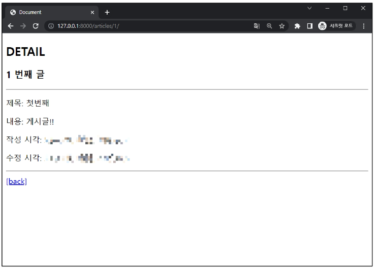

  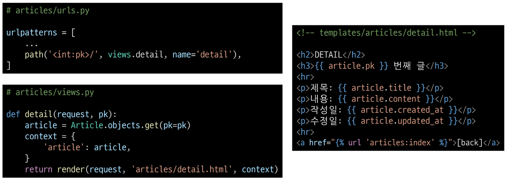


- 단일 게시글 페이지 링크 작성

  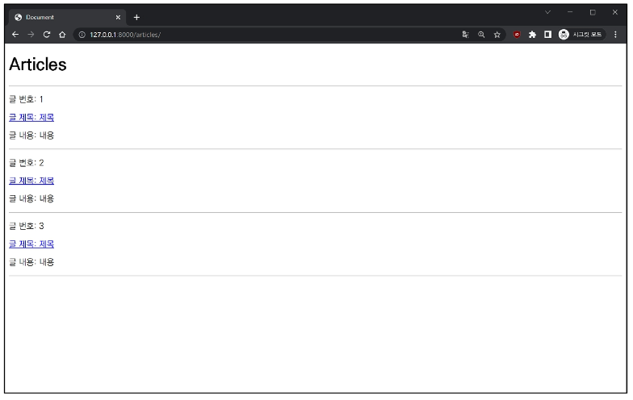

  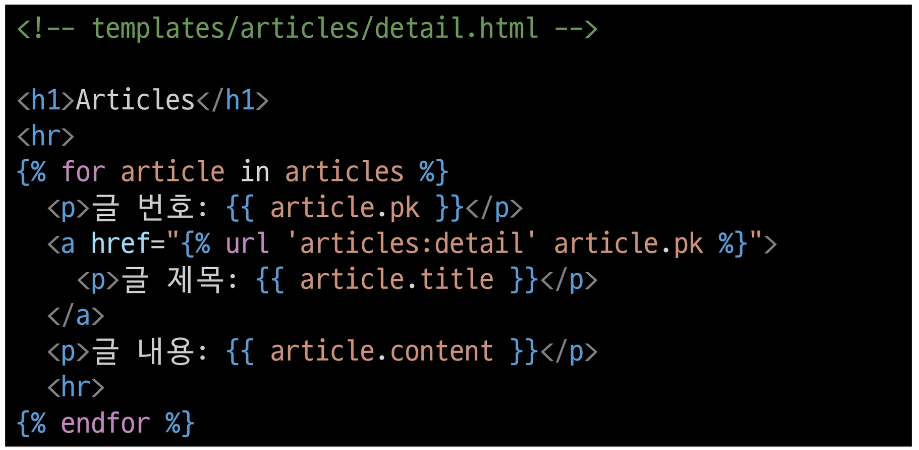


## Create

- Create 로직을 구현하기 위해 필요한 view 함수의 개수는?

  |사용자 입력 데이터를 받을<br>페이지를 렌더링|사용자가 입력한 요청 데이터를<br>받아 DB에 저장|
  |:--:|:--:|
  |new|create|
  <br>


- new 기능 구현

  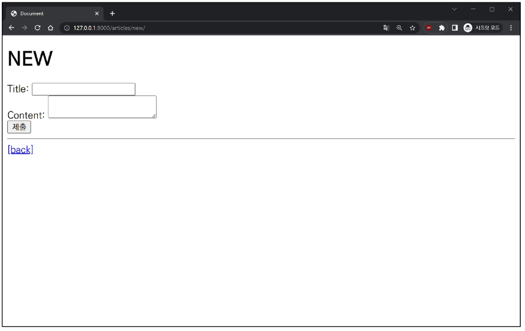

  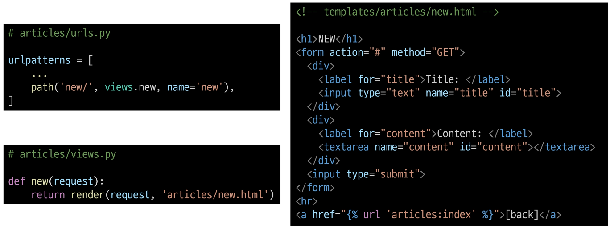

  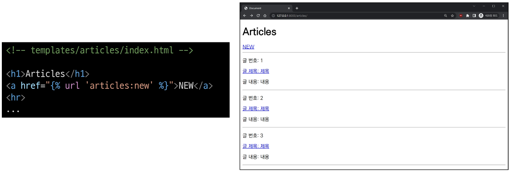


- create 기능 구현

  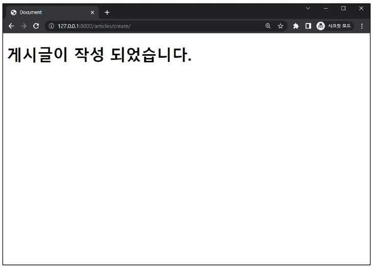

  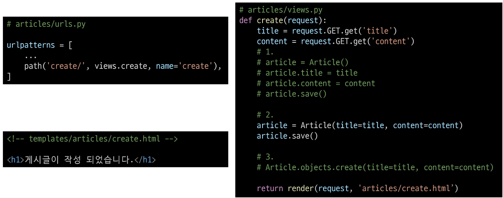

  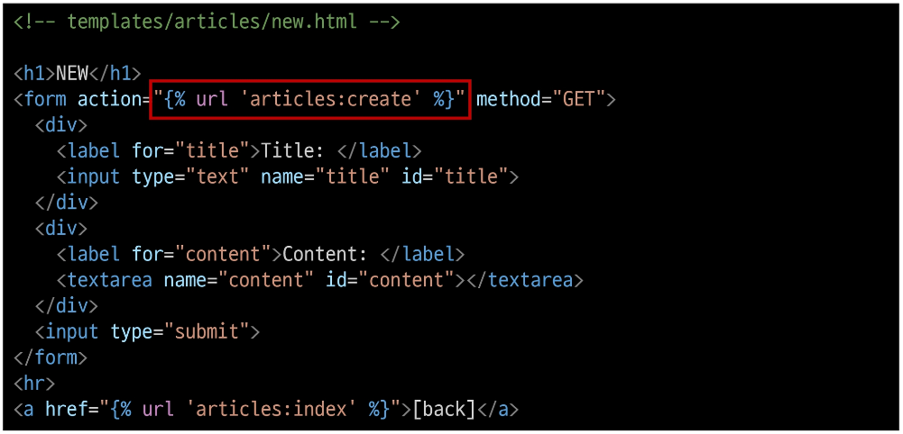


## HTTP requeset methods

- HTTP

  - 네트워크 상에서 데이터(리소스)를 주고 받기 위한 약속


- HTTP request methods

  ```
  - 데이터에 대해 수행을 원하는 작업(행동)을 나타내는 것

    - 서버에게 원하는 작업의 종류를 알려주는 역할

  - 클라이언트가 웹 서버에 특정 동작을 요청하기 위해 사용하는 표준 명령어

  - 대표 메서드

    - GET, POST
  ```


### GET method

- 'GET' Method

  - 서버로부터 데이터를 요청하고 받아오는 데 **(조회)** 사용


- 'GET' Method 특징

  1. 데이터 전송

      - URL의 쿼리 문자열(Query String)을 통해 데이터를 전송

      - http://127.0.0.1:8000/articles/create/?**title=제목&content=내용**

  2. 데이터 제한

      - URL 길이에 제한이 있어 대량의 데이터 전송에는 적합하지 않음

  3. 브라우저 히스토리

     - 요청 URL이 브라우저 히스토리에 남음

  4. 캐싱

     - 브라우저는 GET 요청의 응답을 로컬에 저장할 수 있음

     - 동일한 URL로 다시 요청할 때, 서버에 접속하지 않고 저장된 결과를 사용

     - 페이지 로딩 시간을 크게 단축


- 'GET' Method 사용 예시

      - 검색 쿼리 전송

      - 웹 페이지 요청

      - API에서의 데이터 조회


### POST method

- 'POST' Method

  - 서버에 데이터를 제출하여 리소스를 **변경(생성, 수정, 삭제)** 하는 데 사용


- 'POST' Method 특징

  1. 데이터 전송

      - HTTP Body를 통해 데이터를 전송

  2. 데이터 제한

      - GET에 비해 더 많은 양의 데이터를 전송할 수 있음

  3. 브라우저 히스토리

      - POST 요청은 브라우저 히스토리에 남지 않음

  4. 캐싱

      - POST 요청은 기본적으로 캐시 할 수 없음

      - POST 요청이 일반적으로 서버의 상태를 변경하는 작업을 수행하기 때문


- 'POST' Method 사용 예시

      - 로그인 정보 제출

      - 파일 업로드

      - 새 데이터 생성(예 : 새 게시글 작성)

      - API에서 데이터 변경 요청


- 'GET' & 'POST' Method 정리

      - GET과 POST는 각각의 특성에 맞게 적절히 사용해야 함

      - GET

        - 데이터 조회

      - POST

        - 데이터 생성이나 수정에 주로 사용


### Post method 변경

- POST method 적용

  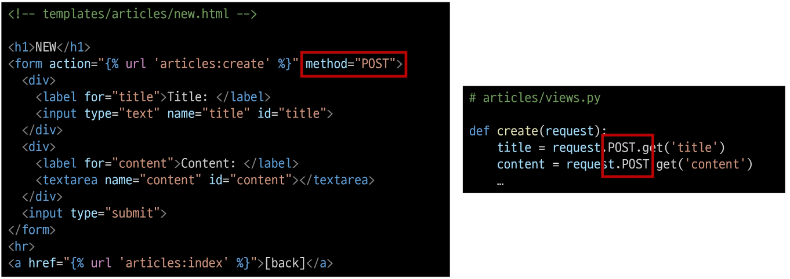


- 게시글 작성 후 403 응답 확인

  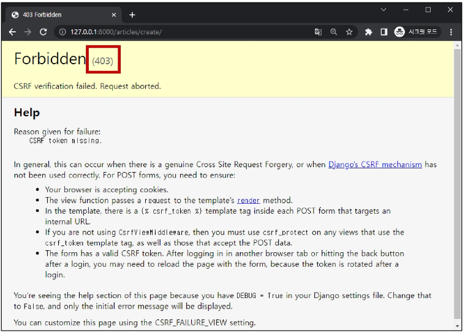


## HTTP response status code

- HTTP response status code

  - 서버가 클라이언트의 요청에 대한 처리 결과를 나타내는 3자리 숫자


- HTTP response status code의 역할

      - 클라이언트에게 요청 처리 결과를 명확히 전달

      - 문제 발생 시 디버깅에 도움

      - 웹 어플리케이션의 동작을 제어하는 데 사용


- 403 Forbidden

  - 서버에 요청이 전달되었지만, **권한** 때문에 거절되었다는 것을 의미


- 거절 된 이유

  - "CSRF token이 누락되었다"라는 응답

    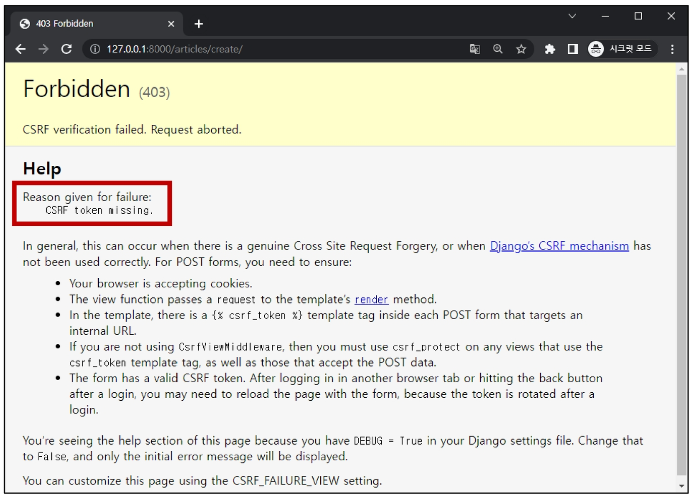


### CSRF

- CSRF(Cross-Site-Request-Forgery)

  - "사이트 간 요청 위조"

  - 사용자가 자신의 의지와 무관하게 공격자가 의도한 행동을 하여 특정 웹 페이지를 보안에 취약하게 하거나 수정, 삭제 등의 작업을 하게 만드는 공격 방법


- CSRF Token 적용

  - DTL의 csrf_token 태그를 사용해 손쉽게 사용자에게 토큰 값을 부여

  - 요청 시 토큰 값도 함께 서버로 전송될 수 있도록 하는 것

    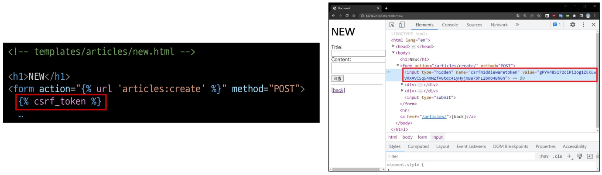


- 요청 시 CSRF Token을 함께 보내야 하는 이유

      - Django 서버는 해당 요청이 DB에 데이터를 하나 생성하는(DB에 영향을 주는) 요청에 대해 "Django가 직접 제공한 페이지에서 데이터를 작성하고 있는 것인지"에 대한 확인 수단이 필요한 것

      - 겉모습은 똑같은 위조 사이트나 정상적이지 않은 요청에 대한 방어 수단

      - 기존

        - 요청 데이터 → 게시글 작성

      - 변경

        - 요쳥 데이터 + 인증 토큰 → 게시글 작성


- 그런데 왜 POST일 때만 Token을 확인할까?

      - POST는 단순 조회를 위한 GET과 달리 특정 리소스에 변경(생성, 수정, 삭제)을 요구하는 의미와 기술적인 부분을 가지고 있기 때문

      - DB에 조작을 가하는 요청은 반드시 인증 수단이 필요

      - 데이터베이스에 대한 변경사항을 만드는 요청이기 때문에 토큰을 사용해 최소한의 신원 확인을 하는 것


- 게시글 작성 결과

  - 게시글 생성 후 개발자 도구를 사용해 Form Data가 전송되는 것 확인

  - 더 이상 URL에 Query String 형태로 보냈던 데이터가 표기되지 않음

    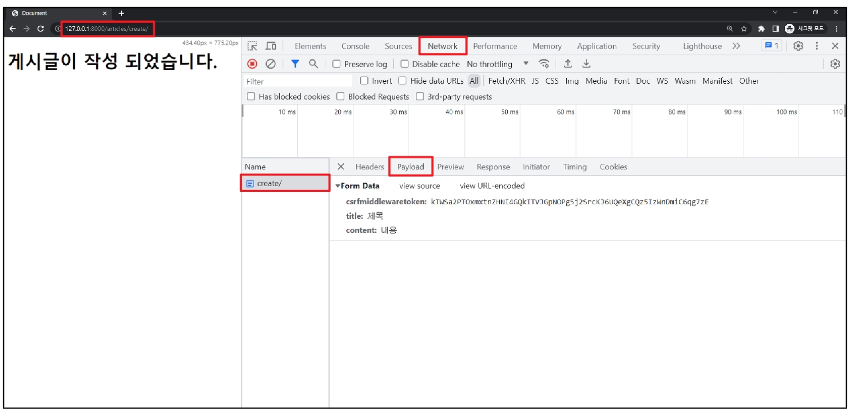


## Redirect

- 게시글 작성 후 완료를 알리는 페이지를 응답한다?

  - 게시글을 "조회해줘!" 라는 요청이 아닌 "작성해줘!"라는 요청이기 때문에 게시글 저장 후 페이지를 응답하는 것은 POST 요청에 대한 적절한 응답이 아님

    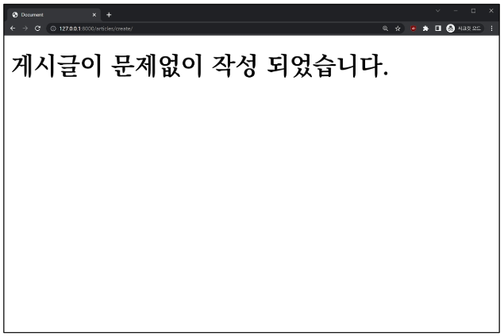


- 서버는 데이터 저장 후 페이지를 응답하는 것이 아닌 사용자를 적절한 기존 페이지로 보내야한다.

  


- redirect()

  - 클라이언트가 인자에 작성된 주소로 다시 요청을 보내도록 하는 함수


- redirect() 함수 적용

  - create view 함수 변경

    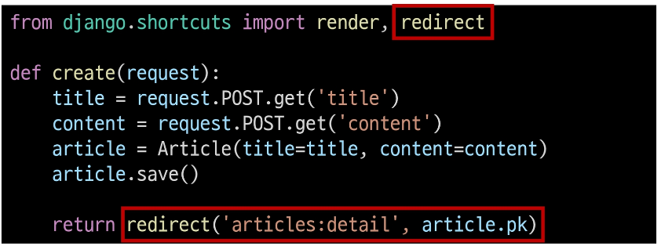


- redirect 동작 원리

  1. redirect 응답을 받은 클라이언트는 detail url로 다시 요청을 보내게 됨

  2. 결과적으로 detail view 함수가 호출되어 detail view 함수의 반환 결과인 detail 페이지를 응답 받게 되는 것

  - 결국 사용자는 게시글 작성 후 작성된 게시글의 detail 페이지로 이동하는 것으로 느끼게 됨

    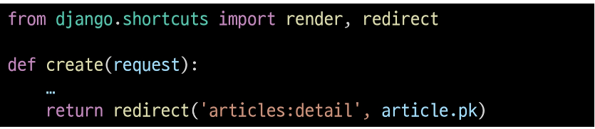


    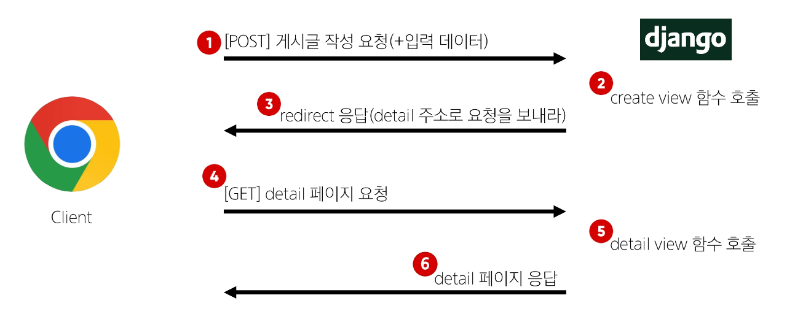


- 게시글 작성 결과

  - 게시글 작성 후 생성된 게시글의 detail 페이지로 redirect 되었는지 확인

  - create 요청 이후에 detail로 다시 요청을 보냈다는 것을 알 수 있음

    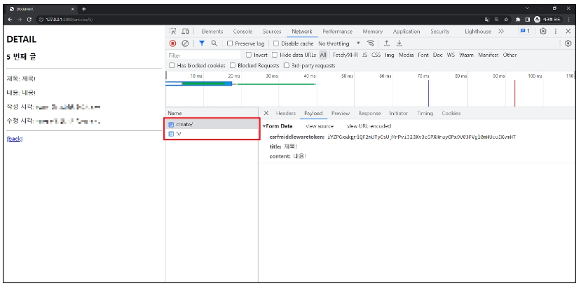


## Delete

- Delete 기능 구현

  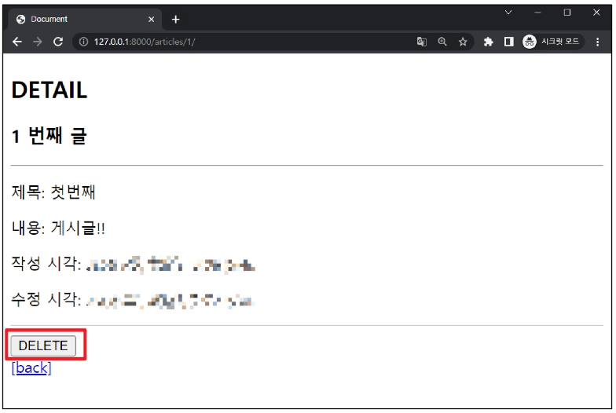

  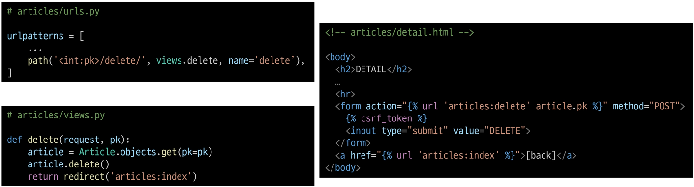


## Update

- Update 로직을 구현하기 위해 필요한 view 함수의 개수는?

  |사용자 입력 데이터를 받을<br>페이지를 렌더링|사용자가 입력한 데이터를 받아<br>DB에 저장|
  |:--:|:--:|
  |**edit**|**update**|
  <br>


- edit 기능 구현

  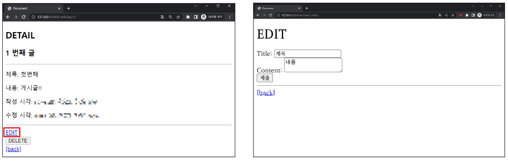

  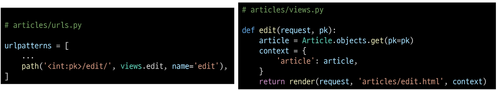

  - 수정 시 이전 데이터가 출력 될 수 있도록 작성하기

    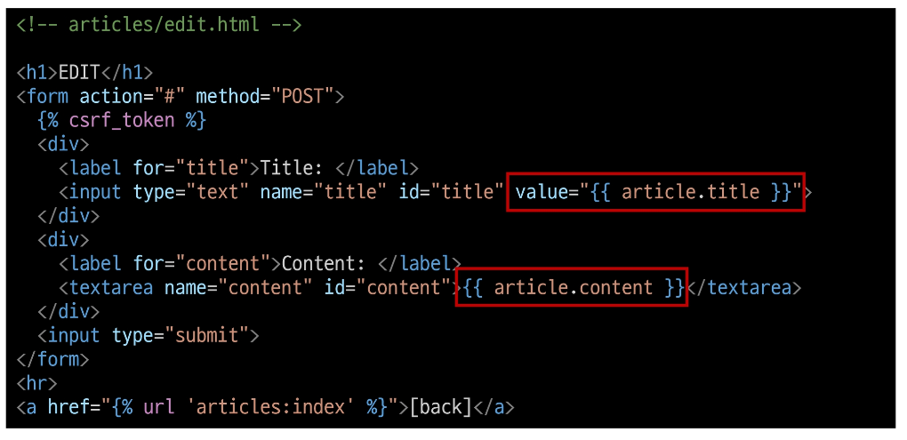

  - edit 페이지로 이동하기 위한 하이퍼링크 작성

    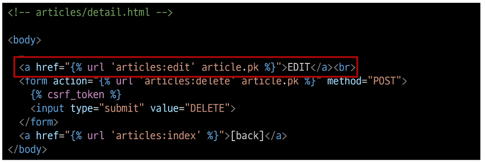


- update 기능 구현

  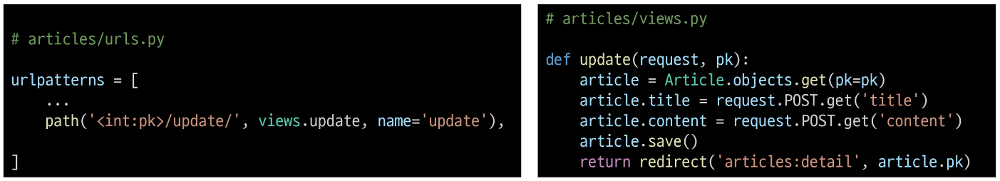

  - 작성 후 게시글 수정 테스트

    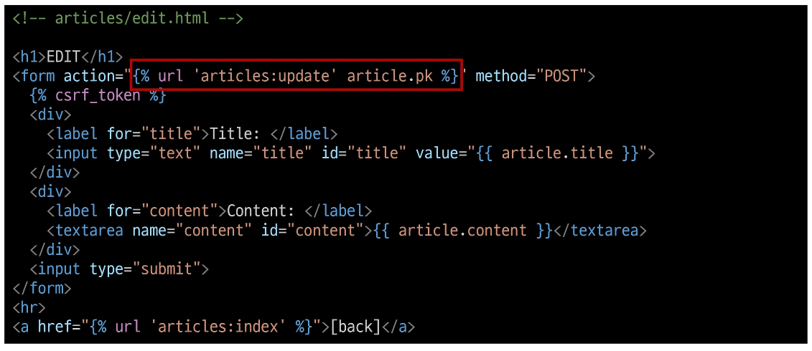


## 참고

### GET & POST

  ||GET|POST|
  |:--:|:--:|:--:|
  |데이터 전송 방식|URL의 Query string parameter|HTTP body|
  |데이터 크기 제한|브라우저 제공 URL의 최대 길이|제한 없음|
  |사용 목적|데이터 검색 및 조회|데이터 제출 및 변경|
  <br>


- GET 요청이 필요한 경우

  - 캐싱 및 성능

    - GET 요청은 캐시(Cache)될 수 있고, 이전에 요청한 정보를 새로 요청하지 않고 사용할 수 있음

    - 특히, 동일한 검색 결과를 여러 번 요청하는 경우 GET 요청은 캐시를 활용하여 더 빠르게 응답할 수 있음

  - 가시성 및 공유

    - GET 요청은 URL에 데이터가 노출되어 있기 때문에 사용자가 해당 URL을 북마크하거나 다른 사람과 공유하기 용이

  - RESTful API 설계

    - HTTP 메서드의 의미에 따라 동작하도록 디자인된 API의 일관성을 유지할 수 있음


- HTTP request methods를 활용한 효율적인 URL 구성

  - 동일한 URL 한 개로 method에 따라 서버에 요구하는 행동을 다르게 요구 Django 후반기 RESTful API 시간에 다룰 예정
    
    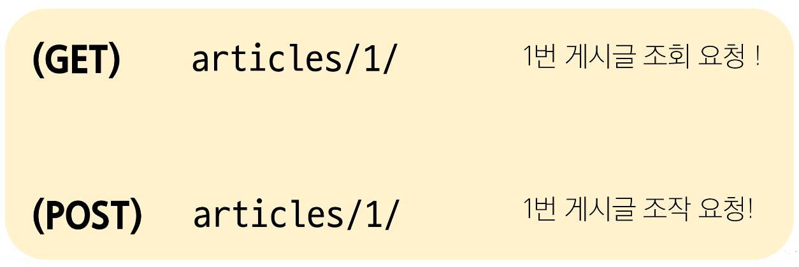


- HTTP request methods 실제 활용 예시

  - TMDB API 가이드 문서 예시

    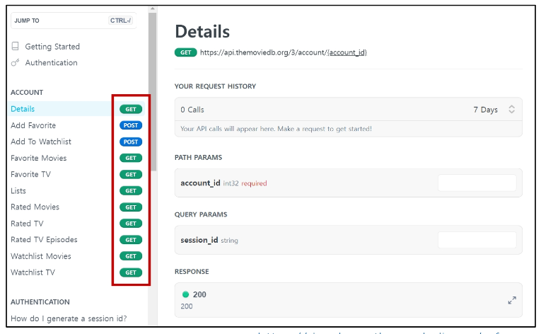


### 캐시(Cache)

- 캐시(Cache)

      - 데이터나 정보를 임시로 저장해두는 메모리나 디스크 공간

      - 이전에 접근한 데이터를 빠르게 검색하고 접근할 수 있도록 함