# 2024년 10월 2일(수) 수업 내용 정리 - Authentication System 2


- 회원 가입


- 회원 탈퇴


- 회원정보 수정


- 비밀번호 변경

  - 세션 무효화 방지


- 로그인 사용자에 대한 접근 제한

  - is_authenticated 속성
  - login_required 데코레이터


- 참고

  - is_authenticated 코드
  - 회원가입 후 자동 로그인
  - 회원 탈퇴 개선
  - PasswordChangeForm 인자 순서
  - Auth built-in form 코드


## 회원 가입

- 회원 가입

  - User 객체를 Create 하는 과정


- UserCreationForm()

  - 회원 가입 시 사용자 입력 데이터를 받는 built-in **ModelForm**


- 회원 가입 페이지 작성

  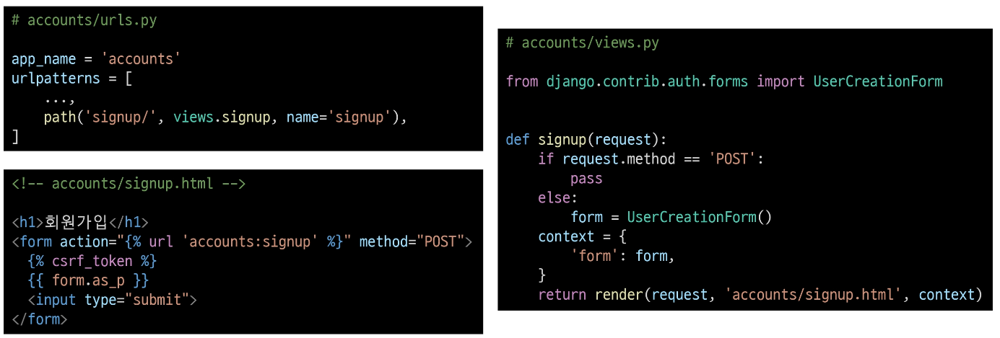

  - 회원 가입 페이지 확인

    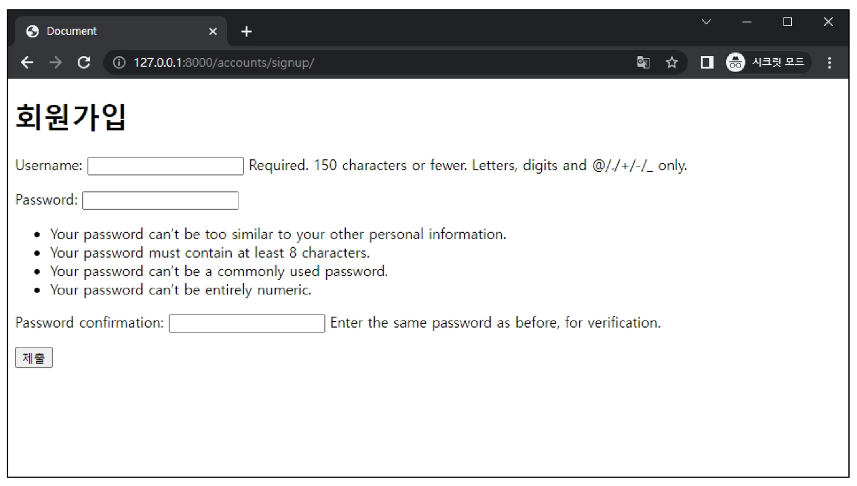


- 회원 가입 로직 작성

  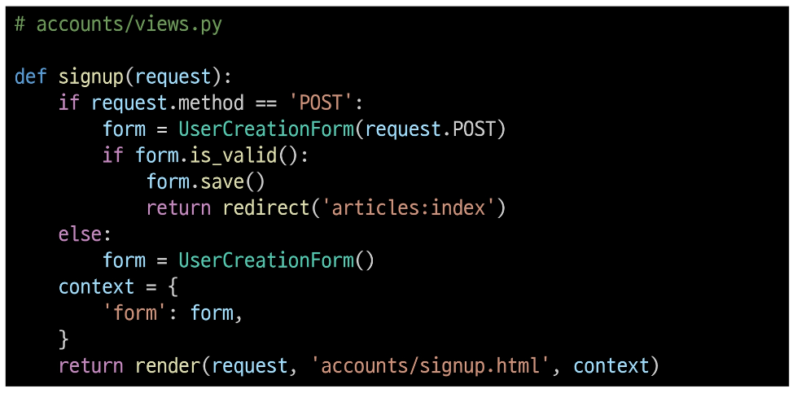


- 회원 가입 로직 에러

  - 회원가입 시도 후 에러 페이지 확인

    - Manager isn't available; 'auth.User' has been swapped for 'aacounts.User'

      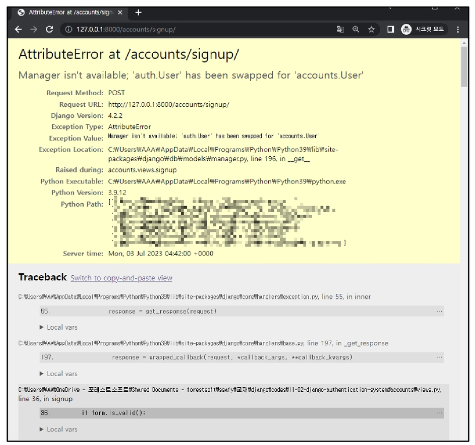

  - 회원가입에 사용하는 UserCreationForm이 대체한 커스텀 유저 모델이 아닌 과거 Django의 기본 유저 모델로 인해 작성된 클래스이기 때문

    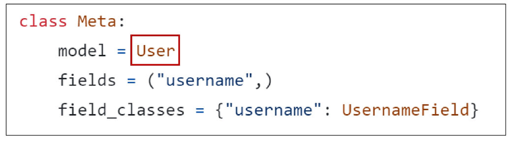

      - [https://github.com/django/django/blob/main/django/contrib/auth/forms.py#L205](https://github.com/django/django/blob/main/django/contrib/auth/forms.py#L205)


- 커스텀 유저 모델을 사용하려면 다시 작성해야 하는 Form

  

    - 두 Form 모두 class Meta: model = User 가 작성된 Form이기 때문에 재작성 필요

      - [https://docs.djangoproject.com/en/4.2/topics/auth/customizing/#custom-users-and-the-built-in-auth-forms](https://docs.djangoproject.com/en/4.2/topics/auth/customizing/#custom-users-and-the-built-in-auth-forms)


- UserCreationForm과 UserChangeForm 커스텀

  - Custom User model을 사용할 수 있도록 상속 후 일부분만 재작성

    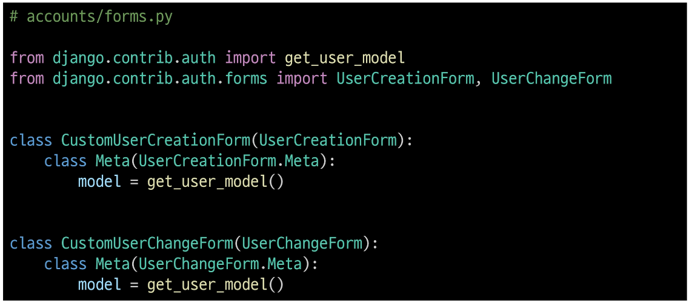


- get_user_model()

  - **"현재 프로젝트에서 활성화된 사용자 모델(active user model)"을 반환**하는 함수


- User 모델을 직접 참조하지 않는 이유

      - get_user_model()을 사용해 User 모델을 참조하면 커스텀 User 모델을 자동으로 반환해주기 때문

      - Django는 필수적으로 User 클래스를 직접 참조하는 대신 get_user_model()을 사용해 참조해야 한다고 강조하고 있음

        ⇨ User model 참조에 대한 자세한 내용은 추후 모델 관계에서 다룰 예정


- 회원 가입 로직 완성

  - CustomUserCreationForm으로 변경

    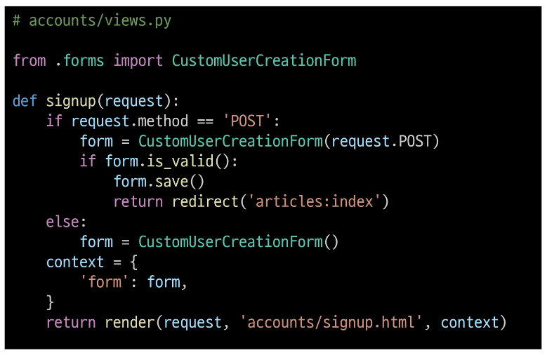


## 회원 탈퇴

- 회원 탈퇴

  - User 객체를 Delete 하는 과정


- 회원 탈퇴 로직 작성

  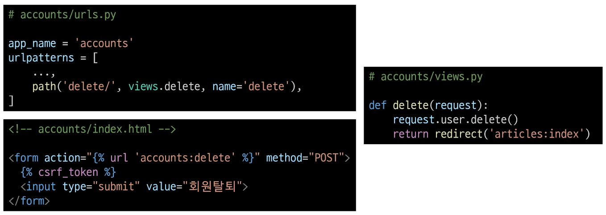

  - 회원 탈퇴 진행

    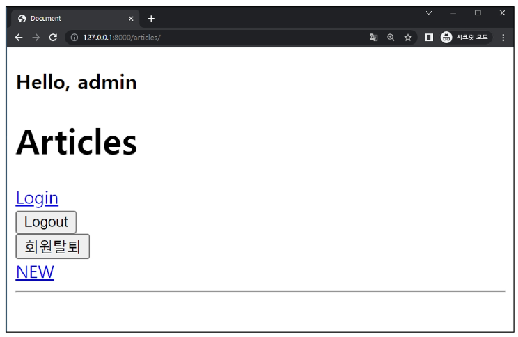


## 회원정보 수정

- 회원정보 수정

  - User 객체를 Update 하는 과정


- UserChangeForm()

  - 회원정보 수정 시 사용자 입력 데이터를 받는 built-in **ModelForm**


- 회원정보 수정 페이지 작성

  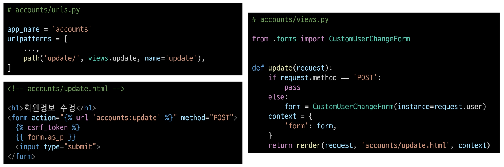

  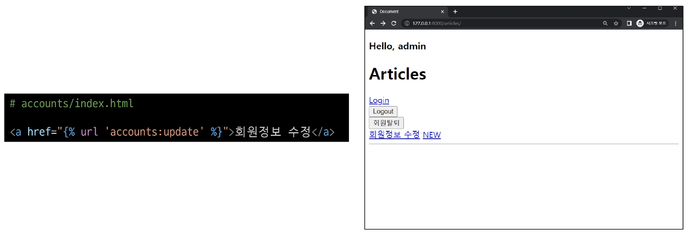

  - 회원정보 수정 페이지 확인

    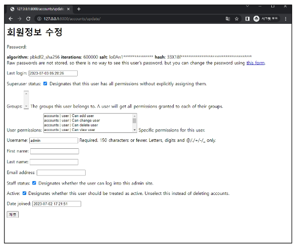


- UserChangeForm 사용 시 문제점

      - User 모델의 모든 정보들(fields)까지 모두 출력됨

      - 일반 사용자들이 접근해서는 안되는 정보는 출력하지 않도록 해야 함

        ⇨ CustomUserChangeForm에서 출력 필드를 다시 조정하기


- CustomUserChangeForm 출력 필드 재정의

  - User Model의 필드 목록 확인

    - [https://docs.djangoproject.com/en/4.2/ref/contrib/auth/](https://docs.djangoproject.com/en/4.2/ref/contrib/auth/)

    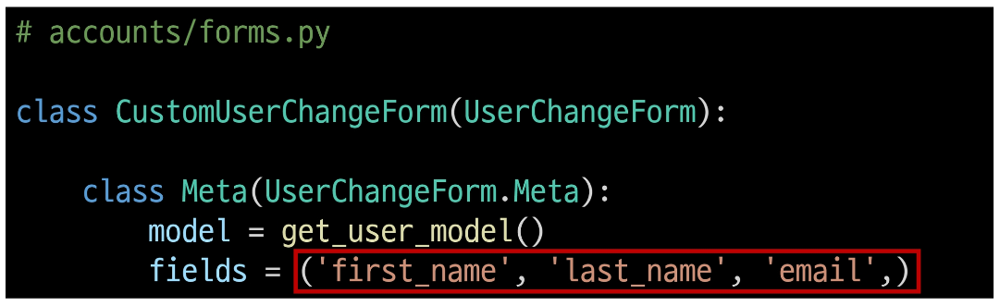

  - 회원정보 수정 페이지 확인

    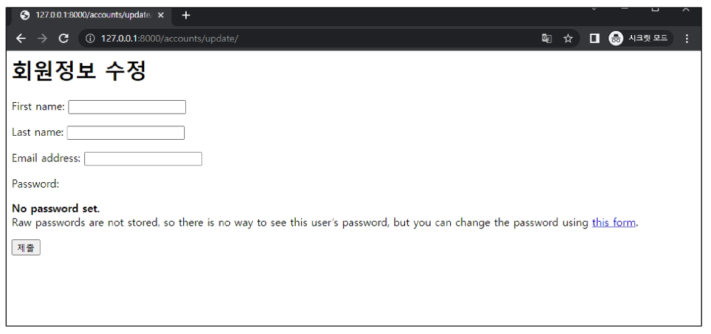


- 회원정보 수정 로직 완성

  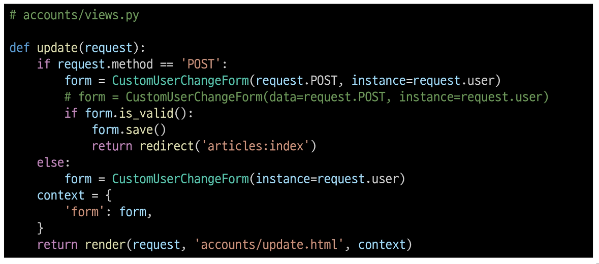


## 비밀번호 변경

- 비밀변호 변경

  - 인증된 사용자의 Session 데이터를 Update 하는 과정


- PasswordChangeForm()

  - 비밀번호 변경 시 사용자 입력 데이터를 받는 built-in **Form**


- 비밀번호 변경 페이지 작성

  - django는 비밀번호 변경 페이지를 회원정보 수정 form 하단에서 별도 주소로 안내

    - /user_pk/password/

    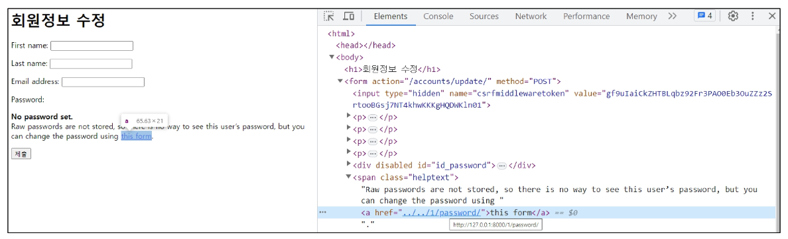

    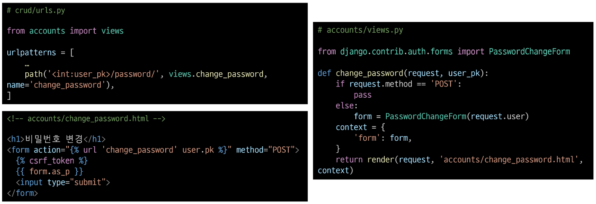

  - 비밀번호 변경 페이지 확인

    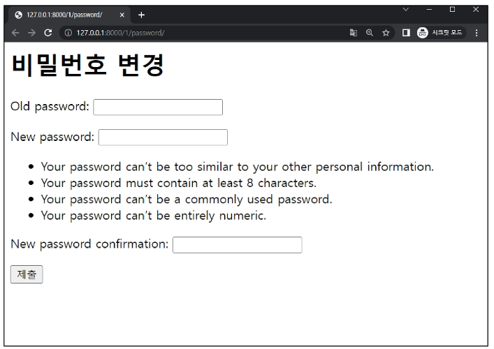


- 비밀번호 변경 로직 완성

  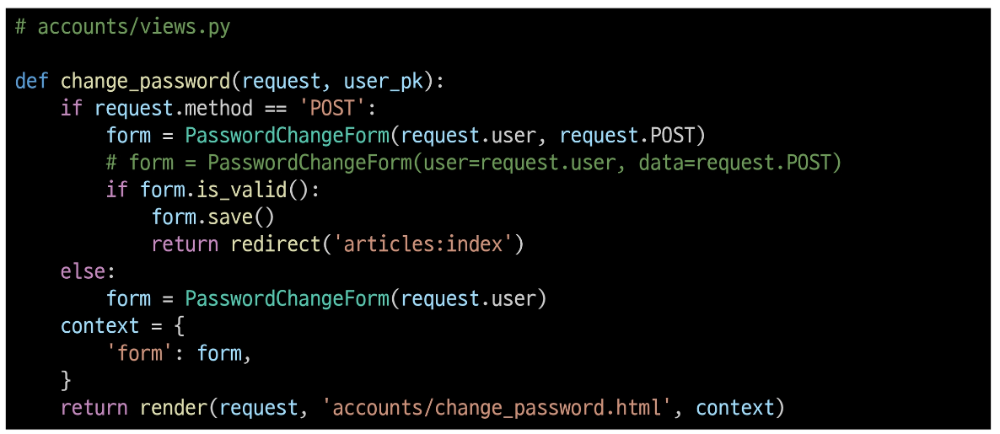


### 세션 무효화 방지

- 암호 변경 시 세션 무효화

      - 비밀번호가 변경되면 기존 세션과의 회원 인증 정보가 일치하지 않게 되어 버려 로그인 상태가 유지되지 못하고 로그아웃 처리됨

      - 비밀번호가 변경되면서 기존 세션과의 회원 인증 정보가 일치하지 않기 때문


- update_session_auth_hash(request, user)

  - 암호 변경 시 세션 무효화를 막아주는 함수

  - 암호가 변경되면 새로운 password의 Session Data로 기존 session을 자동으로 갱신


- update_session_auth_hash 적용

  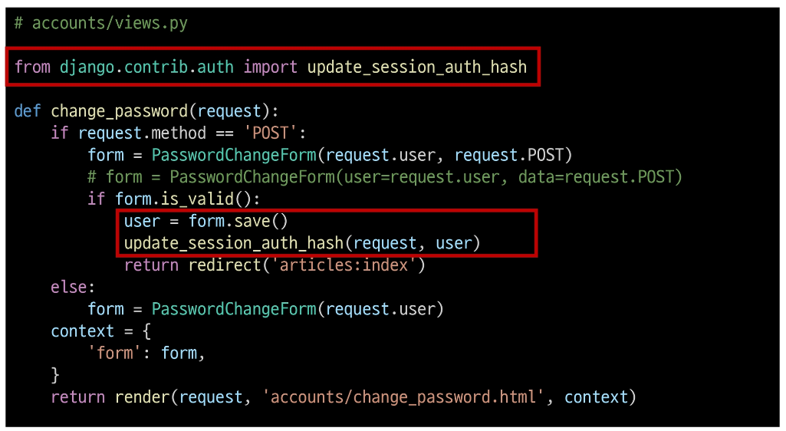


## 로그인 사용자에 대한 접근 제한

- 로그인 사용자에 대해 접근을 제한하는 2가지 방법

      1. is_authenticated 속성

      2. login_required 데코레이터


### is_authenticated 속성

- is_authenticated

  - 사용자가 인증 되었는지 여부를 알 수 있는 User model의 속성

    - 모든 User 인스턴스에 대해 **항상 True**인 읽기 전용 속성

    - 비인증 사용자에 대해서는 **항상 False**


- is_authenticated 적용하기

  - 로그인과 비로그인 상태에서 화면에 출력되는 링크를 다르게 설정하기

    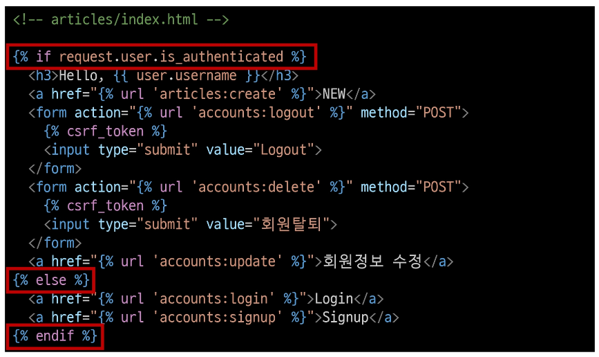

  - 인증된 사용자라면 로그인/회원가입 로직을 수행할 수 없도록 하기

    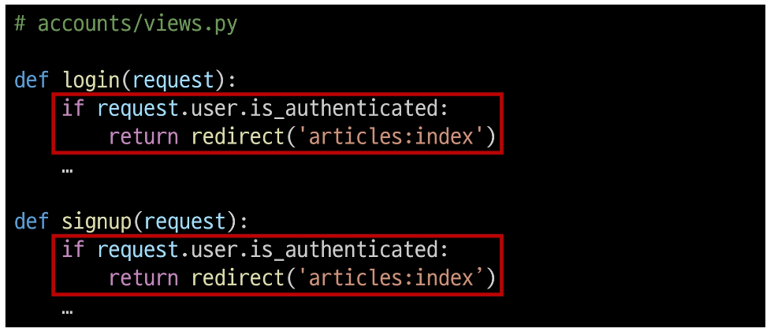


### login_required 데코레이터

- login_required

  - 인증된 사용자에 대해서만 view 함수를 실행시키는 데코레이터

    - 비인증 사용자의 경우 /accounts/login/ 주소로 redirect 시킴


- login_required 적용하기

  - 인증된 사용자만 게시글을 작성/수정/삭제할 수 있도록 수정

    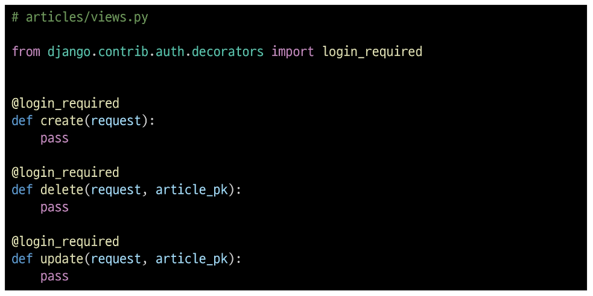

  - 인증된 사용자만 로그아웃/탈퇴/수정/비밀번호 변경할 수 있도록 수정

    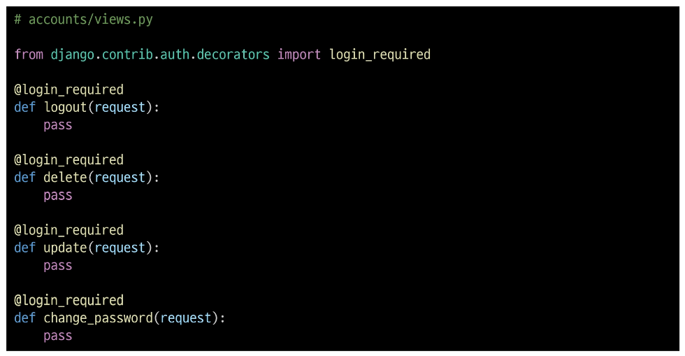


## 참고


### is_authenticated 코드

- is_authenticated 속성 코드

  - 메서드가 아닌 속성 값임을 주의

    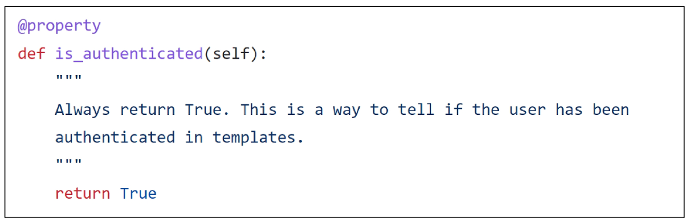

      - [https://github.com/django/django/blob/4.2/django/contrib/auth/base_user.py#L85](https://github.com/django/django/blob/4.2/django/contrib/auth/base_user.py#L85)


### 회원가입 후 자동 로그인

- 회원가입 후 로그인까지 이어서 진행하려면?

  - 회원가입 성공한 user 객체를 활용해 login 진행

    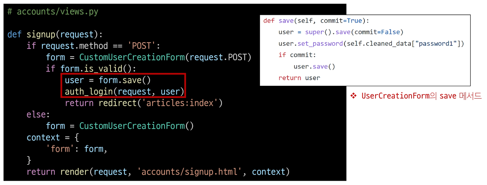


### 회원 탈퇴 개선

- 탈퇴와 함께 기존 사용자의 Session Data 삭제 방법

  - 사용자 객체 삭제 이후 로그아웃 함수 호출

  - 단, **"탈퇴(1) 후 로그아웃(2)"의 순서가 바뀌면 안됨**

  - 먼저 로그아웃이 진행되면 해당 요청 객체 정보가 없어지기 때문에 탈퇴에 필요한 유저 정보 또한 없어지기 때문

    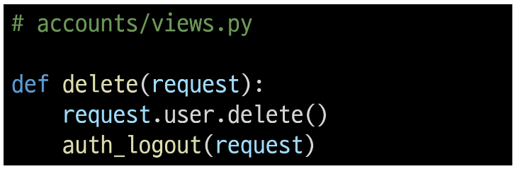


### PasswordChangeForm 인자 순서

- PasswordChangeForm의 인자 순서

  - PasswordChangeForm이 다른 Form과 달리 user 객체를 첫번째 인자로 받는 이유

  - 부모 클래스인 SetPasswordForm의 생성자 함수 구성을 따르기 때문

    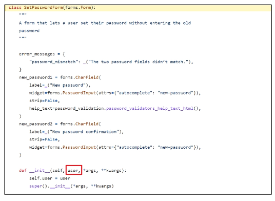

      - [https://github.com/django/django/blob/4.2/django/contrib/auth/forms.py#L378](https://github.com/django/django/blob/4.2/django/contrib/auth/forms.py#L378)


### Auth built-in form 코드

- UserCreationForm()

  - [https://github.com/django/django/blob/4.2/django/contrib/auth/forms.py#L149](https://github.com/django/django/blob/4.2/django/contrib/auth/forms.py#L149)

- UserChangeForm()

  - [https://github.com/django/django/blob/4.2/django/contrib/auth/forms.py#L170](https://github.com/django/django/blob/4.2/django/contrib/auth/forms.py#L170)

- PasswordChangeForm()

  - [https://github.com/django/django/blob/4.2/django/contrib/auth/forms.py#L422](https://github.com/django/django/blob/4.2/django/contrib/auth/forms.py#L422)


# git

```bash
# 이 폴더를 git으로 관리하겠다.
$ git init
```

- 현재 작업중인 폴더 내의 .git을 제외한 폴더 위치를 `working directory`

- working directory 에만 작성한 내용은 아직은 git이 어떤 변동사항이 있는지 모른다.

```bash
# staging area에 해당하는 파일을 등록
$ git add {fili_path}
```

- `staging area` 란, 등록한 파일들의 변도사항만 기록한 txt 파일을 `.git` 폴더 어딘가에 모아둔다.


```bash
# staging area에 등록해둔 변동사항을
# 하나의 버전으로 기록한다.
# 그 후, staing area는 비운다.
$ git commit -m "commit message"
```
- git add, git commit 까지가 Local에서 작업

- `commit` 즉, 버전이란, 아까 전 `staging area`에 등록해둔, 변동사항만을 모아서 하나의 상태로 저장하낟.
- 그곳을 `repository` 라고 부른다.

- example.
  - 신발 밑창을 단상에 올리는게 add.....
  - 밑창 사진을 찍어 올리는게 commit...(하나의 version?)


- remote repository...(github, gitlab 등)
  - 원격 레포지토리에 올리려면 push...?

<br>

```bash
$ git push origin master
# origin : 원격 저장소의 별명
# master : branch의 개념
```

### git branch
- 나뭇가지처럼 여러 갈래로 작업 공간을 나누어 독립적으로 작업할 수 있도록 도와주는 git의 도구

### branch 장점
1. 독립된 개발 환경을 형성하기 때문에 원본(master)에 대해 안전
2. 하나의 작업은 하나의 브랜치로 나누어 진행되므로 체계적으로 협업과 개발이 가능
3. 손쉽게 브랜치를 생성하고 브랜치 사이를 이동할 수 있음

### branch를 꼭 사용해야 할까?
- 만약 상용 중인 서비스에 발생한 에러를 해결하려면?
  1. 브랜치를 통해 별도의 작업 공간을 만든다.
  2. 브랜치에서 에러가 발생한 버전을 이전 버전으로 되돌리거나 삭제한다.
  3. 브랜치는 완전하게 도립 되어있어서 작업 내용이 master 브랜치에 아무런 영향을 끼치지 못한다.
  4. 이후 에러가 해결됐다면? 그 내용을 master 브랜치에 반영할 수 있다.

