# 2024년 10월 16일(수) 수업 내용 정리 - DRF 1

- REST API

  - API
  - REST API
  - 자원의 식별
  - 자원의 행위
  - 자원의 표현
  - json 데이터 응답

- DRF with Single Model

  - DRF
  - Serializer

- CRUD with ModelSerializer

  - GET method - 조회
  - POST method - 생성
  - DELETE method - 삭제
  - PUT method - 수정

- 참고

  - raise_exception

## REST API

### API

- API(Application Programming Interface)

  - 두 소프트웨어가 서로 통신할 수 있게 하는 메커니즘

  - 클라이언트-서버처럼 서로 다른 프로그램에서 요청과 응답을 받을 수 있도록 만든 체계

- API 예시

  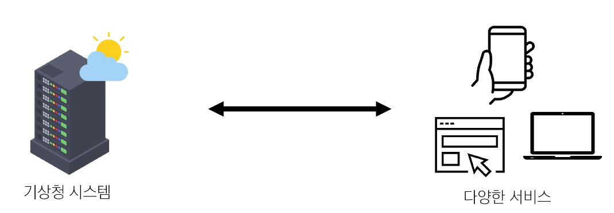

  - 기상 데이터가 들어있는 기상청의 시스템

  - 스마트 폰의 날씨 앱, 웹 사이트의 날씨 정보 등 다양한 서비스들이 이 기상청 시스템으로부터 데이터를 요청해서 받아감

  - 날씨 데이터를 얻으려면?

    - 기상청 시스템에는 정보들을 요청하는 지정된 형식이 있음

    - 지역, 날짜, 조회할 내용들(온도, 바람 등)을 제공하는 매뉴얼

  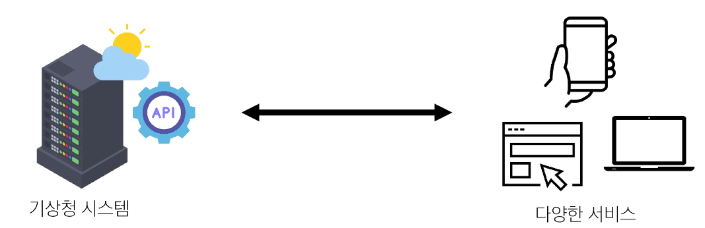

  - **"이렇게 요청을 보내면, 이렇게 정보를 제공해 줄 것이다"**라는 매뉴얼

    - 소프트웨어와 소프트웨어 간 지정된 정의(형식)으로 소통하는 수단 → API

  - 스마트폰의 날씨 앱은 기상청에서 제공하는 API를 통해 기상청 시스템과 대화하여 매일 최신 날씨 정보를 표시할 수 있음

- API 역할

      - 예를 들어 우리 집 냉장고에 전기를 공급해야 한다고 가정해보자

      - 우리는 그냥 냉장고의 플러그를 소켓에 꽂으면 제품이 작동한다.

      - 중요한 것은 우리가 가전 제품에
        "전기를 공급하기 위해 직접 배선을 하지 않는다"는 것이다.
      
      - 이는 매우 위험하면서도 비효율적인 일이기 때문이다.

      ⇨ 복잡한 코드를 추상화하여 대신 사용할 수 있는 몇 가지 더 쉬운 구문을 제공

- Web API

      - 웹 서버 또는 웹 브라우저를 위한 API

      - 현대 웹 개발은 하나부터 열까지 직접 개발하기보다 여러 Open API 들을 활용하는 추세

      - 대표적인 Third Party Open API 서비스 목록

        - Youtube API
        - Google Map API
        - Naver Papago API
        - Kakao Map API

### REST API

- REST(Representational State Transfer)

  - API Server를 개발하기 위한 일종의 소프트웨어 설계 방법론

  - "규칙 X"

  - API Server를 설계하는 구조가 서로 다르니 이렇게 맞춰서 설계하는 게 어때?

- RESTful API

      - REST 원리를 따르는 시스템을 RESTful 하다고 부름

      - "자원을 정의"하고 "자원에 대한 주소를 지정"하는 전반적인 방법을 서술

        - "각각 API 서버 구조를 작성하는 모습이 너무 다르니
          어느 정도 약속을 만들어서 다같이 통일해서 쓰자!"

- REST API

  - REST라는 설계 디자인 약속을 지켜 구현한 API

- REST API 실제 활용 예시

  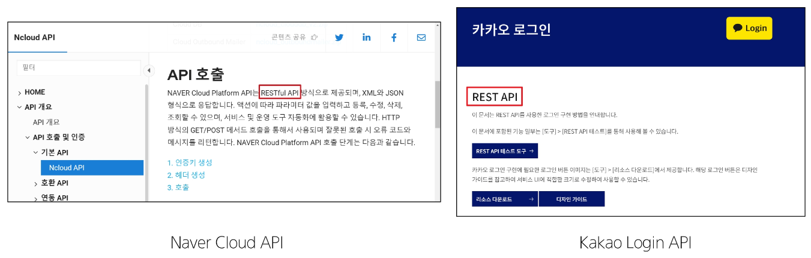

- REST에서 자원을 정의하고 주소를 지정하는 방법

      1. 자원의 "식별"

        - URI

      2. 자원의 "행위"

        - HTTP Methods

      3. 자원의 "표현"

        - JSON 데이터
          (궁극적으로 표현되는 데이터 결과물)

### 자원의 식별

- URI(Uniform Resource Identifier, 통합 자원 식별자)

  - 인터넷에서 리소스(자원)를 식별하는 문자열

  - 가장 일반적인 URI는 웹 주소로 알려진 URL

- URL(Uniform Resource Locator, 통합 자원 위치)

  - 웹에서 주어진 리소스의 위치

  - 네트워크 상에 리소스가 어디 있는지를 알려주기 위한 약속

    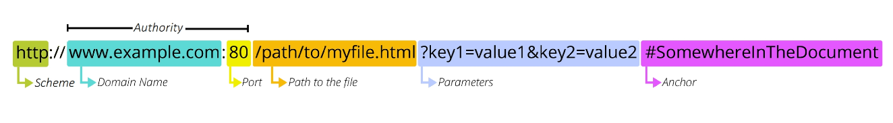

- Schema (or Protocol)

      - 브라우저가 리소스를 요청하는 데 사용해야 하는 규약

      - URL의 첫 부분은 브라우저가 어떤 규약을 사용하는지를 나타냄

      - 기본적으로 웹은 http(s)를 요구

        - 메일을 열기 위한 mailto:, 파일을 전송하기 위한 ftp: 등 다른 프로토콜도 존재

    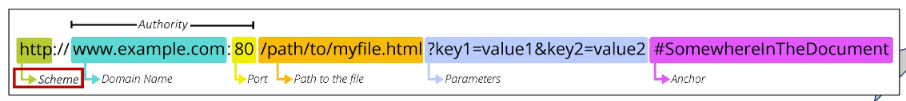

- Domain Name

      - 요청 중인 웹 서버를 나타냄

      - 어떤 웹 서버가 요구되는 지를 가리키며 직접 IP 주소를 사용하는 것도
        가능하지만, 사람이 외우기 어렵기 때문에 주로 Domain Name으로 사용

      - 예) 도메인 google.com의 IP 주소는 142.251.42.142

  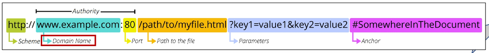

- Port

      - 웹 서버의 리소스에 접근하는데 사용되는 기술적인 문(Gate)

      - HTTP 프로토콜의 표준 포트

        - HTTP - 80
        
        - HTTPS - 443

      - 표준 포트만 작성 시 생략 가능

  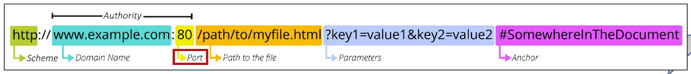

- Path

      - 웹 서버의 리소스 경로

      - 초기에는 실제 파일이 위치한 물리적 위치를 나타냈지만,
        오늘날은 실제 위치가 아닌 추상화된 형태의 구조를 표현

      - 예) /articles/create/라는 주소가 실제 articles 폴더 안에 create 폴더 안을 나타내는 것은 아님

  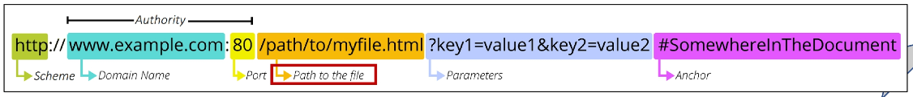

- Parameters

      - 웹 서버에 제공하는 추가적인 데이터

      - '&' 기호로 구분되는 key-value 쌍 목록

      - 서버는 리소스를 응답하기 전에 이러한 파라미터를 사용하여 추가 작업을 수행할 수 있음

  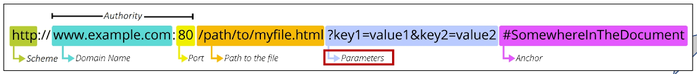

- Anchor

      - 일종의 "북마크"를 나타내며 브라우저에 해당 지점에 있는 콘텐츠를 표시

      - '#' (fragment identifier, 부분 식별자) 이후 부분은 서버에 전송되지 않음

      - https://docs.djangoproject.com/en/4.2/intro/install/#quick-install-guide
        요청에서 #quick-install-guide는 서버에 전달되지 않고 브라우저에게 해당 지점으로 이동할 수 있도록 함

  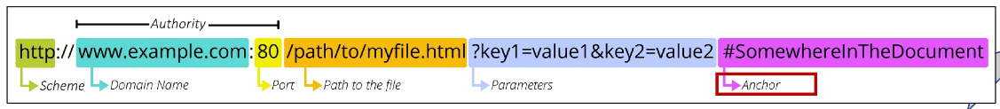

### 자원의 행위

- HTTP Request Methods

  - 리소스에 대한 행위(수행하고자 하는 동작)를 정의

  - HTTP verbs 라고도 함

- 대표 HTTP Request Methods

  |GET|POST|PUT|DELETE|
  |:--:|:--:|:--:|:--:|
  |- 서버에 리소스의 표현을 요청 - GET을 사용하는 요청은 데이터만 검색해야 함|- 데이터를 지정된 리소스에 제출 - 서버의 상태를 변경|- 요청한 주소의 리소스를 수정|- 지정된 리소스를 삭제|
   

- HTTP response status codes

  - 특정 HTTP 요청이 성공적으로 완료 되었는지 여부를 나타냄

- HTTP response status codes

      - 5가지 응답 그룹으로 분류

        1. Informational responses (100-199)

        2. Successful responses (200-299)

        3. Redirection messages (300-399)

        4. Client error responses (400-499)

        5. Server error responses (500-599)

### 자원의 표현

- 그동안 서버가 응답(자원을 표현)했던 것

      - 지금까지 Django 서버는 사용자에게 페이지(html)만 응답하고 있었음

      - 하지만 서버가 응답할 수 있는 것은 페이지 뿐만 아니라 다양한 데이터 타입을 응답할 수 있음

      - REST API는 이 중에서도 JSON 타입으로 응답하는 것을 권장

- 응답 데이터 타입의 변화

  - 페이지(html)만을 응답하는 서버

    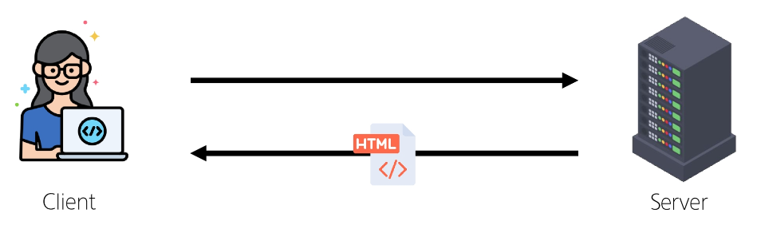

  - 이제는 JSON 데이터를 응답하는 REST API 서버로의 변환

    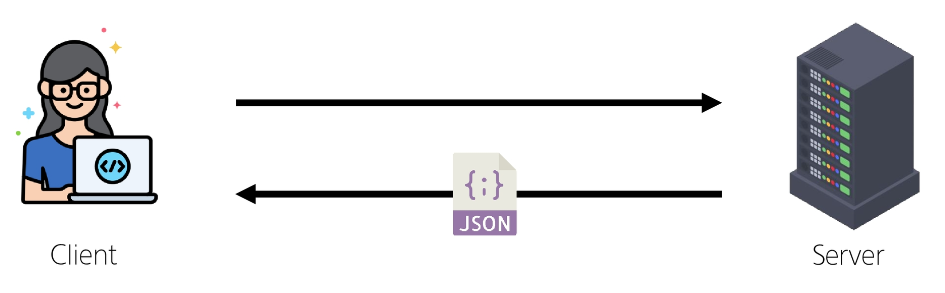

  - Django는 더 이상 Template 부분에 대한 역할을 담당하지 않게 되며, Front-end와 Back-end가 분리되어 구성됨

    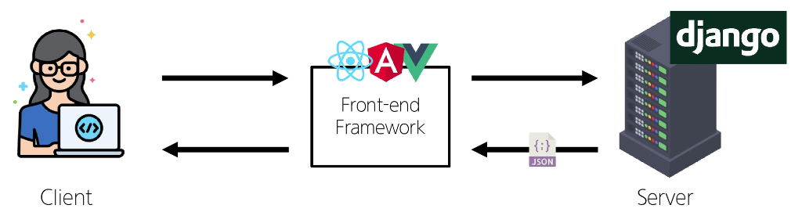

  - 이제부터 Django를 사용해 RESTful API 서버를 구축할 것

    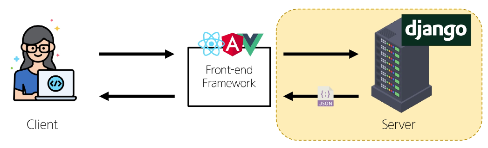

### json 데이터 응답

- 사전 준비

  - 사전 제공된 99-json-response-practice 기반 시작

  - 가상 환경 생성, 활성화 및 패키지 설치

  - migrate 진행

    

  - 준비된 fixtures 파일을 load하여 실습용 초기 데이터 입력

    

  - [http://127.0.0.1:8000/api/v1/articles/](http://127.0.0.1:8000/api/v1/articles/) 요청 후 응답 확인

    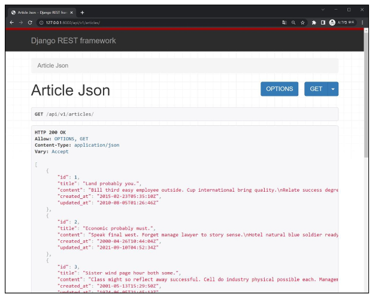

- python으로 json 데이터 처리 하기

  - 준비된 python-request-sample.py 확인

    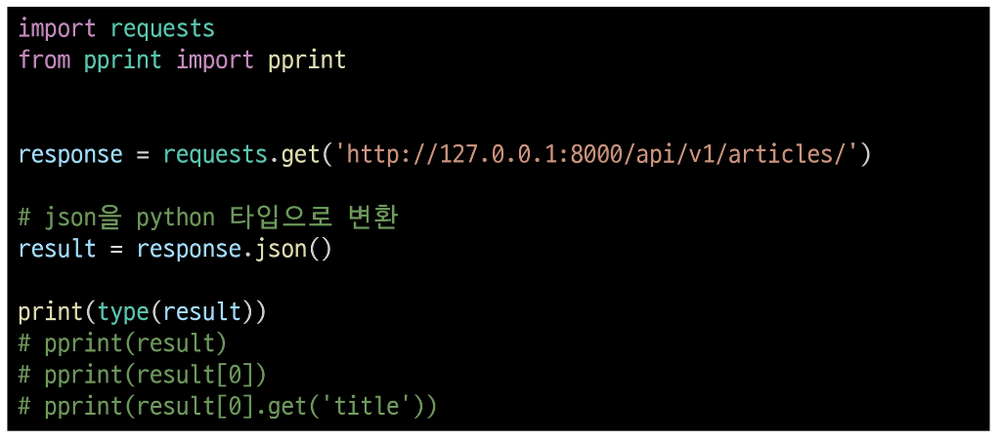

## DRF with Single Model

### DRF

- Django REST framework(DRF)

  - Django에서 RESTful API 서버를 쉽게 구축할 수 있도록 도와주는 오픈소스 라이브러리

- 프로젝트 준비

  - 사전 제공된 drf 프로젝트 기반 시작

    1. 가상 환경 생성, 활성화 및 패키지 설치

    2. migrate 진행

        

    3. 준비된 fixtures 파일을 load하여 실습용 초기 데이터 입력

        

- Postman 설치 및 안내

  - Postman 설치

    - [https://www.postman.com/downloads/](https://www.postman.com/downloads/)

  - Postman 이란?

    - API 개발 및 테스트를 위한 서비스

    - 요청 데이터 구성, 응답 확인, 환경 설정, 자동화 테스트 등 다양한 기능을 제공

  - Workspaces - My workspace

    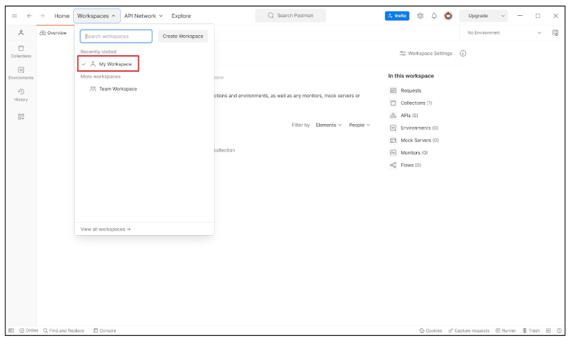

- Postman 화면 구성 안내

  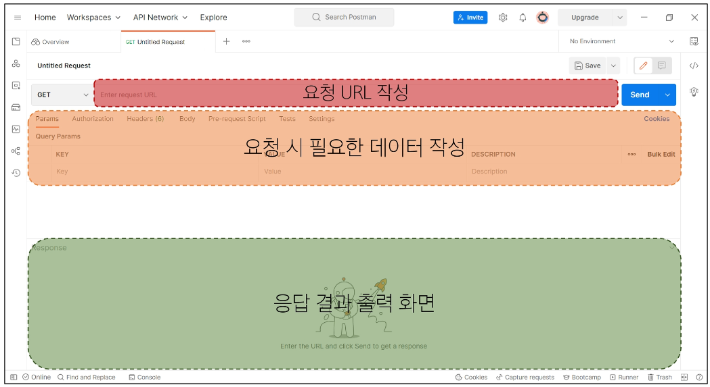

### Serializer

## CRUD with ModelSerializer

### GET method - 조회
### POST method - 생성
### DELETE method - 삭제
### PUT method - 수정

## 참고

### raise_exception