# 2024년 10월 16일(수) 수업 내용 정리 - DRF 1

- DRF with N:1 Relation

  - 사전 준비
  - GET method
  - POST method
  - DELETE & PUT method

- 역참조 데이터 구성

  - 단일 게시글 + 댓글 목록
  - 단일 게시글 + 댓글 개수
  - 읽기 전용 필드

- API 문서화

  - 문서화 활용

- 참고

  - 올바르게 404 응답하기
  - 복잡한 ORM 활용

## DRF with N:1 Relation

### 사전 준비

- Comment 모델 정의

  - Comment 클래스 정의 및 데이터베이스 초기화

    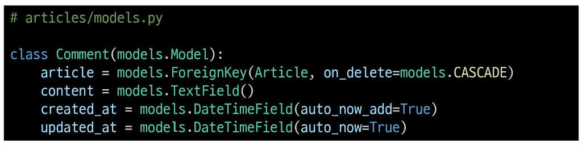

  - Migration 및 fixtures 데이터 로드

    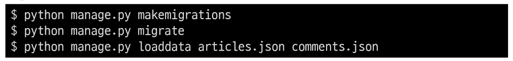

- URL 및 HTTP request method 구성

  |URL|GET|POST|PUT|DELETE|
  |:--:|:--:|:--:|:--:|:--:|
  |comments/|댓글 목록 조회||||
  |comments/1/|단일 댓글 조회||단일 댓글 수정|단일 댓글 삭제|
  |articles/1/comments/||댓글 생성|||
   

### GET method

- GET - List

  - 댓글 목록 조회를 위한 CommentSerializer 정의

    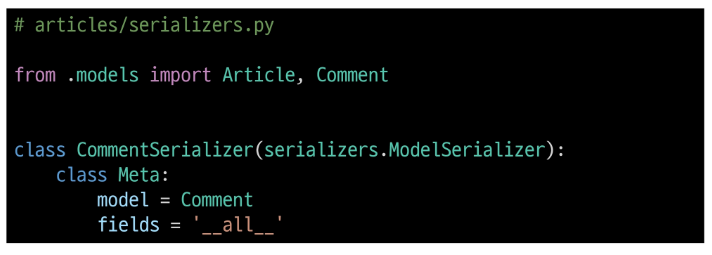

  - url 작성

    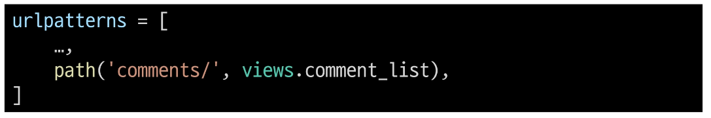

  - view 함수 작성

    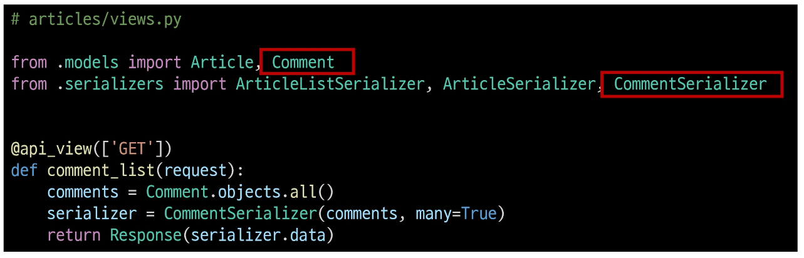

  - GET [http://127.0.0.1:8000/api/v1/comments/](http://127.0.0.1:8000/api/v1/comments/) 응답 확인

    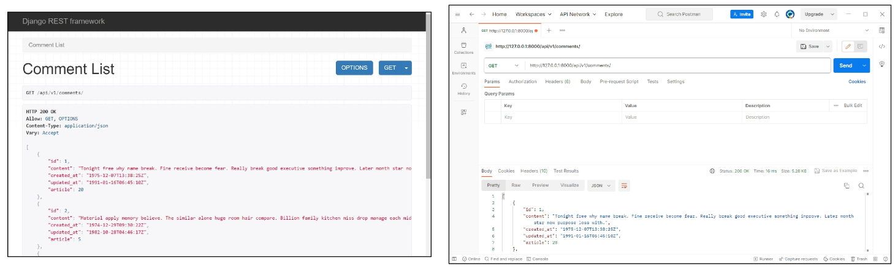

- GET - Detail

  - 단일 댓글 조회를 위한 url 및 view 함수 작성

    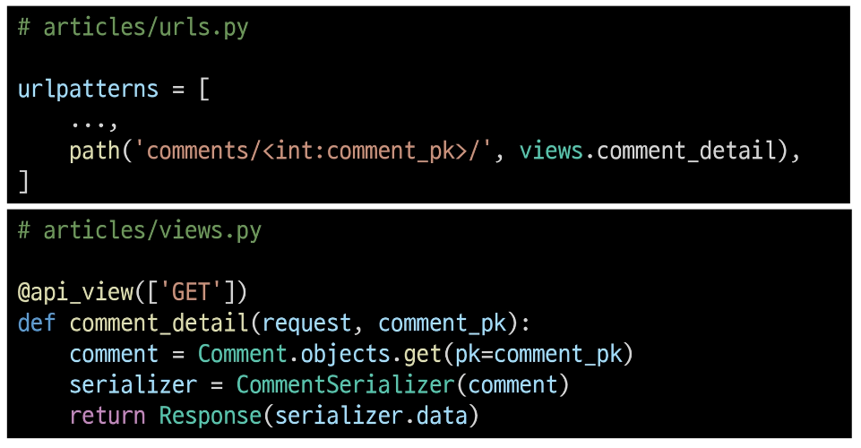

  - GET [http://127.0.0.1:8000/api/v1/comments/1/](http://127.0.0.1:8000/api/v1/comments/1/) 응답 확인

    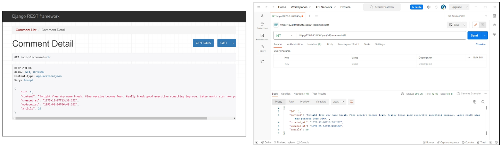

### POST method

- POST

  - 단일 댓글 생성을 위한 url 및 view 함수 작성

    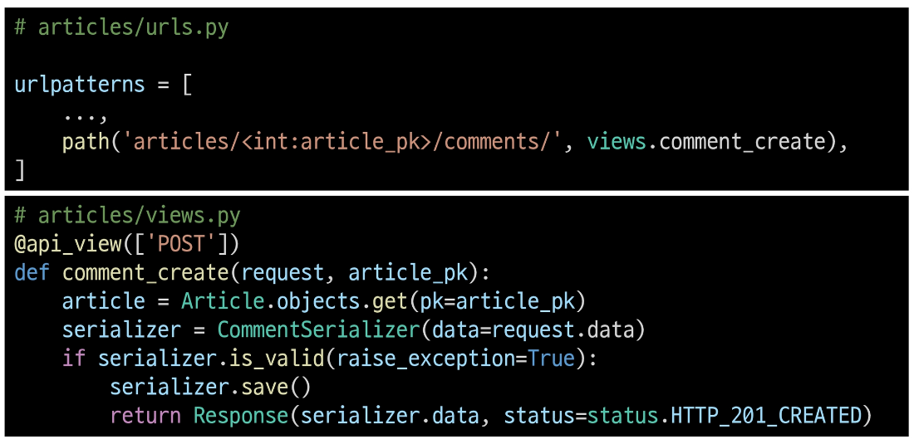

  - serializer 인스턴스의 save() 메서드는 특정 Serializer 인스턴스를 저장하는 과정에서 추가 데이터를 받을 수 있음

    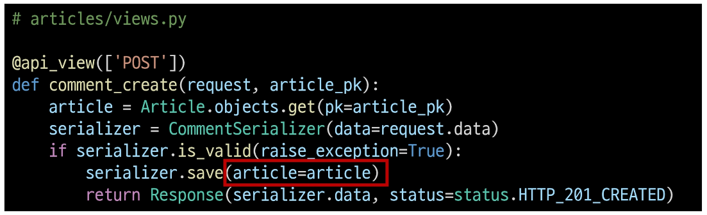

  - POST [http://127.0.0.1:8000/api/v1/articles/1/comments/](http://127.0.0.1:8000/api/v1/articles/1/comments/) 응답 확인

  - 상태코드 400 응답 확인

    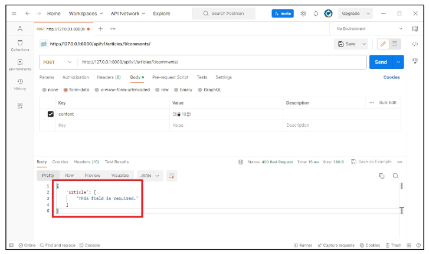

  - CommentSerializer에서 외래 키에 해당하는 article field 또한 사용자로부터 입력 받도록 설정되어 있기 때문에 서버 측에서는 누락되었다고 판단한 것

  - 유효성 검사 목록에서 제외 필요

  - article field를 **읽기 전용 필드**로 설정하기

  - POST [http://127.0.0.1:8000/api/v1/articles/1/comments/](http://127.0.0.1:8000/api/v1/articles/1/comments/) 재요청

    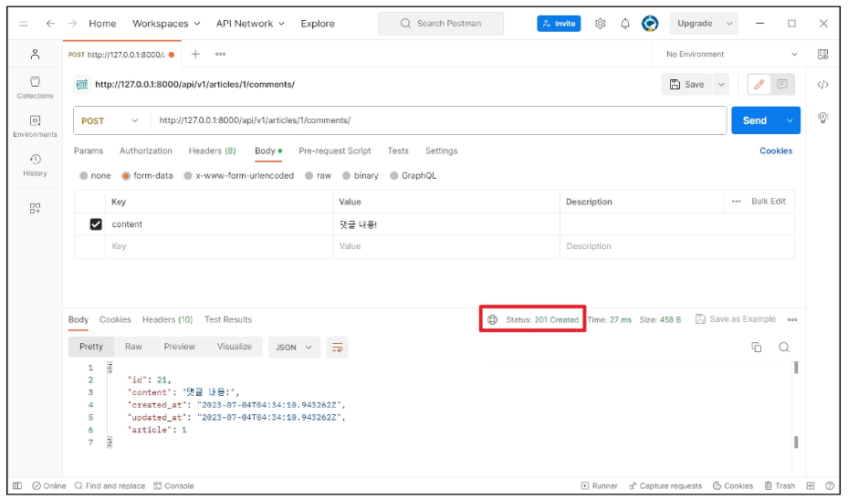

- 읽기 전용 필드(read_only_fields)

  - 데이터를 전송 받은 시점에 "**유효성 검사에서 제외**시키고, **데이터 조회 시에는 출력**"하는 필드

    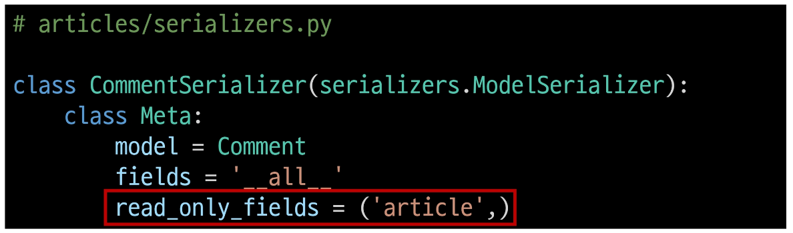

### DELETE & PUT method

- DELETE & PUT

  - 단일 댓글 삭제 및 수정을 위한 view 함수 작성

    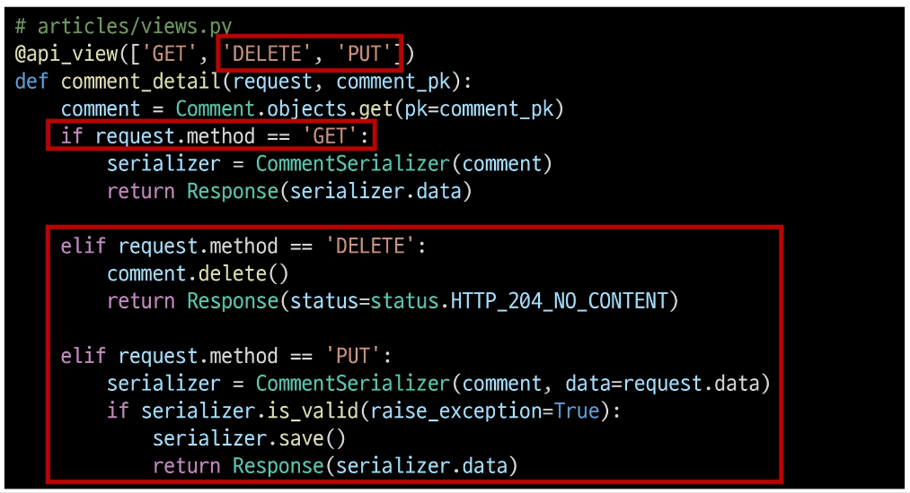

  - DELETE [http://127.0.0.1:8000/api/v1/comments/21/](http://127.0.0.1:8000/api/v1/comments/21/) 응답 확인

    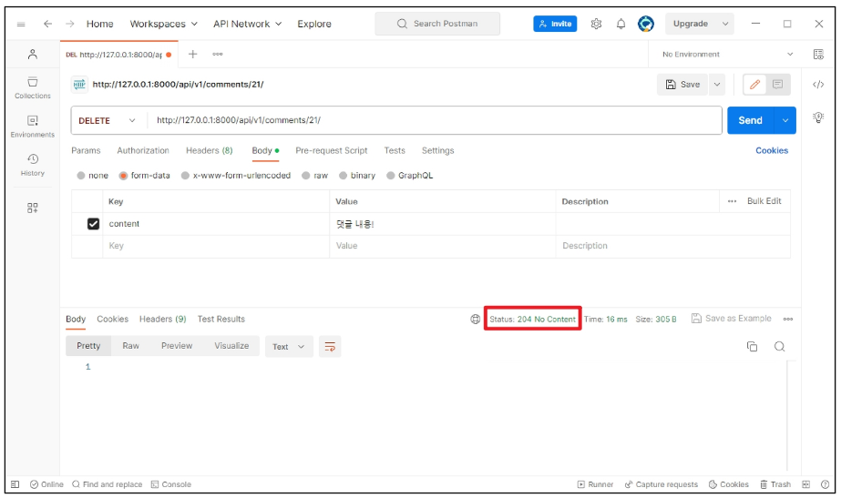

  - PUT [http://127.0.0.1:8000/api/v1/comments/1/](http://127.0.0.1:8000/api/v1/comments/1/) 응답 확인

    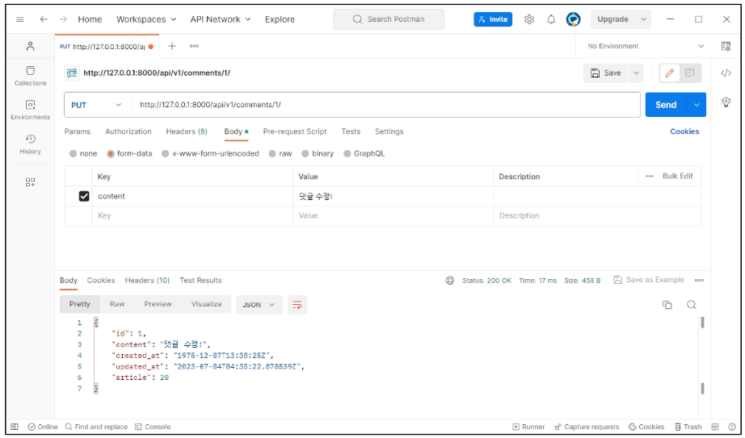

### 응답 데이터 재구성

- 댓글 조회 시 게시글 출력 내역 변경

  - 댓글 조회 시 게시글 번호만 제공해주는 것이 아닌 **'게시글의 제목'까지 제공**하기

    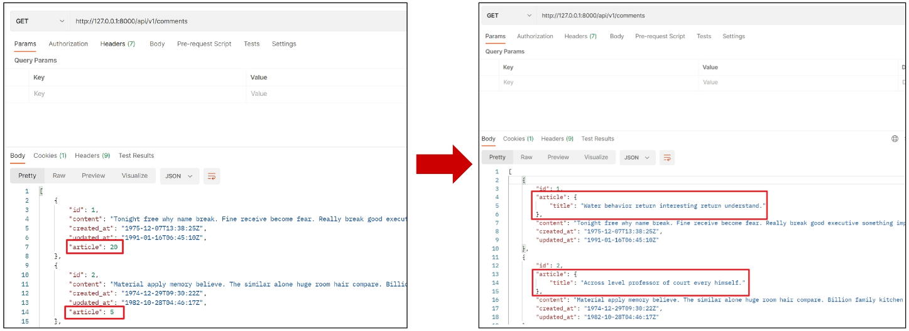

  - 필요한 데이터를 만들기 위한 Serializer는 내부에서 추가 선언이 가능

    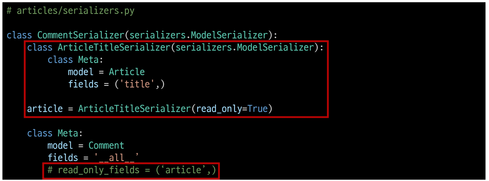

  - GET [http://127.0.0.1:8000/api/v1/comments/1/](http://127.0.0.1:8000/api/v1/comments/1/) 응답 확인

    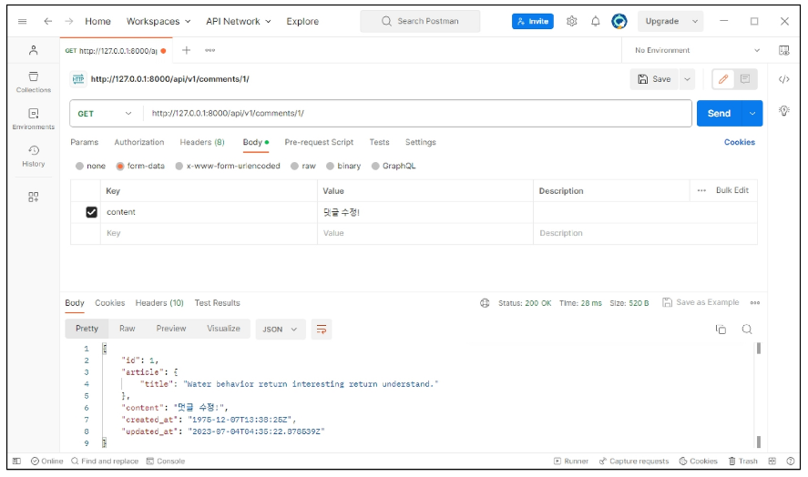

## 역참조 데이터 구성

- Article → Comment 간 역참조 관계를 활용한 JSON 데이터 재구성

      - 아래 2가지 사항에 대한 데이터 재구성하기

        1. 단일 게시글 조회 시 해당 게시글에 작성된 댓글 목록도 함께 붙여서 응답

        2. 단일 게시글 조회 시 해당 게시글에 작성된 댓글 개수도 함께 붙여서 응답

### 단일 게시글 + 댓글 목록

- Nested relationships (역참조 매니저 활용)

  - 모델 관계 상으로 참조하는 대상은 참조되는 대상의 표현에 포함되거나 중첩될 수 있음

  - 이러한 중첩된 관계는 serializers를 필드로 사용하여 표현 가능

    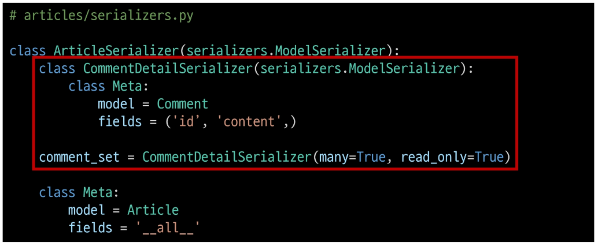

- GET [http://127.0.0.1:8000/api/v1/articles/2/](http://127.0.0.1:8000/api/v1/articles/2/) 응답 확인

  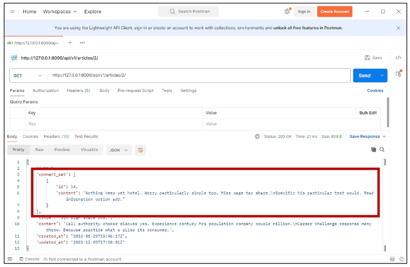

### 단일 게시글 + 댓글 개수

- 댓글 개수에 해당하는 새로운 필드 생성

  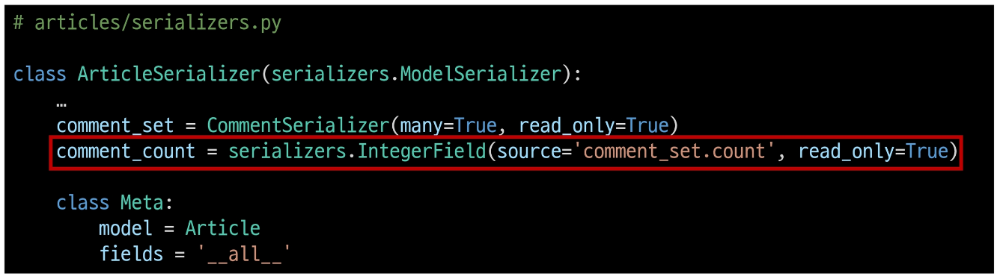

- GET [http://127.0.0.1:8000/api/v1/articles/3/](http://127.0.0.1:8000/api/v1/articles/3/) 응답 확인

  

- 'source' arguments

  - 필드를 채우는 데 사용할 속성의 이름

  - 점 표기법(dotted notation)을 사용하여 속성을 탐색할 수 있음

    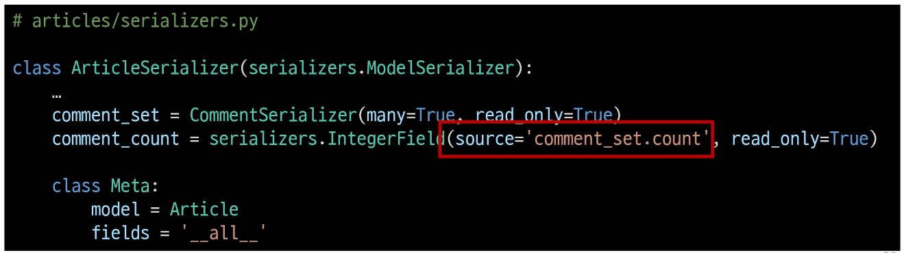

### 읽기 전용 필드

## API 문서화

### 문서화 활용

## 참고

### 올바르게 404 응답하기

### 복잡한 ORM 활용