# 2024년 10월 21일(월) 수업 내용 정리 - DOM

- History of JavaScript

  - 웹 브라우저와 JavaScript
  - ECMAScript

- 변수

  - 변수 작성 규칙
  - 변수 선언 키워드

- DOM

  - document 객체

- DOM 선택

  - 선택 메서드

- DOM 조작

  - 속성 조작
  - HTML 콘텐츠 조작
  - DOM 요소 조작
  - style 조작

- 참고

  - DOM 속성 확인 Tip
  - 용어 정리
  - 세미콜론
  - var
  - 호이스팅

## History of JavaScript

### 웹 브라우저와 JavaScript

- 웹의 탄생 (1990)

  - Tim Berners-Lee 경이 WWW, 하이퍼텍스트 시스템 고안하여 개발

  - URL, HTTP 최초 설계 및 구현

  - 초기의 웹은 정적인 텍스트 페이지만을 지원

- 웹 브라우저의 대중화 (1993)

  - Netscape 사의 최초 상용 웹 브라우저인 Netscape Navigator 출시

  - 당시 약 90% 이상의 시장 점유율을 가짐

  - Netscape 사는 웹의 동적인 기능을 만들기 위한 프로젝트를 시작

    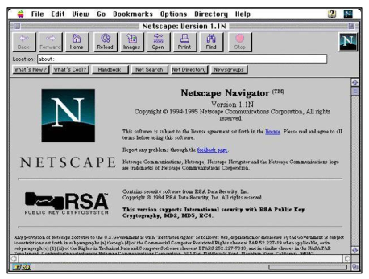

- JavaScript의 탄생 (1995)

  - 당시 Netscape 소속 개발자 Brendan Eich는 웹의 동적 기능 개발이라는 회사의 요구사항을 넘어 스크립트 언어 Mocha를 개발

  - 이후 LiveScript로 이름을 변경했으나 당시 가장 인기있던 프로그래밍 언어인 Java의 명성에 기대보고자 JavaScript로 이름을 변경

  - JavaScript는 Netscape Navigator 2.0에 탑재되어 웹 페이지에 동적 기능을 추가하는 데 사용됨

- JavaScript 파편화 (1996)

  - 그런데 Microsoft가 자체 웹 브라우저인 인터넷 익스플로러(IE) 3.0에 JavaScript와 유사한 언어인 JScript를 도입

  - 이 과정에서 많은 회사들이 독자적으로 JavaScript를 변경하고 이를 자체 브라우저에 탑재

  - JavaScript 파편화의 시작

- 1차 브라우저 전쟁 (1995-2001)

  

  - Microsoft는 IE를 자사 윈도우 운영체제에 내장하여 무료로 배포

  - 빌 게이츠를 필두로 한 Microsoft의 공격적인 마케팅, 자금력 그리고 압도적인 윈도우 운영체제 점유율 앞에 Netscape는 빠르게 몰락하기 시작

  - 결국 IE의 시장 점유율은 2002년 약 96%에 달하며 Microsoft가 승리

  - 추후 Brandon Eich와 함께 Netscape에 나온 핵심 개발진은 모질라 재단을 설립하여 Firefox 브라우저를 출시 (2003)

- 1차 브라우저 전쟁의 영향

  - 웹 표준의 부재로 인해 각 기업에서 자체 표준을 확립하려는 상황 발생

  - 이는 웹 개발자들에게 큰 혼란을 주었으며, 결국 웹 표준의 중요성을 인식하는 계기가 됨

- ECMAScript 출시 (1997)

  - JavaScript의 파편화를 막기 위해 Netscape사는 ECMA 재단에 웹 표준 제작을 요청

  - ECMA에서 ECMAScript라는 표준 언어를 정의하여 발표 (1997)

  - 이때부터 JavaScript는 ECMAScript 표준에 기반을 두고 발전하기 시작

    

- 2차 브라우저 전쟁 (2004-2017)

  

  - 웹 표준이 정의되었지만 당시 가장 높은 점유율을 가진 IE는 웹 표준을 지키지 않았고 독자적인 규격을 유지하며 웹 시장을 주도

  - IE에 독주에 대한 Firefox의 대항

    - 2008년까지 30% 점유율 차지

    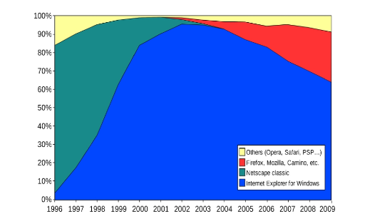

- Chrome 브라우저의 등장 (2008)

  

  - Google의 Chrome 브라우저 출시

  - Chrome은 출시 3년 만에 Firefox의 점유율을 넘어서고 그로부터 반년 뒤 IE의 점유율을 넘어섬

- Chrome이 우위를 점하게 된 이유

  - 빠른 성능, 다양한 플랫폼 지원, 보안, Google 생태계 통합 등 다양한 이유가 있지만 가장 중요했던 역할은 바로 "적극적인 웹 표준 준수"

  - 호환성

    - 웹 표준을 준수함으로써, 사용자들은 브라우저 간에 일관된 웹 페이지를 볼 수 있게 됨

    - 이는 다양한 플랫폼 및 기기에서 웹 사이트가 일관되게 동작할 수 있음을 의미

  - 개발자 도구

    - 웹 개발자를 위한 강력한 도구를 제공하여 웹 애플리케이션을 개발하는 데 도움

- 2차 브라우저 전쟁의 영향

  - Chrome이 웹 표준을 준수하고 새로운 웹 기술을 적극적으로 채택함으로써, 다른 브라우저 제조사들도 웹 표준 준수에 대한 중요성을 인식하고 이에 따라 웹 표준을 채택하는 데 더 많은 노력을 기울이게 됨

  - 웹의 기능이 크게 확장되며 웹 애플리케이션의 비약적인 발전을 이끌어 감

  - 웹의 기술적 발전과 웹 표준의 중요성
  

### ECMAScript

- ECMAScript

  - Ecma International이 정의하고 있는 표준화된 스크립트 프로그래밍 언어 명세

  - 스크립트 언어가 준수해야 하는 규칙, 세부사항 등을 제공

- ECMAScript와 JavaScript

  - JavaScript는 ECMAScript 표준을 구현한 구체적인 프로그래밍 언어

  - ECMAScript의 명세를 기반으로 하여 웹 브라우저나 Node.js와 같은 환경에서 실행됨

  - ECMAScript는 JavaScript의 표준이며, JavaScript는 ECMAScript 표준을 따르는 구체적인 프로그래밍 언어

  - ECMAScript는 언어의 핵심을 정의하고, JavaScript는 ECMAScript 표준을 따라 구현된 언어로 사용됨

- ECMAScript의 역사

  - ECMAScript 5(ES5)에서 안정성과 생산성을 크게 높임(2009)

  - ECMAScript 2015(ES6)에서 객체지향 프로그래밍 언어로써 많은 발전을 이루어, 역사상 가장 중요한 버전으로 평가됨(2015)

    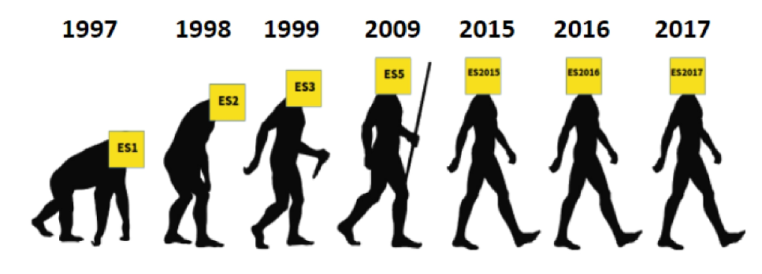

- JavaScript의 현재

  - 현재는 Chrome, Firefox, Safari, Microsoft Edge 등 다양한 웹 브라우저가 경쟁하고 있으며, 모바일 등 시장이 다양화 되어있음

  - 기존에 JavaScript는 브라우저에서만 웹 페이지의 동적인 기능을 구현하는 데에만 사용되었음

    - 예를 들어, 사용자의 입력에 따라 웹 페이지의 내용이 동적으로 변경되거나, 애니메이션 효과가 적용되는 등의 기능

  - 이후 Node.js(2009 출시)로 인해 브라우저 외부에서도 실행 가능해져 서버 사이드 개발에도 사용되기 시작함

  - 다양한 프레임워크와 라이브러리들이 개발되면서, 웹 개발 분야에서는 필수적인 언어로 자리 잡게 됨

## 변수

- JavaScript 문법 학습

  - ECMAScript 2015(ES6) 이후의 명제를 따름

  - 권장 스타일 가이드

    - [https://standardjs.com/rules-kokr.html](https://standardjs.com/rules-kokr.html)

### 변수 작성 규칙

- 식별자(변수명) 작성 규칙

  - 반드시 문자, 달러('$') 또는 밑줄('_')로 시작

  - 대소문자를 구분

  - 예약어 사용 불가

    - for, if, function 등

- 식별자(변수명) Naming case

  - 카멜 케이스(CamelCase)

    - 변수, 객체, 함수에 사용

  - 파스칼 케이스(PascalCase)

    - 클래스, 생성자에 사용

  - 대문자 스네이크 케이스(SNAKE_CASE)

    - 상수(constants)에 사용

### 변수 선언 키워드

- 변수 선언 키워드 3가지

  1. let

  2. const

- let

  - 블록 스코프(block scope)를 갖는 지역 변수를 선언

  - 재할당 가능

  - 재선언 불가능

  - ES6에서 추가

    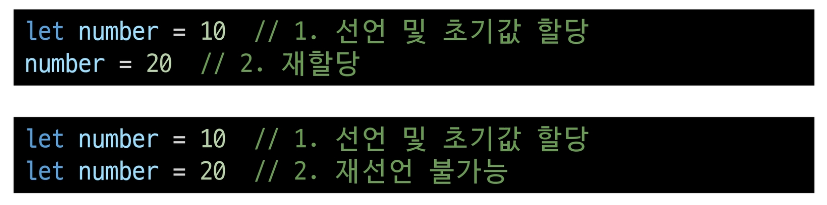

- const

  - 블록 스코프를 갖는 지역 변수를 선언

  - 재할당 불가능

  - 재선언 불가능

  - ES6에서 추가

    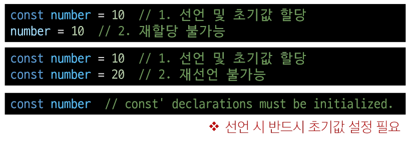

- 블록 스코프(block scope)

  - if, for, 함수 등의 **'중괄호({}) 내부'**를 가리킴

  - 블록 스코프를 가지는 변수는 블록 바깥에서 접근 불가능

    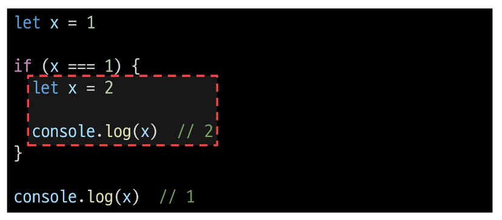

- 어떤 변수 선언 키워드를 사용해야 할까?

  - const를 기본으로 사용

  - 필요한 경우에만 let으로 전환

    - 재할당이 필요한 경우

    - let을 사용하는 것은 해당 변수가 의도적으로 변경될 수 있음을 명확히 나타냄

    - 코드의 유연성을 확보하면서도 const의 장점을 최대한 활용할 수 있음

- const를 기본으로 사용해야 하는 이유

      - 코드의 의도 명확화

        - 해당 변수가 재할당되지 않을 것임을 명확히 표현

        - 개발자들에게 변수의 용도와 동작을 더 쉽게 이해할 수 있게 해줌

      - 버그 예방

        - 의도치 않은 변수 값 변경으로 인한 버그를 예방
        
        - 큰 큐모의 프로젝트나 팀 작업에서 중요

## DOM

- 웹 브라우저에서의 JavaScript

  - 웹 페이지의 동적인 기능을 구현

- JavaScript 실행 환경 종류

  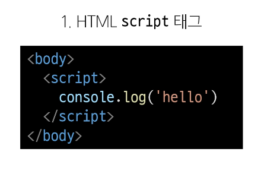

  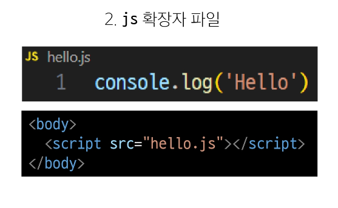

  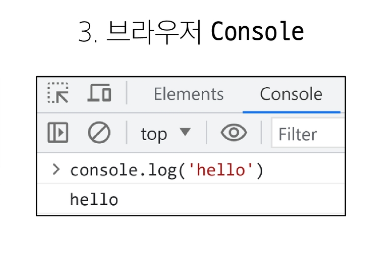

- DOM(The Document Object Model)

  - 웹 페이지(Document)를 구조화된 객체로 제공하여 프로그래밍 언어가 페이지 구조에 접근할 수 있는 방법을 제공

  - 문서 구조, 스타일, 내용 들을 변경할 수 있도록 함

- DOM API

  - 다른 프로그래밍 언어가 웹 페이지에 접근 및 조작할 수 있도록 페이지 요소들을 객체 형태로 제공하며 이에 따른 메서드 또한 제공

    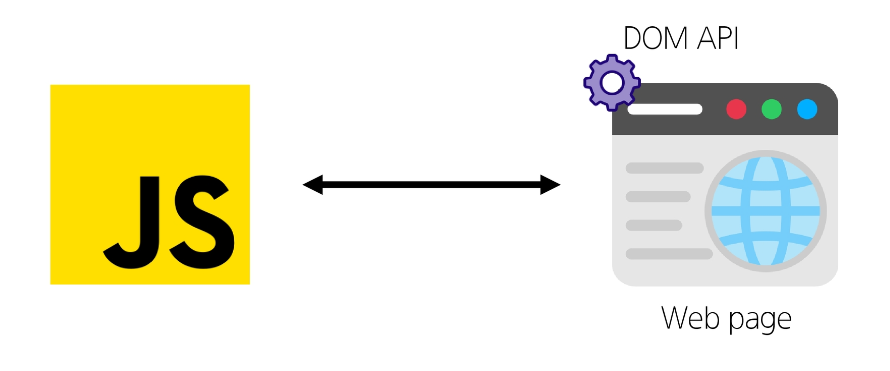

- DOM 특징

  - DOM에서 모든 요소, 속성, 텍스트는 하나의 객체

  - 모두 document 객체의 하위 객체로 구성됨

    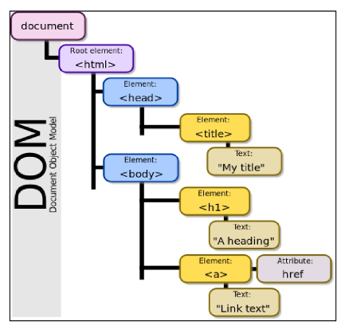

- DOM tree

  - 브라우저는 HTML 문서를 해석하여 DOM tre라는 객체 트리로 구조화

  - 객체 간 상속 구조가 존재

    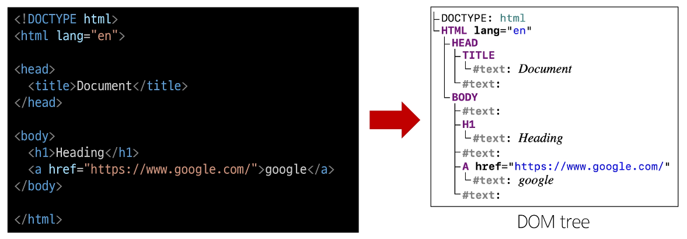

- 브라우저가 웹 페이지를 불러오는 과정

  - 웹 페이지는 웹 브라우저를 통해 해석되어 웹 브라우저 화면에 나타남

    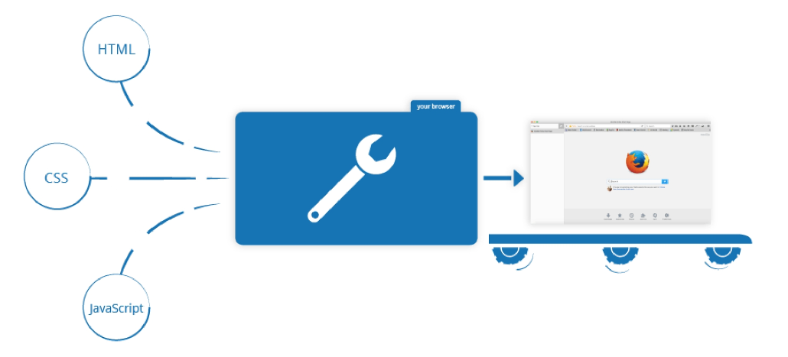

- DOM 핵심

  - 문서의 요소들을 객체로 제공하여 다른 프로그래밍 언어에서 접근하고 조작할 수 있는 방법을 제공하는 API

### document 객체

- 'document' 객체

  - 웹 페이지 객체

  - DOM Tree의 진입점

  - 페이지를 구성하는 모든 객체 요소를 포함

    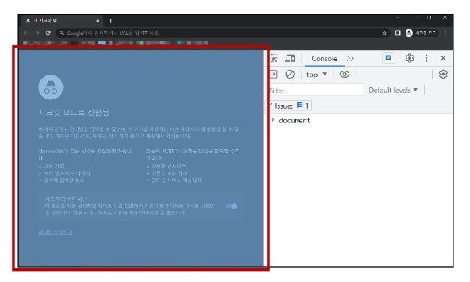

- 'document' 객체 예시

  - HTML의 title 변경하기

    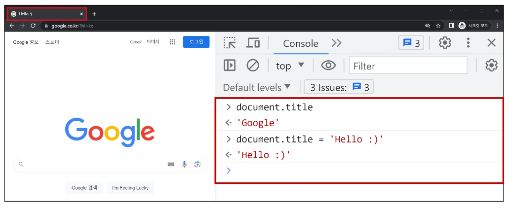

## DOM 선택

- DOM 조작 시 기억해야 할 것

  

  - 조작 순서

    1. 조작하고자 하는 요소를 **선택** (또는 탐색)

    2. 선택된 요소의 콘텐츠 또는 속성을 **조작**

### 선택 메서드

- 선택 메서드

      - document.querySelector()

        - 요소 한 개 선택
      
      - document.querySelectorAll()

        - 요소 여러 개 선택

- document.**querySelector(selector)**

      - 제공한 선택자와 일치하는 element 한 개 선택

      ⇨ 제공한 선택자를 만족하는
        첫 번째 element 객체를 반환 (없다면 null 반환)

- document.**querySelectorAll(selector)**

      - 제공한 선택자와 일치하는 여러 element를 선택

      ⇨ 제공한 선택자를 만족하는 NodeList를 반환

- DOM 선택 실습

  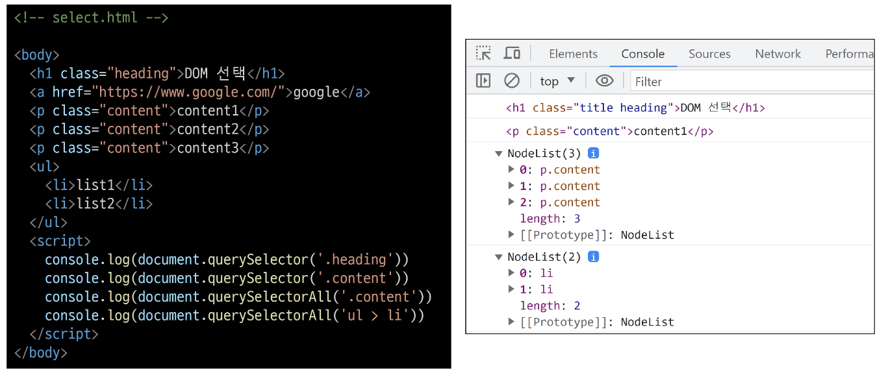

## DOM 조작

- DOM 조작

      1. 속성(attribute) 조작

        - 클래스 속성 조작

        - 일반 속성 조작

      2. HTML 콘텐츠 조작

      3. DOM 요소 조작

      4. 스타일 조작

### 속성 조작

- 속성 조작

      1. 클래스 속성 조작

      2. 일반 속성 조작

- 클래스 속성 조작

  - 'classList' **property**

    - 요소의 클래스 목록을 DOM TokenList(유사 배열) 형태로 반환

1. classList 메서드

  - element.classList.**add()**

    - 지정한 클래스 값을 추가

  - element.classList.**remove()**

    - 지정한 클래스 값을 제거

  - element.classList.**toggle()**

    - 클래스가 존재한다면 제거하고 false를 반환(존재하지 않으면 클래스를 추가하고 true를 반환)

- 클래스 속성 조작 실습

  - add()와 remove() 메서드를 사용해 지정한 클래스 값을 추가 혹은 제거

    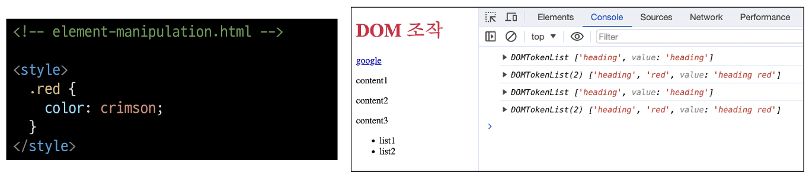

    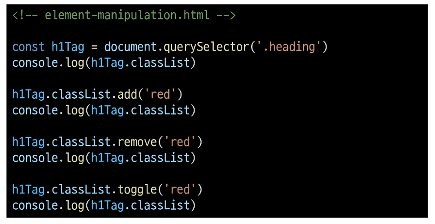

2. 일반 속성 조작 메서드

  - Element.**getAttribute()**

    - 해당 요소에 지정된 값을 반환 (조회)

  - Element.**setAttribute(name, value)**

    - 지정된 요소의 속성 값을 설정

    - 속성이 이미 있으면 기존 값을 갱신 (그렇지 않으면 지정된 이름과 값으로 새 속성이 추가)

  - Element.**removeAttribute()**

    - 요소에서 지정된 이름을 가진 속성 제거

- 일반 속성 조작 실습

  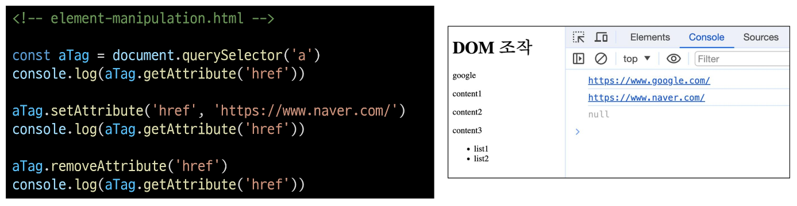

### HTML 콘텐츠 조작

- HTML 콘텐츠 조작

  - 'textContent' **property**

    - 요소의 텍스트 콘텐츠를 표현

      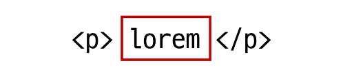

- HTML 콘텐츠 조작 실습

  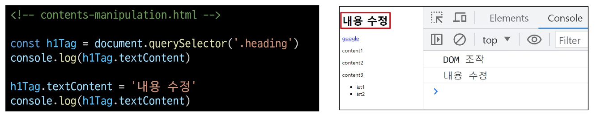

### DOM 요소 조작

- DOM 요소 조작 메서드

  - document.**createElement(tagName)**

    - 작성한 tagName의 HTML 요소를 생성하여 반환

  - Node.**appendChild()**

    - 한 Node를 특정 부모 Node의 자식 NodeList 중 마지막 자식으로 삽입

    - 추가된 Node 객체를 반환

  - Node.**removeChild()**

    - DOM에서 자식 Node를 제거

    - 제거된 Node를 반환

- DOM 요소 조작 실습

  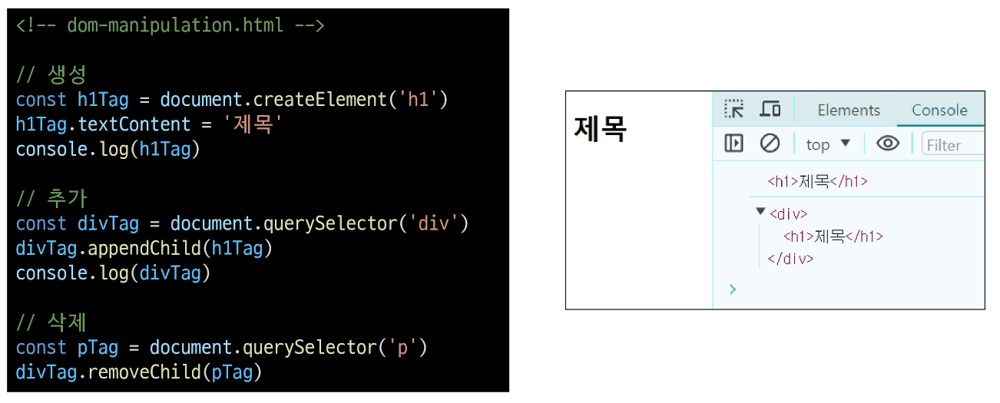

### style 조작

- style 조작

  - 'style' **property**

    - 해당 요소의 모든 style 속성 목록을 포함하는 속성

- style 조작 실습

  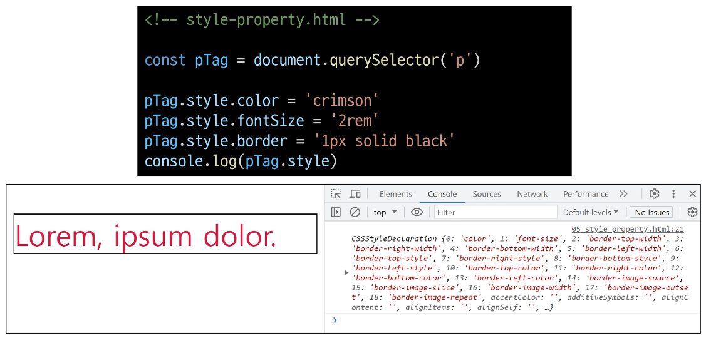

## 참고

### DOM 속성 확인 Tip

- DOM 속성 확인 Tip

  - 개발자도구 - Elements - Properties

  - 선택한 해당 요소의 모든 DOM 속성 확인 가능

    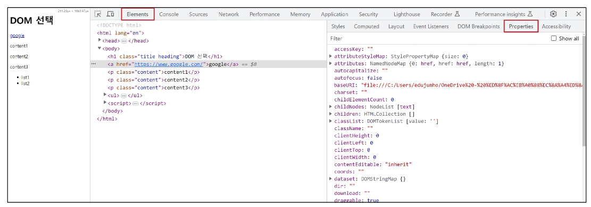

### 용어 정리

- Node

  - DOM의 기본 구성 단위

  - DOM 트리의 각 부분은 Node라는 객체로 표현됨

    - Document Node ⇒ HTML 문서 전체를 나타내는 노드

    - Element Node ⇒ HTML 요소를 나타내는 노드 (예를 들어 \
)

    - Text Node ⇒ HTML 텍스트 (Element Node의 내 텍스트 컨텐츠를 나나탬)

    - Attribute Node ⇒ HTML 요소의 속성을 나타내는 노드

### 세미콜론

### var

### 호이스팅