# 2024년 10월 22일(화) 수업 내용 정리 - Basic Syntax

- 데이터 타입

  - 원시 자료형

- 연산자

- 조건문

- 반복문

  - for_in
  - for_of
  - for_in과 for_of

- 참고

  - NaN 예시
  - null & undefined

## 데이터타입

  |원시 자료형 (Primitive type)|참조 자료형 (Reference type)|
  |:--:|:--:|
  |Nuber, String, Boolean null, undefined|Objects (Object, Array, Function)|
  |변수에 값이 저장되는 자료형 (불변, 값이 복사)|객체의 주소가 저장되는 자료형 (가변, 주소가 복사)|
   

- 원시 자료형 예시

  - 변수에 할당될 때 값이 복사됨

  - 변수 간에 서로 영향을 미치지 않음

    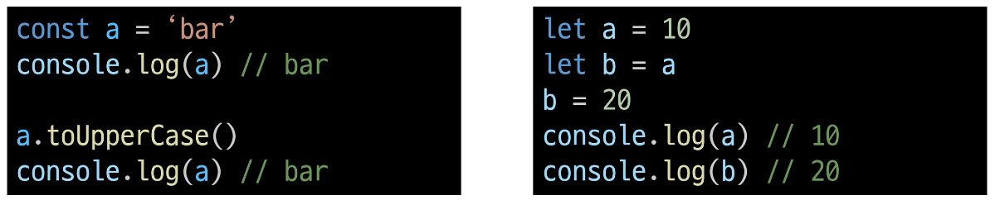

- 참조 자료형 예시

  - 객체를 생성하면 객체의 메모리 주소를 변수에 할당

  - 변수 간에 서로 영향을 미침

    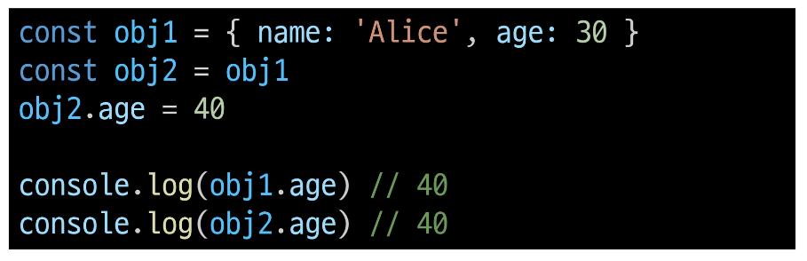

### 원시 자료형

- 원시 자료형 종류

      - Number

      - String

      - null

      - undefined

      - Boolean

- Number

  - 정수 또는 실수형 숫자를 표현하는 자료형

- Number 예시

  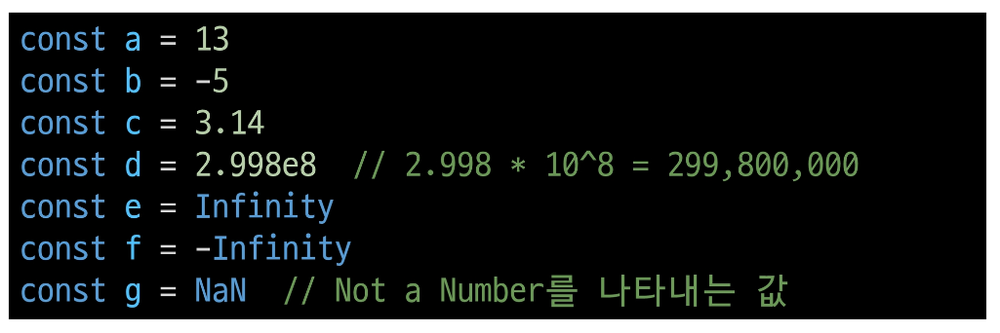

- String

  - 텍스트 데이터를 표현하는 자료형

- String 예시

  - '+' 연산자를 사용해 문자열끼리 결합

  - 뺄셈, 곱셈, 나눗셈 불가능

    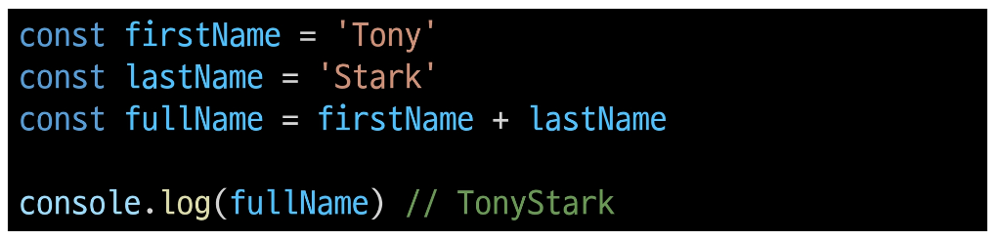

- Template literals (템플릿 리터럴)

  - 내장된 표현식을 허용하는 문자열 작성 방식

  - Backtick(``)을 이용하며, 여러 줄에 걸쳐 문자열을 정의할 수도 있고 JavaScript의 변수를 문자열 안에 바로 연결할 수 있음

  - 표현식은 **'$'** 와 중괄호 (**{expression}**) 로 표기

  - ES6+ 부터 지원

    

- null 과 undefined

  |null|undefined|
  |:--:|:--:|
  |프로그래머가 의도적으로 '값이 없음'을 나타낼 때 사용|시스템이나 JavaScript 엔진이 '값이 할당되지 않음'을 나타낼 때 사용|
  |||
   

- Boolean

  - true / false

  - 조건문 또는 반복문에서 Boolean이 아닌 데이터 타입은 "자동 형변환 규칙"에 따라 **true** 또는 **false** 로 변환됨

- 자동 형변환

  |데이터 타입|false|true|
  |:--:|:--:|:--:|
  |undefined|항상 false|X|
  |null|항상 false|X|
  |Number|0, -0, NaN|나머지 모든 경우|
  |String|' ' (빈 문자열)|나머지 모든 경우|
   

## 연산자

- 할당 연산자

  - 오른쪽에 있는 피연산자의 평가 결과를 왼쪽 피연산자에 할당하는 연산자

  - 단축 연산자 지원

    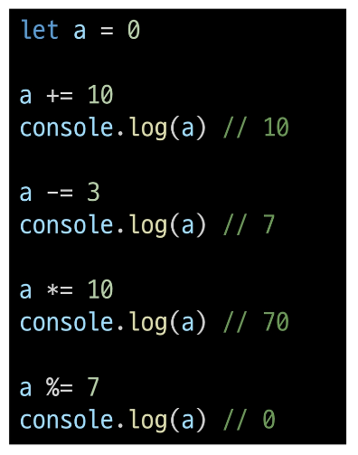

- 증가 & 감소 연산자

  - 증가 연산자 ('++')

    - 피연산자를 증가(1을 더함)시키고 연산자의 위치에 따라 증가하는 전이나 후의 값을 반환

  - 감소 연산자 ('--')

    - 피연산자를 감소(1을 뺌)시키고 연산자의 위치에 따라 감소하기 전이나 후의 값을 반환

  - '+=' 또는 '-='와 같이 더 명시적인 표현으로 작성하는 것을 권장

    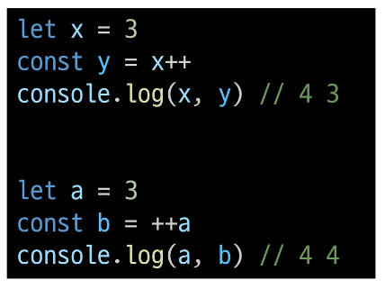

- 비교 연산자

  - 피연산자들(숫자, 문자, Boolean 등)을 비교하고 결과 값을 boolean으로 반환하는 연산자

    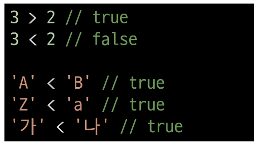

- 동등 연산자(==)

  - 두 피연산자가 같은 값으로 평가되는지 비교 후 boolean 값을 반환

  - '암묵적 타입 변환' 통해 타입을 일치시킨 후 같은 값인지 비교

  - 두 피연산자가 모두 객체일 경우 메모리의 같은 객체를 바라보는지 판별

    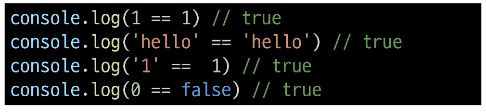

- 일치 연산자(===)

  - 두 피연산자의 값과 타입이 모두 같은 경우 true를 반환

  - 같은 객체를 가리키거나, 같은 타입이면서 같은 값인지를 비교

  - 엄격한 비교가 이뤄지며 암묵적 타입 변환이 발생하지 않음

  - 특수한 경우를 제외하고는 동등 연산자가 아닌 **일치 연산자 사용 권장**

    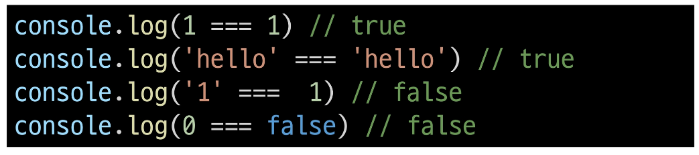

- 논리 연산자

  - and 연산

    - &&

  - or 연산

    - ||
  
  - not 연산

    - !

  - 단축 평가 지원

    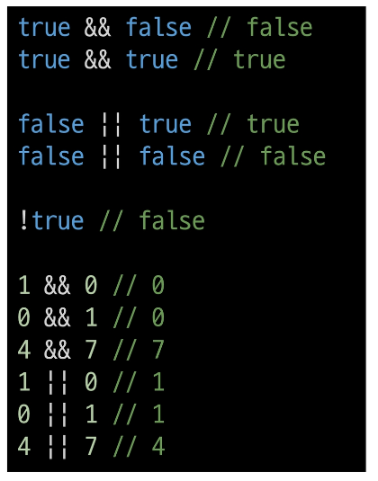
  

## 조건문

- if

  - 조건 표현식의 결과값을 boolean 타입으로 변환 후 참/거짓을 판단

- if 예시

  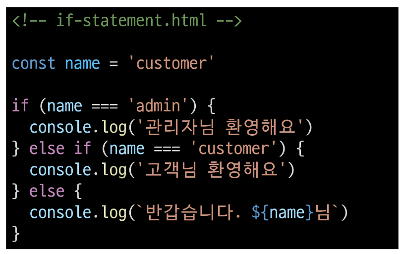

- 삼항 연산자

  

  - condition

    - 평가할 조건 (true 또는 false로 평가)

  - expression1

    - 조건이 true일 경우 반환할 값 또는 표현식

  - expression2

    - 조건이 false일 경우 반환할 값 또는 표현식

- 삼항 연산자 예시

  - 간단한 조건부 로직을 간결하게 표현할 때 유용

  - 복잡한 로직이나 대다수의 경우에는 가독성이 떨어질 수 있으므로 적절한 상황에서만 사용할 것

    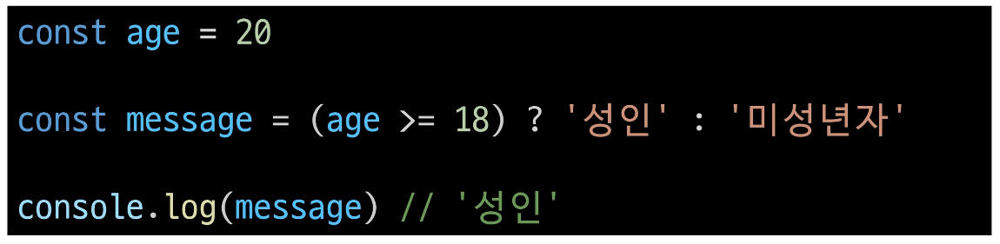
    

## 반복문

### for_in

### for_of

### for_in과 for_of

## 참고

### NaN 예시

### null & undefined
