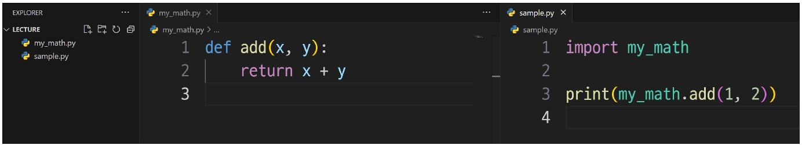
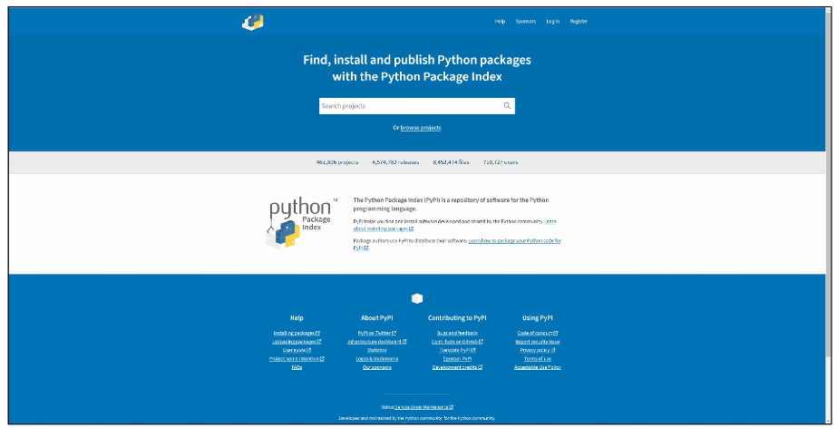
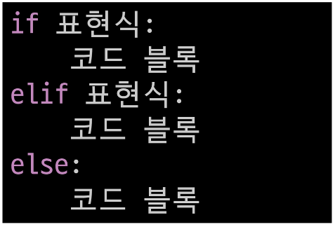
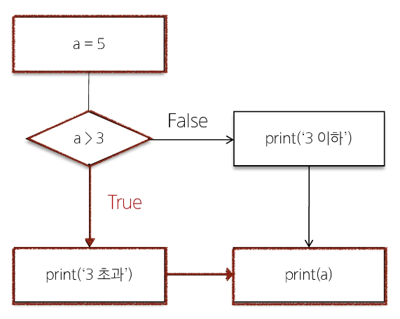

# 2024년 7월 18일 수업 내용 정리 - Functions 2

- 모듈

    - 모듈 활용
    - 사용자 정의 모듈


- 파이썬 표준 라이브러리

    - 패키지


- 제어문


- 조건문

    - if statement


- 반복문

    - for statement
    - while statement
    - 반복 제어
    - List Comprehension


- 참고

    - 모듈 내부 살펴보기
    - enumerate


## 모듈

- 개요

    - 과학자, 수학자가 모든 이론을 새로 만들거나 증명하지 않는 것처럼 개발자 또한 프로그램 전체를 모두 혼자 힘으로 작성하는 것은 드문 일

    - 다른 프로그래머가 이미 작성해 놓은 수천, 수백만 줄의 코드를 활용하는 것은 생산성에서 매우 중요한 일


- 모듈(Module)

    - 한 파일로 묶인 변수와 함수의 모음(특정한 기능을 하는 코드가 작성된 python 파일(.py))


- 모듈 예시

    - math 내장 모듈

        - python이 미리 작성해 둔 수학 관련 변수와 함수가 작성된 모듈

            ```python
            import math

            print(math.pi)  # 3.141592653589793

            print(math.sqrt(4)) # 2.0
            ```


### 모듈 활용

- 모듈을 가져오는 방법

    - import문 사용

        ```python
        import math
        print(math.sqrt(4))
        ```


    - from절 사용

        ```python
        from math import sqrt
        print(sqrt(4))
        ```


- 모듈 사용하기

    - '.(dot)' 연산자

        - '점의 왼쪽 객체에서 점의 오른쪽 이름을 찾아라'라는 의미

            ```python
            # 모듈명.변수명
            print(math.pi)

            # 모듈명.함수명
            print(math.sqrt(4))
            ```


- 모듈 주의사항

    - 서로 다른 모듈이 같은 이름의 함수를 제공할 경우 문제 발생


    - 마지막에 import된 이름으로 대체됨

        ```python
        from math import pi, sqrt
        from my_math import sqrt

        # 그래서 모듈 내 모든 요소를 한번에 import 하는 * 표기는 권장하지 않음
        from math import *
        ```


- 'as' 키워드

    - as 키워드를 사용하여 별칭(alias)을 부여
        - 두 개 이상의 모듈에서 동일한 이름의 변수, 함수 클래스 등을 가져올 때 발생하는 이름 충돌 해결

            ```python
            from math import sqrt
            from my_math import sqrt as my_sqrt

            sqrt(4)
            my_sqrt(4)
            ```


### 사용자 정의 모듈

- 직접 정의한 모듈 사용하기

    1. 모듈 my_math.py 작성

    2. 두 수의 합을 구하는 add 함수 작성

    3. my_math 모듈 import 후 add 함수 호출

        


## python 표준 라이브러리

- Python 표준 라이브러리(Python Standard Library)

    - python 언어와 함께 제공되는 다양한 모듈과 패키지의 모음


### 패키지

- 패키지(Package)

    - 연관된 모듈들을 하나의 디렉토리에 모아 놓은 것


- 패키지 사용하기

    - 아래와 같은 디렉토리 구조로 작성

    - 패키지 3개 : my_package, math, statistics

    - 모듈 2개 : my_math, tools

        


    - 각 패키지의 모듈을 import 하여 사용하기

        ```python
        # sample.py

        from my_package.math import my_math
        from my_package.statistics import tools

        print(my_math.add(1, 2))    # 3
        print(tools.mod(1, 2))  # 1
        ```


- PSL 내부 패키지
    - 설치 없이 바로 import하여 사용

- 외부 패키지
    - pip를 사용하여 설치 후 import 필요


- pip

    - 외부 패키지들을 설치하도록 도와주는 python의 패키지 관리 시스템


- python 패키지 관리자(pip)

    - PyPI(Python Package Index)에 저장된 외부 패키지들을 설치

        


- 패키지 설치

    - 최신 버전/특정 버전/최소 버전을 명시하여 설치할 수 있음

        ```bash
        $ pip install SomePackage
        $ pip install SomePackage==1.0.5
        $ pip install SomePackage>=1.0.4
        ```


- requests 외부 패키지 설치 및 사용 예시

    ```bash
    $ pip install requests
    ```

    ```python
    import requests


    url = 'https://random-data-api.com/api/v2/users'
    response = requests.get(url).json()

    print(response)
    ```


- 패키지 사용 목적

    - 모듈들의 이름공간을 구분하여 충돌을 방지, 모듈들을 효율적으로 관리하고 재사용할 수 있도록 돕는 역할


## 제어문

- 제어문(Control Statement)

    - 코드의 실행 흐름을 제어하는 데 사용되는 구문, **조건**에 따라 코드 블록을 실행하거나 **반복**적으로 코드를 실행


- 제어문

    - 조건문
        - if, elif, else

    - 반복문
        - for, while

    - 반복문 제어
        - break, continue, pass


## 조건문

- 조건문(Conditional Statement)

    - 주어진 조건식을 평가하여 해당 조건이 참(True)인 경우에만 코드 블록을 실행하거나 건너뜀(if, elif, else)


### if statement

- if statement의 기본 구조

    


- 조건문 예시

    ```python
    a = 5

    if a > 3:
        print('3 초과')
    else:
        print('3 이하')

    print(a)
    ```

    


- 복수 조건문

    - 조건식을 동시에 검사하는 것이 아니라 "순차적"으로 비교

        ```python
        dust = 35

        if dust > 150:
            print('매우 나쁨')
        elif dust > 80:
            print('나쁨')
        elif dust > 30:
            print('보통')
        else:
            print('좋음')
        ```


- 중첩 조건문

    ```python
    dust = 35

    if dust > 150:
        print('매우 나쁨')
        if dust > 300:
            print('위험해요! 나가지 마세요!')
    elif dust > 80:
        print('나쁨')
    elif dust > 30:
        print('보통')
    else:
        print('좋음')
    ```


## 반복문

- 반복문(Loop Statement)

    - 주어진 코드 블록을 여러 번 반복해서 실행하는 구문

        - for : 특정 작업을 반복적으로 수행

        - while : 주어진 조건이 참인 동안 반복해서 실행


### for statement

- for

    - 임의의 시퀀스의 항목들을 그 시퀀스에 들어있는 순서대로 반복

        ```python
        for 변수 in 반복 가능한 객체:
            코드 블록
        ```
        - for statement의 기본 구조


- 반복 가능한 객체(iterable)

    - 반복문에서 순회할 수 있는 객체(시퀀스 객체 뿐만 아니라 dict, set 등도 포함)


- for 문 작동원리

    - 리스트 내 첫 항목이 반복 변수에 할당되고 코드 블록이 실행

    - 다음으로 반복 변수에 리스트의 2번째 항목이 할당되고 코드 블록이 다시 실행

    - 마지막으로 반복 변수에 리스트의 마지막 요소가 할당되고 코드 블록이 실행

        ```python
        items = ['apple', 'banana', 'coconut']

        for item in items:
            print(item)

        """
        apple
        banana
        coconut
        """
        ```


- 문자열 순회

    ```python
    country = 'Korea'

    for char in country:
        print(char)
    
    """
    K
    o
    r
    e
    a
    """
    ```


- range 순회

    ```python
    for i in range(5):
        print(i)

    """
    0
    1
    2
    3
    4
    """
    ```


- 딕셔너리 순회

    ```python
    my_dict = {
        'x': 10,
        'y': 20,
        'z': 30,
    }

    for key in my_dict:
        print(key)
        print(my_dict[key])

    """
    x
    10
    y
    20
    z
    30
    """
    ```


- 인덱스로 리스트 순회

    - 리스트의 요소가 아닌 인덱스로 접근하여 해당 요소들을 변경하기

        ```python
        numbers = [4, 6, 10, -8, 5]

        for i in range(len(numbers)):
            numbers[i] = numbers[i] * 2

        print(numbers)  # [8, 12, 20, -16, 10]
        ```


- 중첩된 반복문

    - 안쪽 반복문은 outers 리스트의 각 항목에 대해 한 번씩 실행됨

    - print가 호출되는 횟수 ⇒ len(outers) * len(inners)

        ```python
        outers = ['A', 'B']
        inners = ['c', 'd']

        for outer in outers:
            for inner in inners:
                print(outer, inner)
        
        """
        A c
        A d
        B c
        B d
        """
        ```


- 중첩 리스트 순회

    - 안쪽 리스트 요소에 접근하려면 바깥 리스트를 순회함녀서 중첩 반복을 사용해 각 안쪽 반복을 순회

        ```python
        elements = [['A', 'B'], ['c', 'd']]

        for elem in elements:
            for item in elem:
                print(item)

        """
        A
        B
        c
        d
        """
        ```


### while statement

- while

    - 주어진 조건식이 참(True)인 동안 코드를 반복해서 실행(== 조건식이 거짓(False)이 될 때까지 반복)


- while statement의 기본 구조

    


- while 문 예시

    ```python
    a = 0

    while a < 3:
        print(a)
        a += 1

    print('끝')

    """
    0
    1
    2
    끝
    """
    ```


- 사용자 입력에 따른 반복

    - while문을 사용한 특정 입력 값에 대한 종료 조건 활용하기

        ```python
        number = int(input('양의 정수를 입력해주세요.: '))

        while number <= 0:
            if number < 0:
                print('음수를 입력했습니다.')
            else:
                print('0은 양의 정수가 아닙니다.')

            number = int(input('양의 정수를 입력해주세요.: '))

        print('잘했습니다!')
        ```


- while문은 반드시 **종료 조건**이 필요


- 적절한 반복문 활용하기

    - for

        - 반복 횟수가 명확하게 정해져 있는 경우에 유용

        - 예를 들어 리스트, 튜플, 문자열 등과 같은 시퀀스 형식의 데이터를 처리할 때

    - while

        - 반복 횟수가 불명확하거나 조건에 따라 반복을 종료해야 할 때 유용

        - 예를 들어 사용자의 입력을 받아서 특정 조건이 충족될 때까지 반복하는 경우


### 반복 제어

- for문과 while은 매 반복마다 본문 내 모든 코드를 실행하지만 때때로 일부만 실행하는 것이 필요할 때가 있음


- 반복문 제어 키워드

    - break

        - 반복을 즉시 중지

    - continue

        - 다음 반복으로 건너뜀

    - pass

        - 아무런 동작도 수행하지 않고 넘어감


- 반복문 제어 예시

    ```python
    # break

    for i in range(10):
        if i == 5:
            break
        print(i)    # 0 1 2 3 4
    ```

    ```python
    # continue

    for i in range(10):
        if i % 2 == 0:
            continue
        print(i)    # 1 3 5 7 9
    ```

    ```python
    # pass

    for i in range(10):
        pass    # 아무 작업도 안함
    ```


- break 예시

    - 프로그램 종료 조건 만들기

        ```python
        number = int(input('양의 정수를 입력해주세요.: ))

        while number <= 0:
            if number == -9999:
                print('프로그램을 종료합니다.')
                break

            if number < 0:
                print('음수를 입력했습니다.')
            else:
                print('0은 양의 정수가 아닙니다.')

            number = int(input('양의 정수를 입력해주세요.: '))

        print('잘했습니다!')
        ```


    - 리스트에서 첫번째 짝수만 찾은 후 반복 종료하기

        ```python
        numbers = [1, 3, 5, 6, 7, 9, 10, 11]
        found_even = False

        for num in numbers:
            if num % 2 == 0:
                print('첫 번째 짝수를 찾았습니다: ', num)
                found_even = True
                break
        
        if not found_even:
            print('짝수를 찾지 못했습니다.')
        ```


- continue 예시

    - 리스트에서 홀수만 출력하기

    - **현재 반복문의 남은 코드를 건너뛰고 다음 반복으로 넘어감**

        ```python
        numbers = [1, 2, 3, 4, 5, 6, 7, 8, 9, 10]

        for num in numbers:
            if num % 2 == 0:
                continue
            print(num)

        """
        1
        3
        5
        7
        9
        """
        ```


- pass 예시

    1. 코드 작성 중 미완성 부분
    
       - 구현해야 할 부분이 나중에 추가될 수 있고, 코드를 컴파일하는 동안 오류가 발생하지 않음

            ```python
            def my_function():
                pass
            ```


    2. 조건문에서 아무런 동작을 수행하지 않아야 할 때

        ```python
        if condition:
            pass    # 아무런 동작도 수행하지 않음
        else:
            # 다른 동작 수행
        ```


    3. 무한 루프에서 조건이 충족되지 않을 때 pass를 사용하여 루프를 계속 진행하는 방법

        ```python
        while True:
            if condition:
                break
            elif condition:
                pass    # 루프 계속 진행
            else:
                print('..')
        ```


### List Comprehension

- List Comprehension

    - 간결하고 효율적인 리스트 생성 방법


- List Comprehension 구조

    ```python
    [expression for 변수 in iterable]

    list(expression for 변수 in iterable)
    ```

    ```python
    [expression for 변수 in iterable if 조건식]

    list(expression for 변수 in iterable if 조건식)
    ```


- List Comprehension 사용 전/후 비교

    ```python
    # 사용 전
    numbers = [1, 2, 3, 4, 5]
    squared_numbers = []

    for num in numbers:
        squared_numbers.append(num**2)

    print(squared_numbers)  # [1, 4, 9, 16, 25]

    # 사용 후
    numbers = [1, 2, 3, 4, 5]

    squared_numbers = [num**2 for num in numbers]

    print(squared_numbers)  # [1, 4, 9, 16, 25]
    ```


- List Comprehension 활용 예시

    - 2차원 배열 생성 시(인접행렬 생성 시)

        ```python
        data1 = [[0] * 5 for _ in range(5)]

        # 또는
        data2 = [[0 for _ in range(5)] for _ in range(5)]

        """
        [[0, 0, 0, 0, 0],
         [0, 0, 0, 0, 0],
         [0, 0, 0, 0, 0],
         [0, 0, 0, 0, 0],
         [0, 0, 0, 0, 0]]
        """
        ```


- Comprehension을 남용하지 말자.


## 참고

### 모듈 내부 살펴보기

- 내장 함수 help를 사용해 모듈에 무엇이 들어있는지 확인 가능

    


### enumerate

- enumerate(iterable, start=0)

    - iterable 객체의 각 요소에 대해 인덱스와 함께 반환하는 내장함수


- enumerate 예시

    ```python
    fruits = ['apple', 'banana', 'cherry']

    for index, fruit in enumerate(fruits):
        print(f'인덱스 {index}: {fruit}')

    """
    인덱스 0: apple
    인덱스 1: banana
    인덱스 2: cherry
    """
    ```

---
## 모듈
- import문을 사용하여 모듈을 가져오는 방법이 더 명시적이다.
- 모듈을 모아 패키지, 패키지와 여러 모듈을 모아 라이브러리
- chrome 확장프로그램 ->  chrome 웹스토어 -> json formatter 검색 후 다운로드
- requests라이브러리에서 .json() 함수가 딕셔너리로 받게 해준다. 요청 응답 변환
- 모듈을 통해 협업할 수 있게 되었다.(import)
    - 긴 프로그램을 나누어 보관, 저장
    - 복잡한 프로그램을 여럿이 나누어 작성 가능

## 제어문
- flow control

## 조건문
- if
- elif
- else

## 반복문
### for문
- 반복문 작성 시 반복 변수를 직관적으로 알기 쉽게 작성하는 습관을 만들자
- 문자열도 sequence이므로 반복문 작성 가능하다.
- range()를 print하면 range로만 출력되지만, 반복은 가능하므로 반복문에 사용하면 된다.
- 반복문에 딕셔너리를 출력하면 기본적으로 key만 나오므로 value까지 출력하고 싶으면 key를 이용하면 된다.(혹은 .items()를 사용하면 value까지 받을 수 있다.)

### while문
- 주어진 조건식이 참인 동안(거짓일 될 때 까지) 코드를 반복해서 실행
- while문은 반드시 종료 조건(탈출 조건)이 필요하다.

### 반복 제어
- break
- continue
- pass
- found_even과 같은 변수를 flag variable이라고 부른다.

### List Comprehension
- 간결하고 효율적인 리스트 생성 방법
- 반복문 작성 시 임시변수를 설정하기 애매할 때 _(언더바)로 표현할 수 있다.
- List Comprehension은 리스트 생성이 목적이지 반복문을 간결하게 하는 것이 아니다.
- 남용하지 말자
- 리스트를 생성하는 방법 : loop, list comprehensioin, map

## 참고
### 모듈 내부 살펴보기
### enumerate
- enumerate(iterable, start=0)
- start는 기본인자(인덱스 번호로 사용 가능)

### computer world는 좌상단, 0에서 시작한다...