# 2024-08-29(목) APS 응용_1

- SW 문제 해결
- 복잡도 분석
- 표준 입출력 방법
- 진수
  
---

### `SW 문제 해결`

- SW 문제 해결 역량이란 무엇인가?

    - 프로그램을 하기 위한 많은 제약 조건과 요구사항을 이해하고 최선의 방법을 찾아내는 능력

    - 프로그래머가 사용하는 언어나 라이브러리, 자료구조, 알고리즘에 대한 지식을 적재적소에 퍼즐을 배치하듯 이들을 연결하여 큰 그림을 만드는 능력이라 할 수 있다.

    - 문제 해결 역량은 추상적인 기술이다.

        - 프로그래밍 언어, 알고리즘처럼 명확히 정의된 실체가 없다.
        - 무작정 알고리즘을 암기하고 문제를 풀어본다고 향상되지 않는다.

    - 문제 해결 역량을 향상시키기 위해서는 훈련이 필요하다.

- 문제 해결 과정

    1. 문제를 읽고 이해한다.
    2. 문제를 익숙한 용어로 재정의한다.
    3. 어떻게 해결할지 계획을 세운다.
    4. 계획을 검증한다.
    5. 프로그램으로 구현한다.
    6. 어떻게 풀었는지 돌아보고, 개선할 방법이 있는지 찾아본다.

#### 리스트에 숫자 넣기

    - 수 N을 받는다.
    - 윗 줄에는 N부터 1씩 증가되는 숫자 4개 왼쪽에 채운다.
    - 아랫 줄에는 N부터 1씩 감소되는 숫자 4개 오른쪽에 채운다.
    - 최종 결과를 출력한다. 빈 공간은 0으로 출력한다.

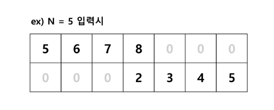

- 설계 예시

    - 2 X 7 크기의 0으로 채운 리스트를 준비한다.

    - 수 N을 입력 받는다.

    - t1 = N 대입 후, for 4번 돌려 T1 값을 리스트에 넣는다. range(0, 4)

    - t2 = N 대입 후, for 4번 돌려 T2 값을 리스트에 넣는다. range(6, 2, -1)

    - 리스트 출력

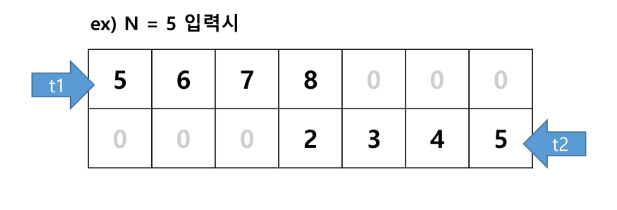

### [정리] SW 문제 해결

- SW 문제 해결 능력을 기르는 이유

    - 코딩을 더 잘하게 하는 능력을 기르기 위함.

    - SWEA 문제를 통해 기본문법 & 자료구조 & 알고리즘을 더 능숙하게 쓸 수 있도록 훈련한다.

- SWEA 문제를 잘 풀기 위한 전략

    - 단계 1 : 완벽한 문제 이해

    - 단계 2 : 종이와 펜을 이용한 설계하기(어떻게 구현할지 계획하기)

    - 단계 3 : 설계 한대로 구현 & 디버깅을 한다.

---

### `복잡도 분석`

- 알고리즘?
    - (명) 알고리즘 : 유한한 단계를 통해 `문제를 해결하기` 위한 절차나 `방법`이다. 주로 컴퓨터용어로 쓰이며, 컴퓨터가 어떤 일을 수행하기 위한 단계적 방법을 말한다.

    - 간단하게 다시 말하면 어떠한 문제를 해결하기 위한 절차라고 볼 수 있다.

    - 예를 들어 1부터 100까지의 합을 구하는 문제를 생각해보자

- 알고리즘의 효율

    - 공간적 효율성과 시간적 효율성

        - 공간적 효율성은 연산량 대비 얼마나 **적은 메모리 공간**을 요하는 가를 말한다.

        - 시간적 효율성은 연산량 대비 얼마나 **적은 시간**을 요하는 가를 말한다.

        - 효율성을 뒤집어 표현하면 복잡도(Complexity)가 된다. 복잡도가 높을수록 효율성이 저하된다.
    
- 복잡도의 점근적 표기

    - 시간(또는 공간)복잡도는 입력 크기에 대한 함수로 표기하는데, 이 함수는 주로 여러 개의 항을 가지는 다항식이다.

    - 이를 단순한 함수로 표현하기 위해 점근적 표기(Asymptotic Notation)를 사용한다.

    - 입력 크기 n이 무한대로 커질 때의 복잡도를 간단히 표현하기 위해 사용하는 표기법이다.

####
    - O(Big-Oh)-표기 : 최대시간
    - (Big-Omega)-표기 : 최소시간
    - (Big-Theta)-표기 : 평균시간

- 아래 코드는 몇 번 반복될까?

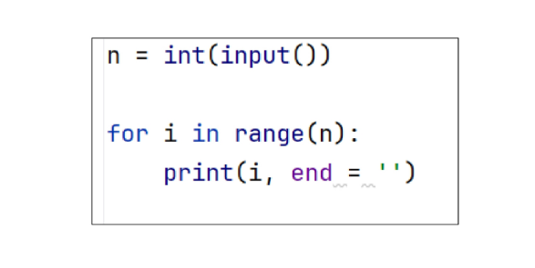

- `O(Big-Oh)-표기`

    - O-표기는 복잡도의 점근적 상한을 나타낸다.
    - 복잡도가 f(n) = 2n² - 7n + 4이라면, f(n)의 O-표기는 **O(n²)** 이다.
    - 먼저 f(n)의 단순화된 표현은 n²이다.
    - 단순화된 함수 n²에 임의의 상수 c를 곱한 cn²이 증가함에 따라 f(n)의 상한이 된다.(단, c > 0)

        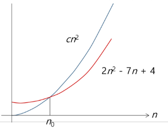

- 빅오표기법으로 표현하면?
    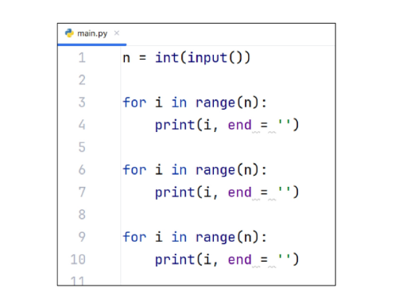

    - 실제 횟수 : 3n번
    - 빅오 표기법(대략적으로 지표만 계산 가능) : O(n)
  
- 빅오표기법으로 표현하면?

    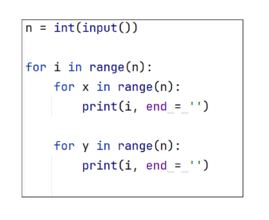

    - 실제 횟수 : 2n²번
    - 빅오 표기법(대략적으로 지표만 계산 가능) : O(n²)

- 상수 횟수 반복하는 코드는 빅오표기법으로 어떻게 표현할까?

    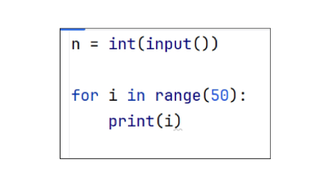

    - O(1) : 상수번 도는거(최고차항이 1이기때문)

- 빅오표기법을 이렇게 표현하기도 합니다.

    - O(5N)

    - 5배수 강조해서 표현하고 싶을 때, O(N)이라고 적지 않고, O(5N)이라고 적곤 합니다.

    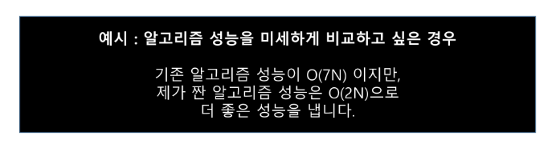

- 빅오표기법으로 성능 비교하기
    - 어떤 알고리즘이 더 좋은 성능을 낼까요?

    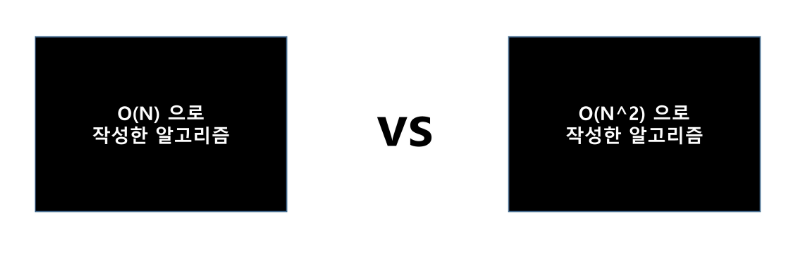

- 자주 사용하는 O-표기

    - O(1) : 상수 시간(Constant time)

    - **O(logn) : 로그(대수) 시간(Logarithmic time)**

    - O(n) : 선형 시간(Linear time)

    - **O(nlogn) : 로그 선형 시간(Log-linear time)**

    - O(n²) : 제곱 시간(Quadratic time)

    - O(n³) : 세제곱 시간(Cubic time)

- O(N) 이해하기

    - 만약 N이 10,000이고 O(N)으로 짠 알고리즘이 있다면, 몇 번 반복하는 프로그램이라고 추정해도 될까?
    - 정답 = 1,000회

- 만약 O(N^2) 라면?
    - 만약 N이 10,000이고 O(N²)으로 짠 알고리즘이 있다면, 몇 번 반복하는 프로그램이라고 추정해도 될까?
    - 정답 = 10,000 X 10,000 = 100,000,000 (1억)

- 만약 O(log N) 라면?

    - 만약 N이 10,000이고 O(log N)으로 짠 알고리즘이 있다면, 몇 번 반복하는 프로그램이라고 추정해도 될까?

    - 알고리즘 이론에서 Log의 밑수는 10이 아니라 2이다. 따라서, 2의 몇 승이 10,000이 되는지 계산기를 사용해서 알 수 있다.

    - 만약 N이 100,000,000이고 O(log N)으로 짠 알고리즘이 있다면, 몇 번 반복하는 프로그램이라고 추정해도 될까?
    - 2의 몇 승이 1억이 되는지 계산기를 사용해서 알 수 있다.

- O(logN)은 O(1)보다는 느리지만, 유사한 성능을 보인다고 결론을 낼 수 있다.

- O(NlogN)은 O(N)보다는 느리지만, 유사한 성능을 보인다고 결론을 낼 수 있다.

    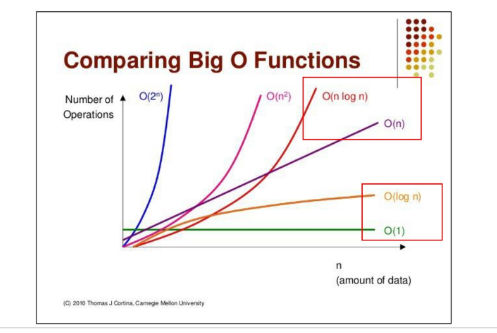

### [정리] 복잡도 분석

- 왜 효율적인 알고리즘이 필요한가

    - 10억 개의 숫자를 정렬하는데 PC에서 O(n^2) 알고리즘은 300여 년이 걸리는 반면에 O(nlogn) 알고리즘은 5분 만에 정렬한다.

    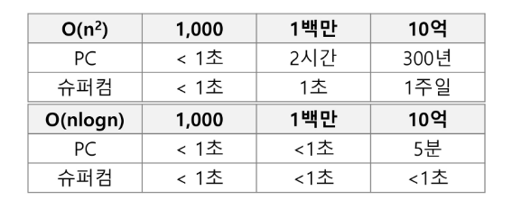

    - 효율적인 알고리즘은 슈퍼컴퓨터보다 더 큰 가치가 있다.
    - 값 비싼 H/W의 기술 개발보다 효율적인 알고리즘 개발이 훨씬 더 경제적이다.
---

### 표준 입출력 방법

- 챕터의 목표 : 콘솔 입력 대신, 파일 입력으로 입력을 받아보자.

- 실습 준비
    - 하나의 파일을 만들자 : input.txt

    - input.txt 에는 77을 적고 저장한다.
    - main.py에는 우측과 같이 코드를 작성한다.

- 실행 결과
    - input()을 하더라도 사용자로부터 입력받지 않고, 텍스트 파일로부터 값을 가져온다.

- SWEA에서 활용하기 1

    1. sample_input.txt 내용을 열고, input.txt 파일에 복사 붙여넣기한다.
    2. 문제를 푼다. 테스트 할 때 마다 수동 입력할 필요 없다.
    3. 코드를 제출할 때는 파일 입력하는 코드를 주석처리하고 제출한다.

### [도전] 표준 입출력 방법
- [도전] 수 2개 파일 입력 받고, 두 수의 합과 곱 출력하기
    - 두 수를 input.txt 파일에서 입력 받는다.
    - 두 수의 합과 곱을 output.txt 파일에 출력한다.

- EX. 2 3 입력 시 출력결과는 5 6

---

### `진수(진법)`

#### 2진수, 8진수, 10진수, 16진수

    - 10진수 : 사람이 사용하는 진수, 수 하나를 0 ~ 9로 표현
    - 2진수 : 컴퓨터가 사용하는 진수, 수 하나를 0, 1로 표현
    - 8진수 : 2진수를 더 가독성 있게 사용
    - 16진수 : 2진수를 더 가독성 있게 사용, 수 하나를 0, 1, ..., 8, 9, A, B, C, D, E, F로 표현

- 왜 16진수를 사용하는 것인가?
    - 2진수를 사람이 이해하기 편하도록, 10진수로 변환 시
        -> 인간이 이해하기 편하지만, **연산이 오래 걸림**

    - 2진수를 사람이 이해하기 편하도록, 16진수로 변환 시
        -> 인간이 이해하기 어렵지만, **연산 속도가 매우 빠름**

- 구현하기 전, 검증할 수 있도록 계산기부터 다룰 수 있어야한다.

| 용어  암기 |
|:---------:|
|HEX - 16진수|
|DEC - 10진수|
|OCT - 8진수|
|BIN - 2진수|

### 앞으로 학습목표

    1. 2진수, 10진수, 16진수를 왜 쓰는지 이해한다.(완료)
    2. 손으로 변환하는 방법을 익힌다.(다음 페이지부터 시작)
    3. 프로그래밍으로 진수 변환을 직접 구현한다.

--- 

### `진법 변환`

- 10진수 -> 타 진수로 변환
    - 원하는 타진법의 수로 나눈 뒤 나머지를 거꾸로 읽는다.
    
    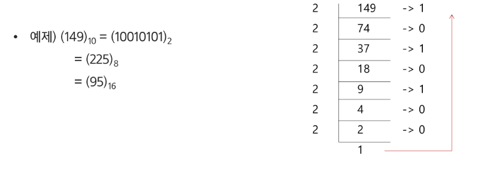

### [도전] 진법 변환

- 수기로 10진수 -> 2진수로 변환 해보기
    - 수기로 75를 2진수로 변환하기
    - 수기로 14를 2진수로 변환하기

    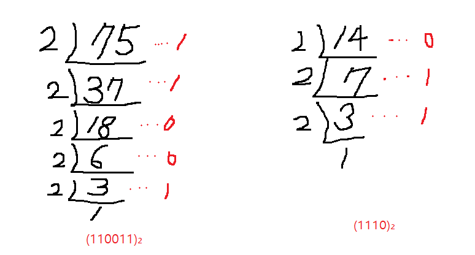

#### 10진수 -> 2진수로 변환 구현

- 10진수를 지속적으로 2로 나누어 구현한다.

- 마지막으로 List를 거꾸로 뒤집는다.

    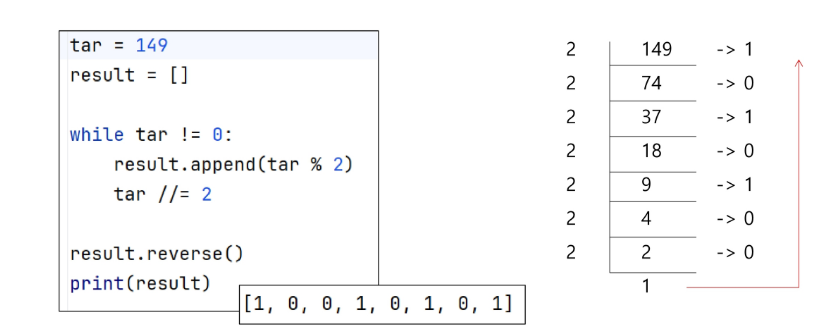

#### 2진수를 10진수로 변환

- 수기로 계산할 수 있어야한다.

    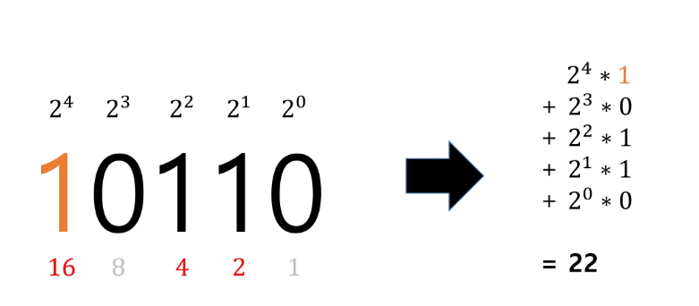

#### 16진수 <-> 2진수 변환

- 2진수, 10진수 간 변환은 연산이 많으나, 2진수, 16진수 변환은 연산이 없다.

- 진법 변환을 빠르게 할 수 있으려면 우측 진수 표를 암기하는 것을 권장

    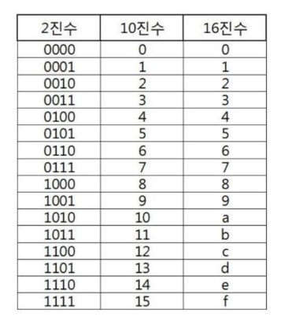

#### 16진수 0xF9 -> 2진수로 변환하기

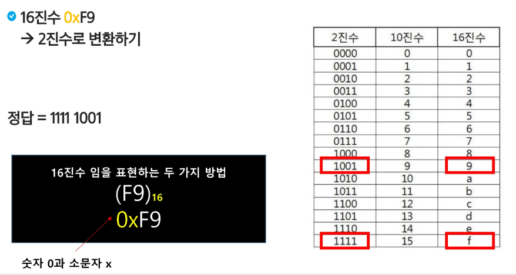

#### 16진수 0xBB3 -> 2진수로 변환하기

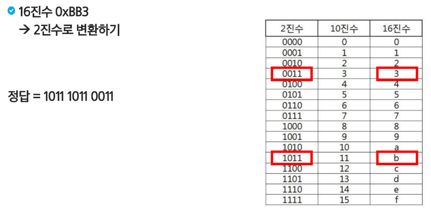

#### 2진수 1100101111 -> 16진수로 변환하기

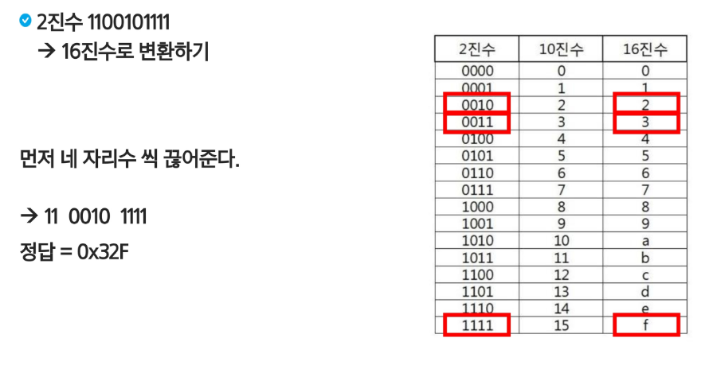

### [도전] 진법 변환
- 16진수를 입력 받으면, 2진수로 출력해주는 프로그램 작성하기
    - 오른쪽 표에서 2진수 부분을 리스트에 모두 저장해두고 구현

---

### 연습문제

- 0과 1로 이루어진 1차 배열에서 7개씩 수를 묶어, 10진수로 출력하기

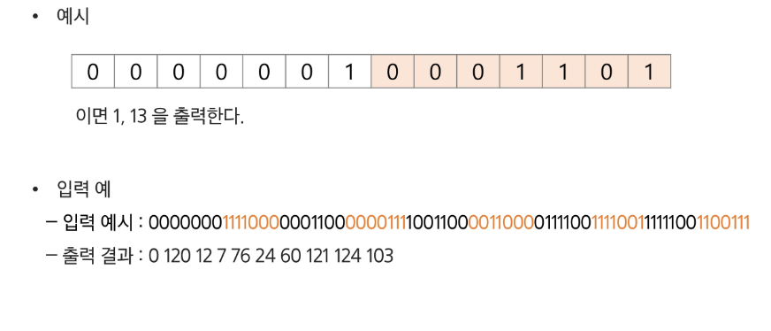