# 7월 15일 수업 내용 정리 - Basic Syntax 1

- 프로그래밍

    - 프로그래밍이란?
    - 프로그래밍 언어

- 파이썬

    - 파이썬 소개
    - 파이썬 실행
    - 표현식과 값
    - 타입
    - 변수와 메모리

- Data Types

- Numeric Types

    - int
    - float

- Sequence Types

    - str

- 참고

    - Style Guide
    - 주석
    - Python tutor


## 프로그래밍

### 프로그래밍이란?

- **프로그램(program)** : 명령어들의 집합

- 프로그램 예시

    - 친구에게 우리 집으로 오는 길을 적어주는 것 -> '프로그램 작성'
    - 적어준 길을 순서대로 따라가는 것 -> '프로그램 실행'
    - 프로그램은 이처럼 몇 가지 기초 연산으로 구성됨
        - 'XX사거리에서 우회전', '두 블록 직진 후 좌회전' 등
    - 컴퓨터는 더 다양한 연산 집합을 가짐
        - 파일에서 3번째 줄을 지워라', '네모 박스를 오른쪽으로 옮겨라' 등
        - 기존 연산을 사용해 더 많은 연산을 만들 수 있음
        - 이전에 사용한 연산 위에 차곡차곡 쌓여 새로운 연산을 만들어냄

- **프로그래밍의 핵심** : 새 연산을 정의하고 조합해 유용한 작업을 수행하는 것 => '문제를 해결'하는 매우 강력한 방법


### 프로그래밍 언어
- 컴퓨터에게 작업을 지시하고 문제를 해결하는 도구


## Python

### Python 소개

- Python을 배우는 이유
    - 쉽고 간결한 문법 : 읽기 쉽고 쓰기 쉬운 문법을 가지고 있어 쉽게 배우고 활용할 수 있음

    - python 커뮤니티의 지원 : 세계적인 규모의 풍부한 온라인 포럼 및 커뮤니티 생태계

    - 광범위한 응용 분야 : 웹 개발, 데이터 분석, 인공지능, 자동화 스크립트 등 다양한 분야에서 사용
    

- [Python의 인기와 사용성](https://www.jetbrains.com/ko-kr/lp/devecosystem-2023/)


- 알고리즘 구현에 유리한 Python

    - 직관적인 문법
        - 복잡한 논리 구조의 알고리즘을 이해하고 구현하기에 쉬움

    - 강력한 표준 라이브러리
        - 다양한 알고리즘 구현에 필요한 도구를 제공

    - 빠른 프로토타이핑
        - 알고리즘을 빠르게 테스트하고 수정할 수 있음


### Python 실행

- Python 프로그램이 실행되는 과정

    - 컴퓨터는 기계어로 소통하기 때문에 사람이 기계어를 직접 작성하기 어려움

        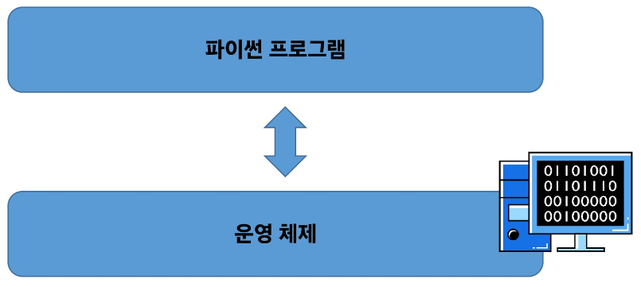

    - 인터프리터가 사용자의 명령어를 운영체제가 이해하는 언어로 바꿈

        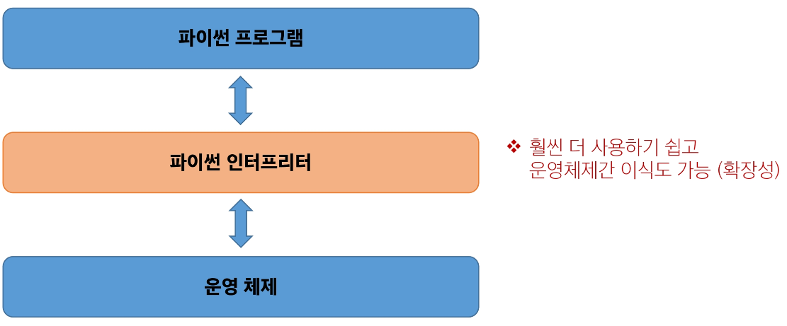


- Python 인터프리터를 사용하는 2가지 방법

    1. shell 이라는 프로그램으로 한 번에 한 명령어 씩 입력해서 실행

        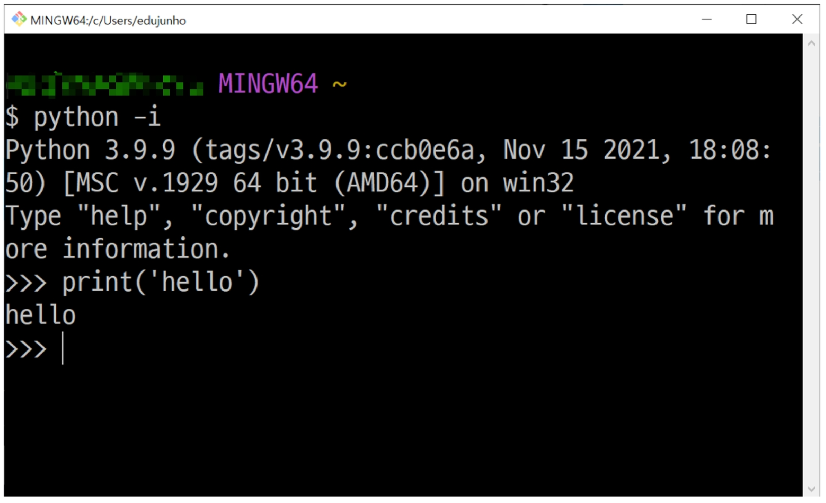

    2. 확장자가 .py인 파일에 작성된 python 프로그램을 실행

        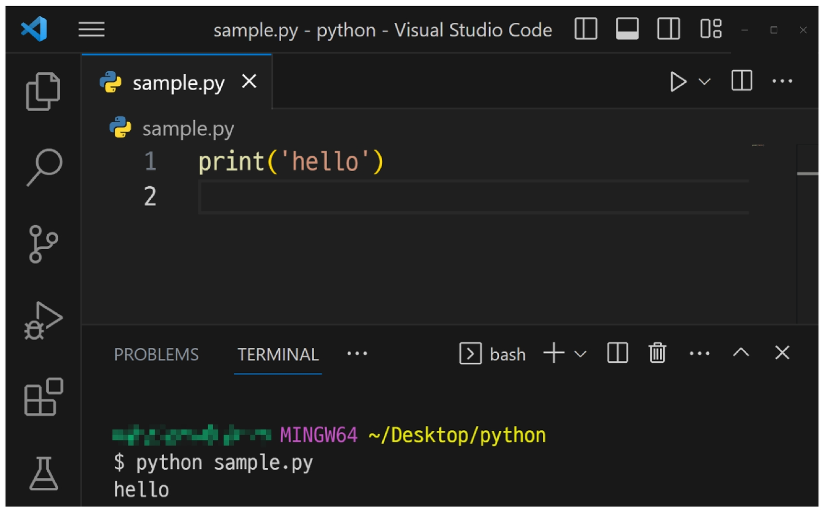


### 표현식과 값

- 표현식(Expression) : 값으로 평가될 수 있는 코드 조각

- 값(Value) : 표현식이 평가된 결과

    

- 표현식이 **평가**되어 값이 반환됨


- 평가(Evaluate) : 표현식을 실행하여 값을 얻는 과정(표현식을 순차적으로 평가하여 프로그램의 동작을 결정)


- 문장(Statement) : 실행 가능한 동작을 기술하는 코드(조건문, 반복문, 함수 정의 등), 문장은 보통 여러 개의 표현식을 포함

    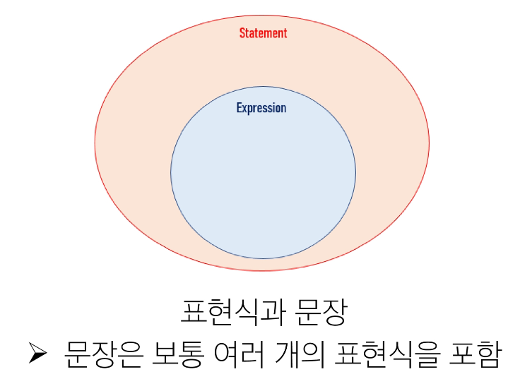


### 타입

- 타입(Type) : 변수나 값이 가질 수 있는 데이터의 종류를 의미, 어떤 종류의 데이터인지, 어떻게 해석되고 처리되어야 하는지를 정의

- 타입은 2가지 요소로 이루어짐, "값(피연산자)"과 "값에 적용할 수 있는 연산(연산자)"

    

- 데이터 타입

    |Numeric Type|Sequence Types|Text Sequence Type|Non-sequence Types|기타|
    |:--:|:--:|:--:|:--:|:--:|
    |- int(정수)<br>- float(실수)<br>- complex(복소수)|- list<br>- tuple<br>- range|- str(문자열)|- set<br>- dict|- Boolean<br>- None<br>- Functions|
    <br>


- 타입의 중요성 : 데이터 타입에 맞는 연산을 수행할 수 있기 때문

- 산술 연산자

    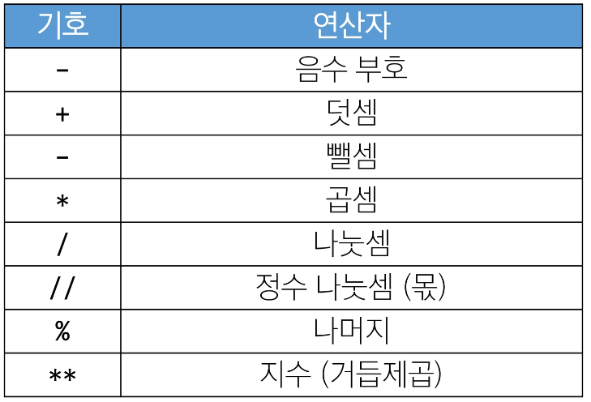


- 연산자 우선순위

    


- 연산자 우선순위 예시

    ```python
    # -16
    -2 ** 4

    # -16
    -(2 ** 4)

    # 16
    (-2) ** 4
    ```


### 변수와 메모리 "값이 저장되는 법"

- 변수(Variable) : 값을 저장하기 위한 이름(값을 참조하기 위한 이름)

- 변수 할당 : 표현식을 통해 변수에 값을 저장(재할당)

    

    


- 할당문

    

    1. 할당 연산자(=) 오른쪽에 있는 표현식을 평가해서 값(메모리 주소)을 생성

    2. 값의 메모리 주소를 '=' 왼쪽에 있는 변수에 저장
    - 존재하지 않는 변수라면
        - 새 변수 생성
    - 기존에 존재했던 변수라면
        - 기존 변수를 재사용해서 변수에 들어 있는 메모리 주소를 변경


- 변수, 값 그리고 메모리

    - 거리에 집 주소가 있듯이 메모리의 모든 위치에는 그 위치를 고유하게 식별하는 메모리 주소가 존재

        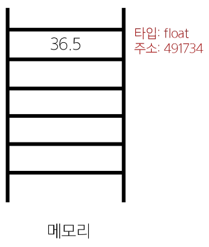

    - 객체
        - 타입을 갖는 메모리 주소 내 값
        - "값이 들어있는 상자"

        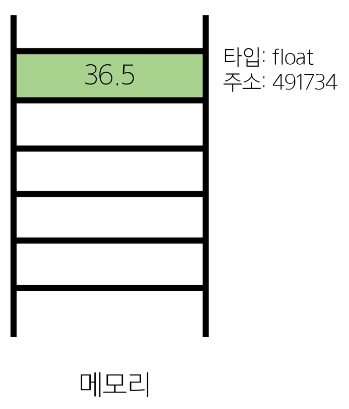

    - 변수는 그 변수가 참조하는 객체의 메모리 주소를 가짐
    - 변수 degrees는 값 36.5를 참조

        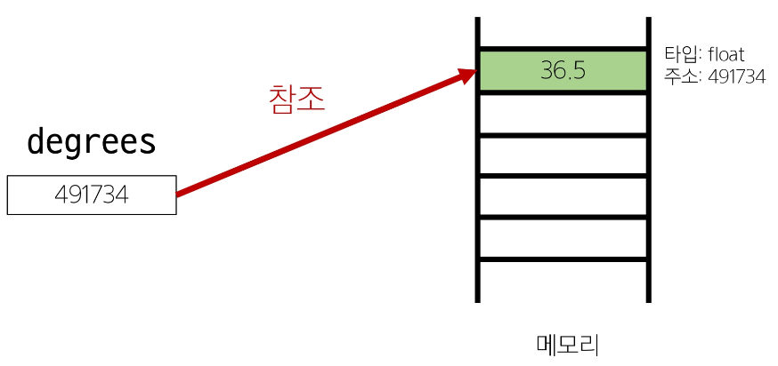


- 변수에 재할당
    - 변수 double에는 값 20의 주소가 들어 있으니 여전히 20을 참조

        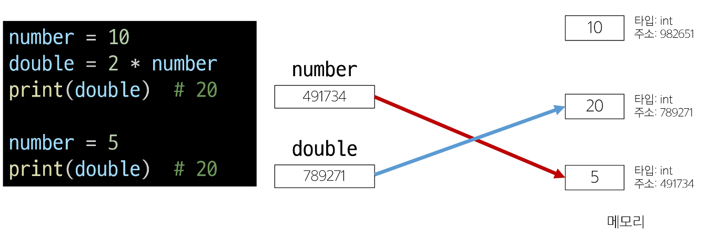

- 변수명 규칙
    - 영문 알파벳, 언더스코어(_), 숫자로 구성
    - 숫자로 시작할 수 없음
    - 대소문자를 구분
    - 아래 키워드는 python의 내부 예약어로 사용할 수 없음

        

## Data Types

- Data Types : 값의 종류와 그 값에 적용 가능한 연산과 동작을 결정하는 속성

- 데이터 타입 분류

    |Numeric Type|Sequence Types|Text Sequence Type|Non-sequence Types|기타|
    |:--:|:--:|:--:|:--:|:--:|
    |- int(정수)<br>- float(실수)<br>- complex(복소수)|- list<br>- tuple<br>- range|- str(문자열)|- set<br>- dict|- Boolean<br>- None<br>- Functions|
    <br>

- 데이터 타입이 필요한 이유

    - 값들을 구분하고, 어떻게 다뤄야 하는지를 알 수 있음
    
    - 요리 재료마다 특정한 도구가 필요하듯이 각 데이터 타입 값들도 각자에게 적합한 도구를 가짐

    - 타입을 명시적으로 지정하면 코드를 읽는 사람이 변수의 의도를 더 쉽게 이해할 수 있고, 잘못된 데이터 타입으로 인한 오류를 미리 예방


## Numeric Types

### int

- int(정수 자료형) : 정수를 표현하는 자료형

    ```python
    a = 10
    b = 0
    c = -5
    ```

- 진수 표현
    - 2진수(binary) : 0b
    - 8진수(octal) : 0o
    - 16진수(hexadecimal) : 0x

        ```python
        print(0b10) # 2

        print(0o30) # 24

        print(0x10) # 16
        ```


### float

- float(실수 자료형) : 실수를 표현하는 자료형, 프로그래밍 언어에서 float는 실수에 대한 근삿값

    ```python
    d = 3.14
    e = -2.7
    ```


- 유한 정밀도

    - 컴퓨터 메모리 용량이 한정돼 있고 한 숫자에 대해 저장하는 용량이 제한 됨

    - 0.666666666과 1.666666667은 제한된 양의 메모리에 저장할 수 있는 2/3과 5/3에 가장 가까운 값

        ```python
        # 0.66666666666
        print(2/3)

        # 1.66666666667
        print(5/3)
        ```

- 실수 연산 시 주의사항

    - 컴퓨터는 2진수를 사용, 사람은 10진법을 사용

    - 이때 10진수 0.1은 2진수로 표현하면 0.00011001100...과 같이 무한대로 반복됨

    - 무한대 숫자를 그대로 저장할 수 없어서 사람이 사용하는 10진법의 근삿값만 표시

    - 0.1의 경우 360287970/2 **55이며 0.1에 가깝지만 정확히 동일하지는 않음

    - 이 과정에서 예상치 못한 결과가 나타남

    - 이런 증상을 **Floating point rounding error(부동소수점 에러)**라고 함


- 부동소수점 에러

    - 컴퓨터가 실수를 표현하는 방식으로 인해 발생하는 작은 오차

    - 원인
        - 실수를 2진수로 변환하는 과정에서 발생하는 근사치 표현


- 부동소수점 에러 해결책

    - 대표적으로 decimal 모듈을 사용해 부동소수점 연산의 정확성을 보장하는 방법

    - 이외에도 다양한 해결 방법이 존재

        


- 지수 표현 방식
    - e 또는 E를 사용한 지수 표현

        ```python
        # 314 * 0.01
        number = 314e-2

        # 3.14
        print(numer)
        ```


## Sequence Types

- Sequence Types : 여러 개의 값들을 **순서대로 나열**하여 저장하는 자료형(str, list, tuple, range)


- Sequence Types 특징
    1. 순서(Sequence)
        - 값들이 순서대로 저장(정렬X)

    2. 인덱싱(Indexing)
        - 각 값에 고유한 인덱스(번호)를 가지고 있으며, 인덱스를 사용하여 특정 위치의 값을 선택하거나 수정할 수 있음

    3. 슬라이싱(Slicing)
        - 인덱스 범위를 조정해 부분적인 값을 추출할 수 있음

    4. 길이(Length)
        - len()함수를 사용하여 저장된 값의 개수(길이)를 구할 수 있음

    5. 반복(Iteration)
        - 반복문을 사용하여 저장된 값들을 반복적으로 처리할 수 있음


### str

- str(문자열) : 문자들의 순서가 있는 변경 불가능한 시퀀스 자료형

- 문자열 표현

    - 문자열은 단일 문자나 여러 문자의 조합으로 이루어짐

    - 작은따옴표(') 또는 큰따옴표(")로 감싸서 표현

        ```python
        # Hello, World!
        print('Hello, World!')

        # str
        print(type('Hello, World!'))
        ```


- 중첩 따옴표
    - 따옴표 안에 따옴표를 표현할 경우
        - 작은따옴표가 들어 있는 경우는 큰따옴표로 문자열 생성
        - 큰따옴표가 들어 있는 경우는 작은따옴표로 문자열 생성

            ```python
            # 문자열 안에 "큰따옴표"를 사용하려면 작은 따옴표로 묶는다.
            print('문자열 안에 "큰따옴표"를 사용하려면 작은 따옴표로 묶는다.')

            # 문자열 안에 '작은따옴표'를 사용하려면 큰따옴표로 묶는다.
            print("문자열 안에 '작은따옴표'를 사용하려면 큰따옴표로 묶는다.")
            ```


- Escape sequence

    - 역슬래시(back slash, \\ )뒤에 특정 문자가 와서 특수한 기능을 하는 문자 조합

    - python의 일반적인 문법 규칙을 잠시 탈출한다는 의미

        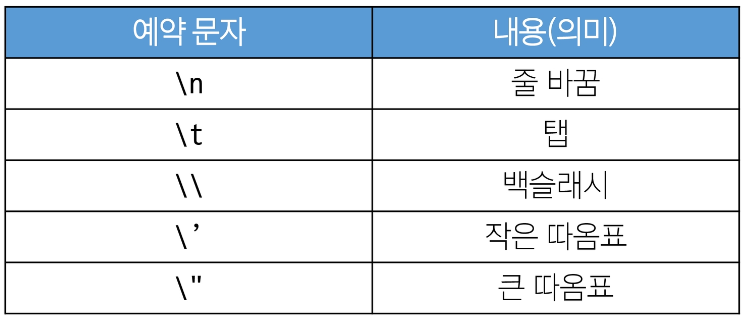

- Escape sequence 예시

    ```python
    # 철수야 '안녕'
    print('철수야 \'안녕\'')

    '''
    이 다음은 엔터
    입니다.
    '''
    print('이 다음은 엔터\n입니다.')
    ```

- String Interpolation : 문자열 내에 변수나 표현식을 삽입하는 방법


- f-string
    - 문자열에 f 또는 F 접두어를 붙이고 표현식을 {expression}로 작성하는 문법

    - 문자열에 python 표현식의 값을 삽입할 수 있음

        ```python
        bugs = 'roaches'
        counts = 13
        area = 'living room'

        # Debugging roaches 13 living room
        print(f'Debugging {bugs} {counts} {area}')
        ```

- 문자열의 시퀀스 특징

    ```python
    my_str = 'hello'

    # 인덱싱
    print(my_str[1])    # e

    # 슬라이싱
    print(my_str[2:4])  # ll

    # 길이
    print(len(my_str))  # 5
    ```

- 인덱스(index)
    - 시퀀스 내의 값들에 대한 고유한 번호로, 각 값의 위치를 식별하는 데 사용되는 숫자

- 문자열 hello의 인덱스

    


- 슬라이싱(slicing)
    - 시퀀스의 일부분을 선택하여 추출하는 작업
    - 시작 인덱스와 끝 인덱스를 지정하여 해당 범위의 값을 포함하는 새로운 시퀀스를 생성

- slicing 예시

    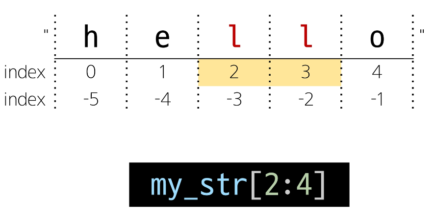

    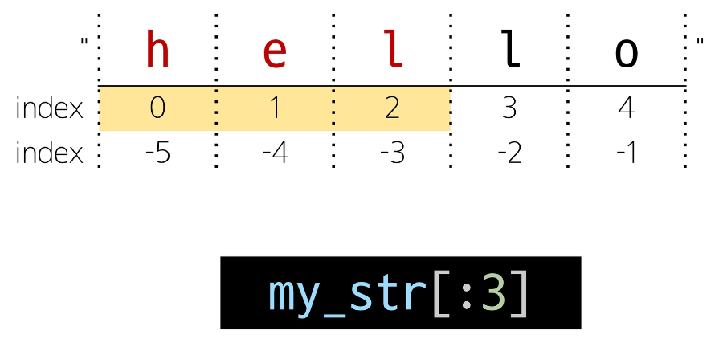

    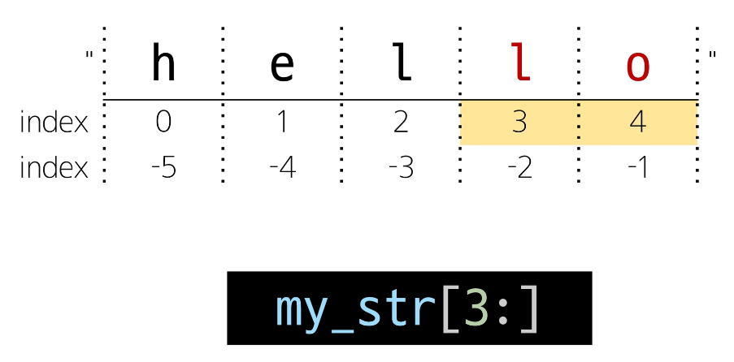

    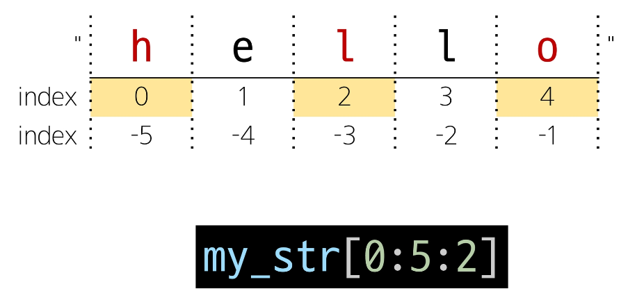
    - step을 지정하여 추출

    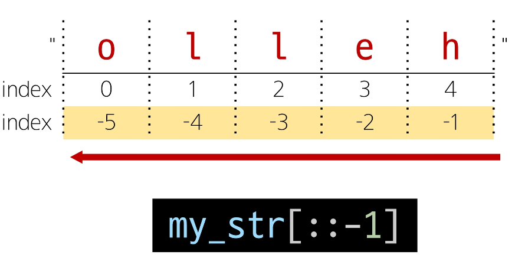
    - step이 음수일 경우


- 문자열은 불변(변경 불가)

    ```python
    my_Str = 'hello'

    # TypeError: 'str' object does not support item assignment
    my_str[1] = 'z'
    ```


## 참고

### Style Guide

- Style Guide
    - 코드의 일관성과 가독성을 향상시키기 위한 규칙과 권장 사항들의 모음


- python style guide

    - 변수명은 무엇을 위한 변수인지 직관적인 이름을 가져야 함

    - 공백(spaces) 4칸을 사용하여 코드 블록을 들여쓰기

    - 한 줄의 길이는 79자로 제한하며, 길어질 경우 줄 바꿈을 사용

    - 문자와 밑줄(_)을 사용하여 함수, 변수, 속성의 이름을 작성

    - 함수 정의나 클래스 정의 등의 블록 사이에는 빈 줄을 추가
    
    - [그 외](https://peps.python.org/pep-0008/)


### 주석

- 주석(Comment)

    - 프로그램 코드 내에 작성되는 설명이나 메모

    - 인터프리터에 의해 실행되지 않음

        ```python
        # 이것은
        age = 10

        # 주석입니다
        print(age)

        """
        여러 줄 주석
        """
        ```


- 주석의 목적

    - 코드의 특정 부분을 설명하거나 임시로 코드를 비활성화할 때

    - 코드를 이해하거나 문서화하기 위해

    - 다른 개발자나 자신에게 코드의 의도나 동작을 설명하는데 도움


### Python tutor

- Python Tutor
    - python 프로그램이 어떻게 실행되는지 도와주는 시각화 도우미

    - [Python Tutor](https://pythontutor.com/)


- Python Tutor 사용 예시

    


---
1. 변수 값 할당
- a = 3, 값을 왼쪽에 먼저 하면 할당되지 않는다.
- a == 3
2. 문자열 데이터 타입 이해
3. 문자열의 인덱싱, 슬라이싱
- 양의 인덱스, 음의 인덱스, 슬라이싱
- 공백도 인덱스 해줘야 한다.
- 음의 인덱스는 전체 문자열의 길이를 모를 때 사용
- hello 슬라이싱 => ex. a[1:3]  -> el
4. f-string(매우 중요!!)
- {  } place holder 사용
- 변수, 식(표현식)도 사용 가능
- 사용법 : f'오늘 기온은 {temp*2}입니다'
5. 변수 이름 컨벤션(숫자, 스네이크케이스)
- 스네이크케이스 : _(언더바) 사용
6. 들여쓰기 컨벤션
- 들여쓰기가 굉장히 중요
- space bar 4개가 기본
- tab도 좋다
7. 여러줄 주석 - """ """
- 주석 처리를 하고 싶을 때는 #을 사용하는게 좋다
- '''은 가급적 사용하지 말자!
- '''은 doc string, documentation string으로 문서적 기능을 만들 때 사용(참고)
- 공식문서를 보면 코드를 설명하기 전 설명할 때 사용되기도 한다.
8. python tutor(즐겨찾기)
9. 영어로 검색 - 에러 메시지 복붙
- 에러 메시지를 읽고 해결하기 어려울 때 검색해보면 해결 가능한 경우도 있다.
10. 제발 에러 메시지를 읽자!
- 에러 메시지를 읽으면 해결될 경우가 많다!


# 구글링
검색어
- 영어로 검색하기 하지만 완벽한 문장이 아니여도 좋음
- 내가 해결하고자 하는 문제에 대한 키워드를 명확히 작성하기

신뢰할 수 있는 출처 사용
- 공식 문서
    - 프로그래밍 언어의 공식 문서와 라이브러리 문서를 우선적으로 참고
- 커뮤니티 사이트
    - stack overflow, github issues 등의 개발자 커뮤니티

# AI
- 새롭게 언어를 배우는 과정에서 AI가 제시하는 솔루션이 좋은지 나쁜지를 판단하기 어려움
-  기본 개념을 학습하는 것을 소홀히 하지말고 다양한 문제를 스스로 해결해보려는 경험을 쌓는 것이 중요


- 개발자의 가치는 논리적 사고력과 문제해결 능력
- 이는 하루아침에 만들어지는 것이 아님
- 문제를 해결하는 과정에서 만나는 수많은 실수와 버그들을 마주하고,
- 해결하기 위해 고민하는 시간 속에서 깊은 학습과 진정한 성장이 이루어짐


- 손쉽게 어려움을 없애주는 AI의 해결책에 의존하지 않도록 주의할 것
- AI는 강력한 도구이지만, 이를 맹목적으로 의존하지 말고 생산성을 위한 보조 수단으로 활용하는 것이 중요
- 이를 통해 AI의 도움을 받더라도 문제를 근복적으로 이해하고 해결할 수 있는 능력을 갖출 수 있음
- 또한, 구글링을 통해 신뢰할 수 있는 정보를 찾고, 커뮤니티와의 상호작용을 통해 다양한 관점을 배우는 것도 중요
- 개발자로서의 여정은 끝없는 학습과 성장의 과정임
- 스스로 문제를 해결하며 얻는 경험은 귀중한 자산이 될 것


- 이런 자세를 잊지 않고, AI를 적절히 활용하면 프로그래밍 학습과 문제 해결에 있어 더 유용한 도구로 사용할 수 있을 것
