# 2024년 7월 16일 수업 내용 정리 - Basic Syntax 2

- Data Types


- Numeric Types

    - int
    - float


- Sequence Types

    - str
    - list
    - tuple
    - range


- Non-sequence Types

    - dict
    - set


- Other Types

    - None
    - Boolean


- Collection


- 형변환

    - 암시적 형변환
    - 명시적 형변환


- 연산자

    - 산술 연산자
    - 복합 연산자
    - 비교 연산자
    - 논리 연산자
    - 단축평가
    - 멤버십 연산자
    - 시퀀스형 연산자


## Data Types

- Data Types
    - 값의 종류와 그 값에 적용 가능한 연산과 동작을 결정하는 속성

- 데이터 타입 분류
    
    |Numeric Types|Text Sequence Type|Sequence Types|Non-sequence Types|기타|
    |:--:|:--:|:--:|:--:|:--:|
    |- int(정수)<br>- float(실수)<br>- complex(복소수)|- str(문자열)|- list<br>- tuple<br>- range|- set<br>- dict|- Boolean<br>- None<br>- Functions|
    <br>


- 데이터 타입이 필요한 이유

    - 값들을 구분하고, 어떻게 다뤄야 하는지를 알 수 있음

    - 요리 재료마다 특정한 도구가 필요하듯이 각 데이터 타입 값들도 각자에게 적합한 도구를 가짐

    - 타입을 명시적으로 지정하면 코드를 읽는 사람이 변수의 의도를 더 쉽게 이해할 수 있고, 잘못된 데이터 타입으로 인한 오류를 미리 예방


## Numeric Types

### int

- int(정수 자료형) : 정수를 표현하는 자료형

    ```python
    a = 10
    b = 0
    c = -5
    ```

- 진수 표현
    - 2진수(binary) : 0b
    - 8진수(octal) : 0o
    - 16진수(hexadecimal) : 0x

        ```python
        print(0b10) # 2
        print(0o30) # 24
        print(0x10) # 16
        ```


### float

- float(실수 자료형) : 실수를 표현하는 자료형(프로그래밍 언어에서 float는 실수에 대한 **근삿값**)

    ```python
    d = 3.14
    e = -2.7
    ```

- 유한 정밀도

    - 컴퓨터 메모리 용량이 한정돼 있고, 한 숫자에 대해 저장하는 용량이 제한 됨

    - 0.6666666666과 1.6666667은 제한된 양의 메모리에 저장할 수 있는 2/3과 5/3에 가장 가까운 값

        ```python
        # 0.666666666666666
        print(2/3)

        # 1.666666666666667
        print(5/3)
        ```


- 실수 연산 시 주의사항

    - 컴퓨터는 2진수를 사용, 사람은 10진법을 사용

    - 이때 10진수 0.1은 2진수로 표현하면 무한대로 반복됨

    - 무한대 숫자를 그대로 저장할 수 없어서 사람이 사용하는 10진법의 근삿값만 표시

    - 0.1의 경우 정확히 동일하지 않음

    - 이 과정에서 예상치 못한 결과가 나타남

    - 이런 증상을 **Floating point rounding error(부동소수점 에러)**라고 함


- 부동소수점 에러

    - 컴퓨터가 실수를 표현하는 방식으로 인해 발생하는 작은 오차

    - 원인 : 실수를 2진수로 변환하는 과정에서 발생하는 근사치 표현


- 부동소수점 에러 해결책

    - 대표적으로 decimal 모듈을 사용해 부동소수점 연산의 정확성을 보장하는 방법

    - 이외에도 다양한 해결 방법이 존재

        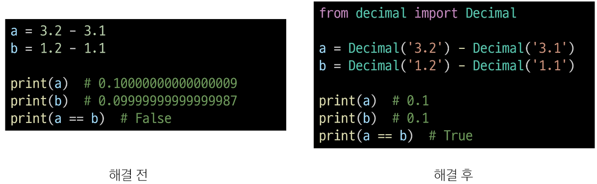


- 지수 표현 방식 : e 또는 E를 사용한 지수 표현

    ```python
    # 314 * 0.01
    number = 314e-2

    # 3.14
    print(number)
    ```


## Sequence Types

- Sequence Types

    - 여러 개의 값들을 **순서대로 나열**하여 저장하는 자료형(str, list, tuple, range)


- Sequence Types 특징

    1. 순서(Sequence) : 값들이 순서대로 저장(정렬X)

    2. 인덱싱(Indexing) : 각 값에 고유한 인덱스(번호)를 가지고 있으며, 인덱스를 사용하여 특정 위치의 값을 선택하거나 수정할 수 있음

    3. 슬라이싱(Slicing) : 인덱스 범위를 조절해 부분적인 값을 추출할 수 있음

    4. 길이(Length) : len()함수를 사용하여 저장된 값의 개수(길이)를 구할 수 있음

    5. 반복(Iteration) : 반복문을 사용하여 지정된 값들을 반복적으로 처리할 수 있음


### str

- str(문자열)

    - 문자들의 순서가 있는 변경 불가능한 시퀀스 자료형


- 문자열 표현

    - 문자열은 단일 문자나 여러 문자의 조합으로 이루어짐

    - 작은따옴표(') 또는 큰따옴표(")로 감싸서 표현

        ```python
        # Hello, World!
        print('Hello, World!')

        # str
        print(type('Hello, World!'))
        ```


- 중첩 따옴표

    - 따옴표 안에 따옴표를 표현할 경우

        - 작은따옴표가 들어 있는 경우는 큰따옴표로 문자열 생성

        - 큰따옴표가 들어 있는 경우는 작은따옴표로 문자열 생성

            ```python
            # 문자열 안에 "큰따옴표"를 사용하려면 작은 따옴표로 묶는다.
            print('문자열 안에 "큰따옴표"를 사용하려면 작은 따옴표로 묶는다.')

            # 문자열 안에 '작은따옴표'를 사용하려면 큰따옴표로 묶는다.
            print("문자열 안에 '작은따옴표'를 사용하려면 큰따옴표로 묶는다.")
            ```


- Escape sequence

    - 역슬래시(backslash, \\ )뒤에 특정 문자가 와서 특수한 기능을 하는 문자 조합

    - python의 일반적인 문법 규칙을 잠시 탈출한다는 의미

        


- Escape sequence 예시

    ```python
    # 철수야 '안녕'
    print('철수야 \'안녕\'')

    '''
    이 다음은 엔터
    입니다.
    '''
    print('이 다음은 엔터\n입니다.')
    ```


- String Interpolation

    - 문자열 내에 변수나 표현식을 삽입하는 방법


- f-string

    - 문자열에 f 또는 F 접두어를 붙이고 표현식을 {expression}로 작성하는 문법

    - 문자열에 python 표현식의 값을 삽입할 수 있음

        ```python
        bugs = 'roaches'
        counts = 13
        area = 'living room'

        # Debugging roaches 13 living room
        print(f'Debugging {bugs} {counts} {area}')
        ```


- 문자열의 시퀀스 특징

    ```python
    my_str = 'hello'

    # 인덱싱
    print(my_str[1])    # e

    # 슬라이싱
    print(my_str[2:4])  # ll

    # 길이
    print(len(my_str))  # 5
    ```


- 인덱스(index)

    - 시퀀스 내의 값들에 대한 고유한 번호로, 각 값의 위치를 식별하는 데 사용되는 숫자

- 문자열 hello의 인덱스

    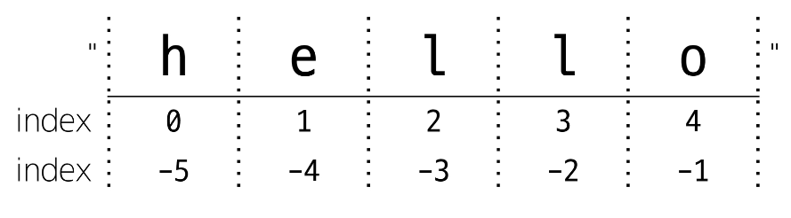


- 슬라이싱(slicing)

    - 시퀀스의 일부분을 선택하여 추출하는 작업
    - 시작 인덱스와 끝 인덱스를 지정하여 해당 범위의 값을 포함하는 새로운 시퀀스를 생성

- slicing 예시

    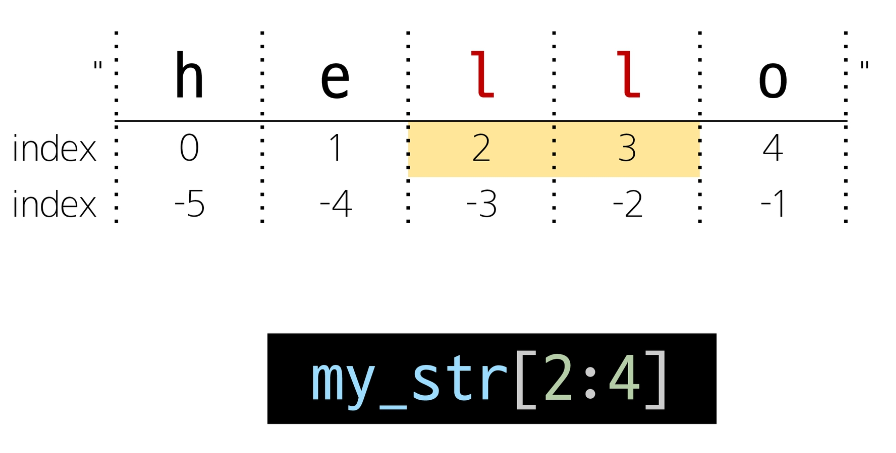

    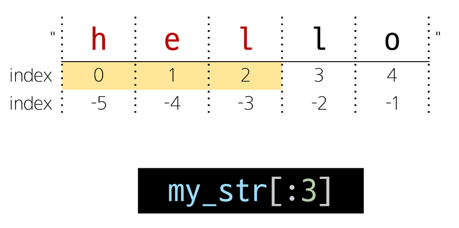

    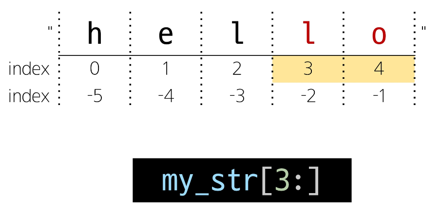

    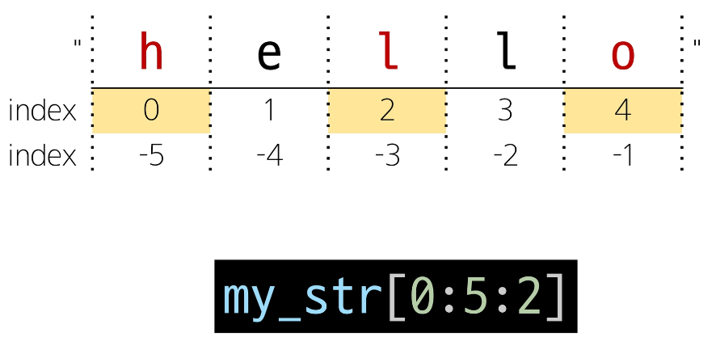
    - step을 지정하여 추출

    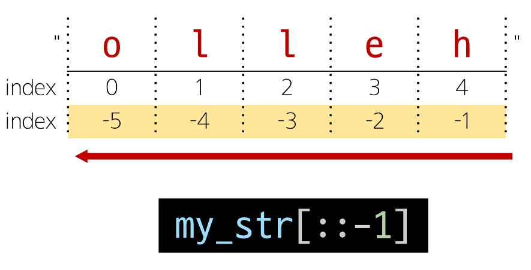
    - step이 음수일 경우


- 문자열은 불변(변경 불가)

    ```python
    my_Str = 'hello'

    # TypeError: 'str' object does not support item assignment
    my_str[1] = 'z'
    ```


### list

- list(리스트)

    - 여러 개의 값을 순서대로 저장하는 변경 가능한 시퀀스 자료형


- 리스트 표현

    - 0개 이상의 객체를 포함하며 데이터 목록을 저장

    - 대괄호([])로 표기

    - 데이터는 어떤 자료형도 저장할 수 있음

        ```python
        my_list_1 = []

        my_list_2 = [1, 'a', 3, 'b', 5]

        my_list_3 = [1, 2, 3, 'Python', ['hello', 'world', '!!!']]
        ```


- 리스트의 시퀀스 특징

    ```python
    my_list = [1, 'a', 3, 'b', 5]

    # 인덱싱
    print(my_list[1])   # a

    # 슬라이싱
    print(my_list[2:4]) # [3, 'b']
    print(my_list[:3])  # [1, 'a', 3]
    print(my_list[3:])  # ['b', 5]
    print(my_list[0:5:2])   # [1, 3, 5]
    print(my_list[::-1])    # [5, 'b', 3, 'a', 1]

    # 길이
    print(len(my_list)) # 5
    ```


- 중첩된 리스트 접근
        
    ```python
    my_list = [1, 2, 3, 'Python', ['hello', 'world', '!!!']]

    print(len(my_list)) # 5
    print(my_list[4][-1])   # !!!
    print(my_list[-1][1][0])    # w
    ```


- 리스트는 가변(변경 가능)

    ```python
    my_list = [1, 2, 3]
    my_list[0] = 100

    print(my_list)  # [100, 2, 3]
    ```


### tuple

- tuple(튜플)

    - 여러 개의 값을 순서대로 저장하는 변경 불가능한 시퀀스 자료형


- 튜플 표현

    - 0개 이상의 객체를 포함하며 데이터 목록을 저장

    - 소괄호(())로 표기

    - 데이터는 어떤 자료형도 저장할 수 있음

        ```python
        my_tuple_1 = ()

        my_tuple_2 = (1,)

        my_tuple_3 = (1, 'a', 3, 'b', 5)
        ```

- 튜플의 시퀀스 특징

    ```python
    my_tuple = (1, 'a', 3, 'b', 5)

    # 인덱싱
    print(my_tuple[1])  # a

    # 슬라이싱
    print(my_tuple[2:4])    # (3, 'b')
    print(my_tuple[:3]) # (1, 'a', 3)
    print(my_tuple[3:]) # ('b', 5)
    print(my_tuple[0:5:2])  # (1, 3, 5)
    print(my_tuple[::-1])   # (5, 'b', 3, 'a', 1)

    # 길이
    print(len(my_tuple))    #5
    ```


- 튜플은 불변(변경 불가)

    ```python
    my_tuple = (1, 'a', 3, 'b', 5)

    # TypeError: 'tuple' object does not support item assignment
    my_tuple[1] = 'z'
    ```


- 튜플은 어디에 쓰일까?

    - 튜플의 불변 특성을 사용한 안전하게 여러 개의 값을 전달, 그룹화, 다중 할당 등
    - **개발자가 직접 사용하기 보다 'python 내부 동작'에서 주로 사용됨**

        ```python
        x, y = (10, 20)

        print(x)    # 10
        print(y)    # 20

        # 파이썬은 쉼표를 튜플 생성자로 사용하니 괄호는 생략 가능
        x, y = 10, 20
        ```


### range

- range

    - 연속된 정수 시퀀스를 생성하는 변경 불가능한 자료형


- range 표현

    - range(시작 값, 끝 값, 증가 값)

    - range(n) : 0부터 n-1까지의 숫자 시퀀스

    - range(n, m) : n부터 m-1까지의 숫자 시퀀스


- range 특징

    - 증가 값이 없으면 1씩 증가

    - 증가 값이 음수이면 감소/증가 값이 양수이면 증가

    - 증가 값이 0이면 에러

    - 증가 값이 음수이면 시작 값이 끝 값보다 커야 함

    - 증가 값이 양수이면 시작 값이 끝 값보다 작아야 함

        ```python
        my_range_1 = range(5)
        my_range_2 = range(1, 10)

        print(my_range_1)   # range(0, 5)
        print(my_range_2)   # range(1, 10)
        ```


- range 표현

    - 주로 반복문과 함께 사용 예정

        ```python
        # 리스트로 형 변환 시 데이터 확인 가능
        print(list(range(5)))   # [0, 1, 2, 3, 4]
        print(list(range(1, 10)))   # [1, 2, 3, 4, 5, 6, 7, 8, 9]

        # 반복문과 함께 사용
        for i in range(1, 10):
            print(i)    # 1 2 3 4 5 6 7 8 9

        for i in range(1, 10, 2):
            print(i)    # 1 3 5 7 9
        ```


## Non-sequence Types

### dict

- dict(딕셔너리)

    - key-value 쌍으로 이루어진 순서와 중복이 없는 변경 가능한 자료형


- 딕셔너리 표현

    - key는 변경 불가능한 자료형만 사용 가능(str, int, float, tuple, range ...)

    - value는 모든 자료형 사용 가능

    - 중괄호({})로 표기

        ```python
        my_dict_1 = {}
        my_dict_2 = {'key': 'value'}
        my_dict_3 = {'apple': 12, 'list': [1, 2, 3]}

        print(my_dict_1)    # {}
        print(my_dict_2)    # {'key': 'value'}
        print(my_dict_3)    # {'apple': 12, 'list': [1, 2, 3]}
        ```


- 딕셔너리 사용

    - key를 통해 value에 접근

        ```python
        my_dict = {'apple': 12, 'list': [1, 2, 3]}

        print(my_dict['apple']) # 12
        print(my_dict['list'])  # [1, 2, 3]

        # 추가
        my_dict['banana'] = 50
        print(my_dict)  # {'apple': 12, 'list': [1, 2, 3], 'banana': 50}

        # 변경
        my_dict['apple'] = 100
        print(my_dict)  # {'apple': 100, 'list': [1, 2, 3], 'banana': 50}
        ```


### set

- set(세트)

    - 순서와 중복이 없는 변경 가능한 자료형


- 세트 표현

    - 수학에서의 집합과 동일한 연산 처리 가능

    - 중괄호({})로 표기

        ```python
        my_set_1 = set()
        my_set_2 = {1, 2, 3}
        my_set_3 = {1, 1, 1}

        print(my_set_1) # set()
        print(my_set_2) # {1, 2, 3}
        print(my_set_3) # {1}
        ```


- 세트의 집합 연산

    ```python
    my_set_1 = {1, 1, 1}
    my_set_2 = {3, 6, 9}

    # 합집합
    print(my_set_1 | my_set_2)  # {1, 2, 3, 6, 9}

    # 차집합
    print(my_set_1 - my_set_2)  # {1, 2}

    # 교집합
    print(my_set_1 & my_set_2)  # {3}
    ```


## Other Types

### None

- None

    - python에서 '값이 없음'을 표현하는 자료형


- None 표현

    ```python
    variable = None

    print(variable) # None
    ```


### Boolean

- Boolean

    - 참(True)과 거짓(False)을 표현하는 자료형


- 불리언 표현

    - 비교/논리 연산의 평가 결과로 사용됨

    - 주로 조건/반복문과 함께 사용

        ```python
        bool_1 = True
        bool_2 = False

        print(bool_1)   # Ture
        print(bood_2)   # False
        print(3 > 1)    # True
        print('3' != 3) # True
        ```


## Collection

- Collection

    - 여러 개의 항목 또는 요소를 담는 자료 구조(str, list, tuple, set, dict)


- 컬렉션 정리

    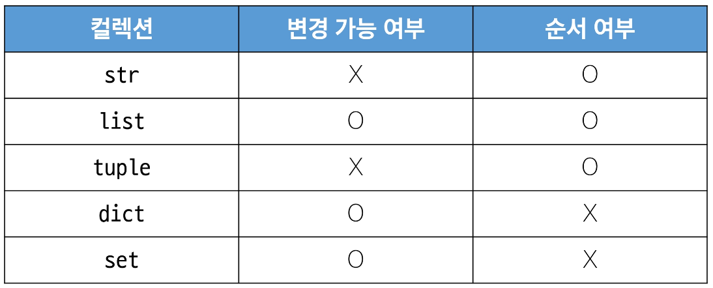

    


- 불변과 가변의 차이

    ```python
    my_str = 'hello'
    # TypeError: 'str' object does not suppport item assignment
    my_str[0] = 'z'

    my_list = [1, 2, 3]
    my_list[0] = 100
    # [100, 2, 3]
    print(my_list)
    ```

    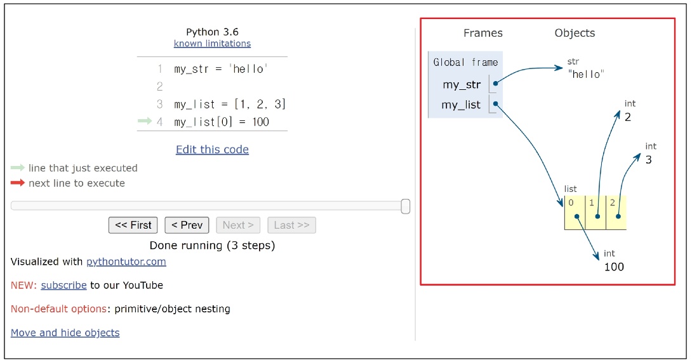


## 형변환(Type Conversion)

- 형변환(Type Conversion)

    - 한 데이터 타입을 다른 데이터 타입으로 변환하는 과정(암시적 형변환/명시적 형변환)


### 암시적 형변환

- 암시적 형변환(Implicit Type conversion)

    - python이 자동으로 수행하는 형변환


- 암시적 형변화 예시

    - 정수와 실수의 연산에서 정수가 실수로 변환됨

    - Boolean과 Numeric Type에서만 가능

        ```python
        print(3 + 5.0)  # 8.0

        print(True + 3) # 4

        print(True + False) # 1
        ```


### 명시적 형변환

- 명시적 형변환(Explicit Type conversion)

    - 프로그래머가 직접 지정하는 형변환(암시적 형변환이 아닌 경우를 모두 포함)


- 명시적 형변환 예시

    - str -> int : 형식에 맞는 숫자만 가능

        ```python
        print(int('1'))

        # ValueError: invalid literal for int() with base 10: '3.5'
        print(int('3.5'))

        print(int(3.5)) # 3

        print(float('3.5')) # 3.5
        ```

    - int -> str : 모두 가능

        ```python
        print(str(1) + '등')    # 1등
        ```


- 컬렉션 간 형변환 정리

    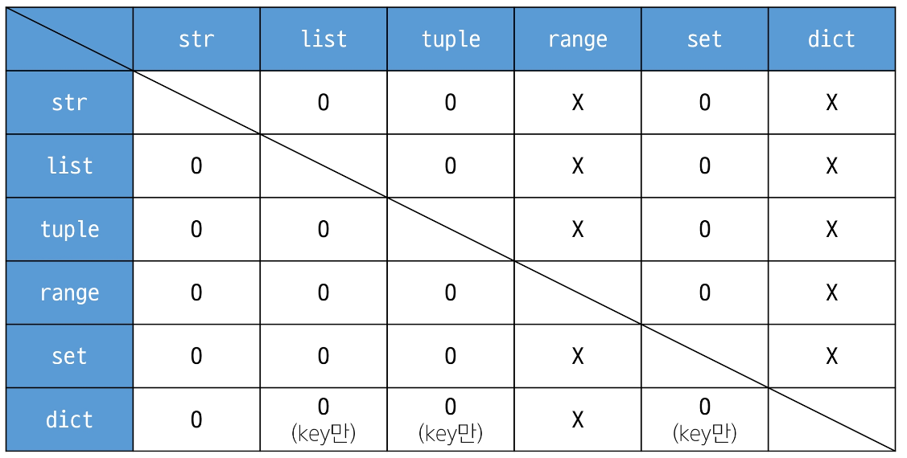


## 연산자

### 산술 연산자

    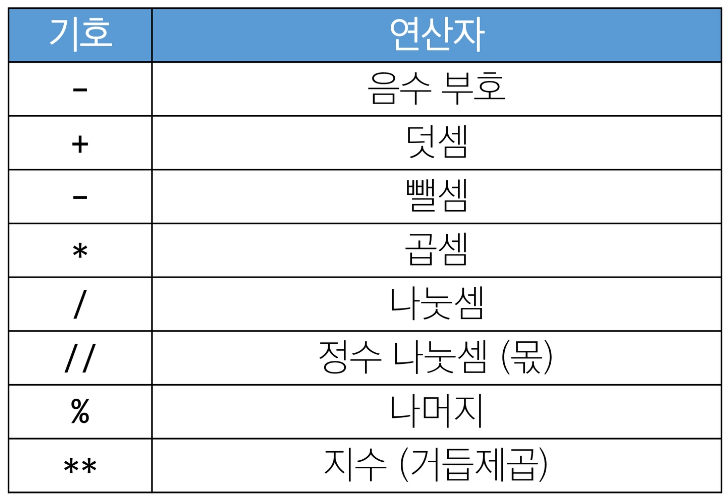


### 복합 연산자

- 연산과 할당이 함께 이루어짐

    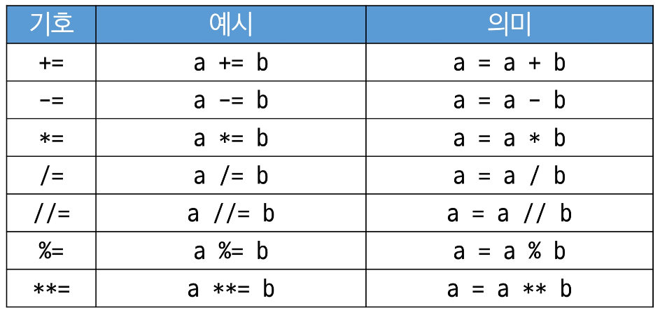


- 복합 연산자 예시

    ```python
    y = 10
    y -= 4
    print(y)    # 6

    z = 7
    z *= 2
    print(z)    # 14

    w = 15
    w /= 4
    print(w)    # 3.75

    q = 20
    q //= 3
    print(q)    # 6
    ```


### 비교 연산자

    


- is 비교 연산자

    - 메모리 내에서 같은 객체를 참조하는지 확인

    - ==는 동등성(equality), **is**는 식별성(identity)

    - 값을 비교하는 ==와 다름

        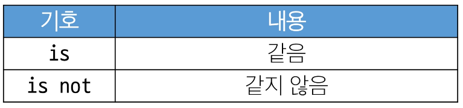


- 비교 연산자 예시

    ```python
    print(3 > 6)    # False
    print(2.0 == 2) # True
    print(2 != 2)   # False
    print('HI' == 'hi') # False
    print(1 == True)    # True

    # SyntaxWarning: "is" with a literal. Did you mean "=="?
    # ==은 값(데이터)을 비교하는 것이지만 is는 레퍼런스(주소)를 비교하기 때문
    # 아래 조건은 항상 False이기 때문에 is 대신 ==를 사용해야 한다는 것을 알림
    print(1 is True)    # False
    print(2 is 2.0) # False
    ```


### 논리 연산자

|기호|연산자|내용|
|:--:|:--:|:--:|
|and|논리곱|두 피연산자 모두 True인 경우에만<br>전체 표현식을 True로 평가|
|or|논리합|두 피연산자 중 하나라도 True인 경우<br>전체 표현식을 True로 평가|
|not|논리부정|단일 피연산자를 부정|
<br>


- 논리 연산자 예시

    ```python
    print(True and False)   # False

    print(True or False)    # True

    print(not True) # False

    print(not 0)    # True
    ```

    - 비교 연산자와 함께 사용 가능
    ```python
    num = 15
    result = (num > 10) and (num % 2 == 0)
    print(result)   # False

    name = 'Alice'
    age = 25
    result = (name == 'Alice') or (age == 30)
    print(result)   # True
    ```


### 단축평가


- 단축평가

    - 논리 연산에서 두 번째 피연산자를 평가하지 않고 결과를 결정하는 동작


- 단축평가 예시 문제

    ```python
    vowels = 'aeiou'

    print(('a' and 'b') in vowels)  # str값은 True로 나오고 'b'가 뱉어진다. -> False
    print(('b' and 'a') in vowels)  # 이 경우에는 'a'가 뱉어지므로 -> True

    print(3 and 5)  # 5, 두 숫자는 True 값이므로 -> True
    print(3 and 0)  # 0, 0은 False 이므로 -> False
    print(0 and 3)  # 0, 앞에 False가 나왔으므로 단축평가
    print(0 and 0)  # 0, 단축평가

    print(5 or 3)  # 5, 이미 True가 나왔으므로 단축평가가 일어난다.
    print(3 or 0)  # 3, 이미 True가 나왔으므로 단축평가가 일어난다.
    print(0 or 3)  # 3, 뒤에 True가 나왔으므로 단축평가가 일어나지 않고, 3이 출력된다.
    print(0 or 0)  # 0, 뒤 0까지 봐야하므로 단축평가가 일어나지 않는다.
    ```


- 단축평가 동작

    - and

        - 첫 번째 피연산자가 False인 경우, 전체 표현식은 False로 결정, 두 번째 피연산자는 평가되지 않고 그 값이 무시

        - 첫 번째 피연산자가 True인 경우, 전체 표현식의 결과는 두 번째 피연산자에 의해 결정, 두 번째 피연산자가 평가되고 그 결과가 전체 표현식의 결과로 반환

    - or

        - 첫 번째 피연산자가 True인 경우, 전체 표현식은 True로 결정, 두 번째 피연산자는 평가되지 않고 그 값이 무시

        - 첫 번째 피연산자가 False인 경우, 전체 표현식의 결과는 두 번째 피연산자에 의해 결정, 두 번째 피연산자가 평가되고 그 결과가 전체 표현식의 결과로 반환


- 단축평가 이유

    - 코드 실행을 최적화하고, 불필요한 연산을 피할 수 있도록 함


### 멤버십 연산자

- 멤버십 연산자

    - 특정 값이 시퀀스나 다른 컬렉션에 속하는지 여부를 확인

        |기호|내용|
        |:--:|:--:|
        |in|왼쪽 피연산자가 오른쪽 피연산자의 시퀀스에 속하는지를 확인|
        |not in|왼쪽 피연산자가 오른쪽 피연산자의 시퀀스에 속하지 않는지를 확인|
        <br>


- 멤버십 연산자 예시

    ```python
    word = 'hello'
    numbers = [1, 2, 3, 4, 5]

    print('h' in word)  # True
    print('z' in word)  # False

    print(4 not in numbers) # False
    print(6 not in numbers) # True
    ```


### 시퀀스형 연산자

- 시퀀스형 연산자

    - +와 *는 시퀀스 간 연산에서 산술 연산자일때와 다른 역할을 가짐

        |연산자|내용|
        |:--:|:--:|
        |+|결합 연산자|
        |*|반복 연산자|
        <br>


- 시퀀스형 연산자 예시

    ```python
    # Gildong Hong
    print('Gildong' + 'Hong')

    # hihihihihi
    print('hi' * 5)

    # [1, 2, 'a', 'b']
    print([1, 2] + ['a', 'b'])

    # [1, 2, 1, 2]
    print([1, 2] * 2)
    ```


- 연산자 우선순위 정리

    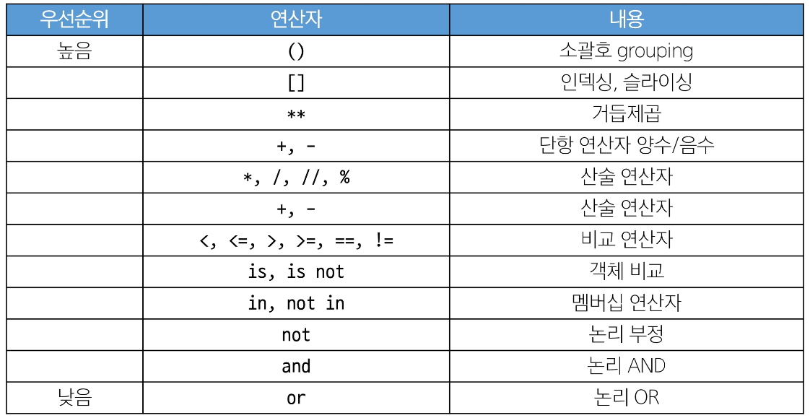
